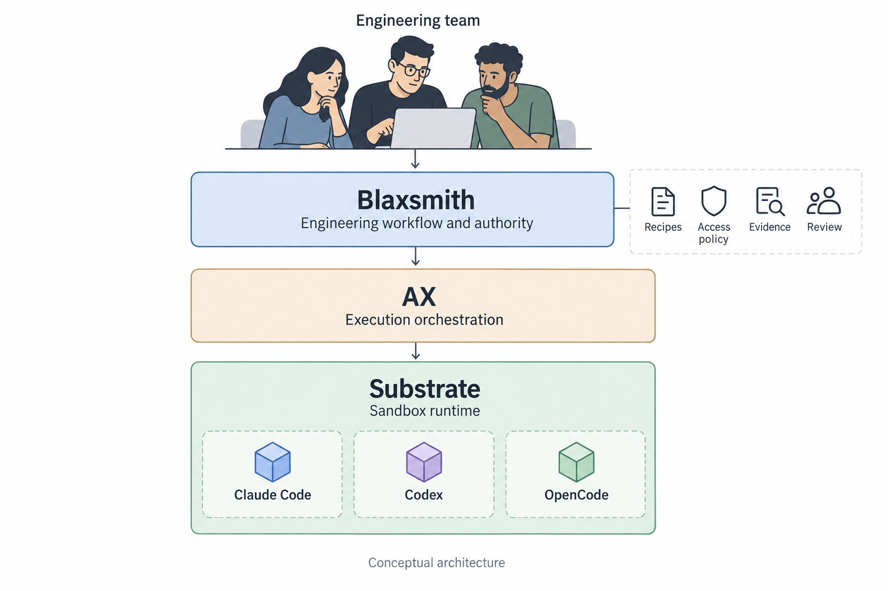
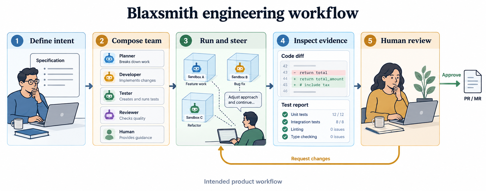
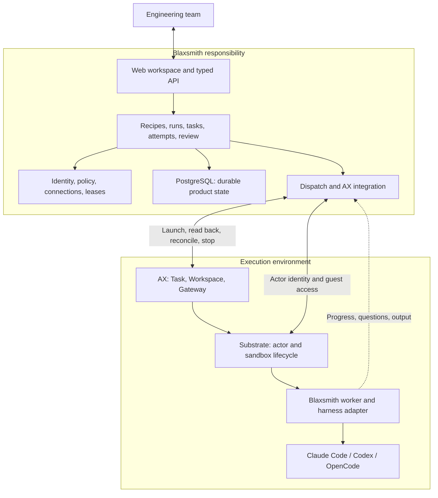
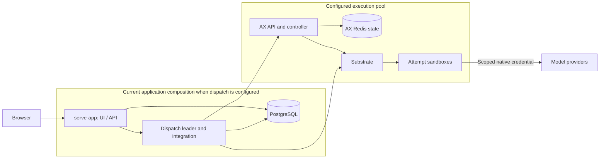

# Blaxsmith, AX, and the engineering platform

Audience: engineering team. Reviewed against repository source on 2026-09-24.

## 1. The platform in one paragraph

Blaxsmith is a self-hosted engineering workspace where humans direct composable AI teams from specification through implementation, verification, and final review. Blaxsmith owns the project, workflow, permissions, connections, interaction history, and acceptance decisions. AX manages execution tasks and their runtime configuration. Substrate supplies the underlying actors, sandbox lifecycle, networking mechanisms, and snapshots. Coding tools such as Claude Code, Codex, and OpenCode perform assignments inside those environments.

The architecture below describes the intended product contract. Section 8 distinguishes source implementation from deployment evidence; diagrams and illustrations are not release-readiness claims.



## 2. What the overall platform provides

The product connects five activities into one durable project history:

1. **Define work:** investigate a repository, record requirements and decisions, and resolve questions with a human.
2. **Compose a team:** select a versioned recipe, stage dependencies, role profiles, tools, models, skills, extensions, and checks.
3. **Authorize and execute:** resolve access, freeze inputs, select an approved runtime, and run each assignment through AX.
4. **Observe and steer:** show progress, conversations, questions, blockers, and authorized native-session access while preserving ownership of control.
5. **Review and deliver:** assemble revisions and evidence, request corrections, and obtain approval for controlled PR/MR publication. Merge and deployment require separate authority.

For engineers, this means an assignment has identifiable inputs, an execution owner, bounded access, an attributable result, and a place in the larger workflow. Individual model sessions can end without becoming the only record of the project.



The illustration's roles, code, and test counts are illustrative examples, not screenshots or measured results. The final PR/MR step is the intended delivery contract.

## 3. Responsibility boundaries

| Layer | Owns | Contract with the next layer |
|---|---|---|
| Blaxsmith application | Organizations, projects, recipes, runs, logical tasks, attempts, identity, authorization, access grants, questions, steering, evidence references, and human decisions | An authorized, frozen assignment and rules for accepting its output |
| Blaxsmith execution integration | Mapping attempts to AX resources; runtime readback; bootstrap activation; completion collection; stop and recovery coordination | A specific AX Task and observed runtime bound to the current attempt owner |
| AX | Task definitions, workspace and gateway references, runner setup, and execution lifecycle reconciliation through Substrate | Runtime configuration and lifecycle operations for the selected actor |
| Substrate | Actors, sandbox execution, guest access, network enforcement mechanisms, snapshot and resume machinery | The actual environment and its observed identity/state |
| Blaxsmith worker and tool adapters | Materializing selected inputs/configuration, launching a pinned harness, normalizing interaction and output, and collecting stage output | Tool execution under the platform's assignment |
| Coding harness | Model interaction and coding-tool behavior within the assignment | Changes, activity, questions, and reported results |
| Guild or another extension | Engineering methodology, prompts, templates, and declared capabilities/checks | Versioned methodology embedded in, or composed into, the platform workflow |

### Logical architecture



Blaxsmith's responsibility spans both the control plane and its worker code inside the sandbox. The location of a binary does not determine who owns its contract. Likewise, Substrate enforcement and Blaxsmith authorization are distinct: the platform decides what is permitted and must verify that the selected runtime can enforce that decision.

### Terms that must stay distinct

| Term | Meaning |
|---|---|
| Blaxsmith workspace | Durable project context and user experience across runs and sessions |
| AX Workspace | Execution setup definition, including repository and other selected runtime inputs |
| Blaxsmith task | Logical engineering work with dependencies and acceptance rules |
| Blaxsmith attempt | One concrete execution of that task, with frozen inputs and current ownership |
| AX Task | The execution resource used for an attempt; it is not the whole engineering run |
| AX Gateway | Runtime networking configuration associated with a Task |
| Blaxsmith model gateway | An optional model API proxy for authorization, routing, provider credentials, and usage accounting |
| Runtime state | Whether the execution environment is starting, ready, running, stopped, or uncertain |
| Engineering acceptance | Whether the output satisfies the required checks and review contract |

## 4. One assignment across the boundary

The connector maps a durable attempt to an attempt-specific AX Task. Blaxsmith persists ownership before making the external launch request. It then reads back the Task and live actor instead of treating the launch response as sufficient proof of the selected environment.

The bootstrap design has two phases: setup access enables workspace preparation; model access is released after workspace readiness and runtime revalidation. A setup failure must not become a partially initialized coding session.

```mermaid
sequenceDiagram
    participant H as Human
    participant B as Blaxsmith workflow
    participant D as Dispatch / AX bridge
    participant A as AX / Substrate
    participant W as Runner / worker
    H->>B: Start a selected recipe
    B->>B: Freeze inputs and authorize assignment
    B->>B: Commit attempt reservation
    B->>D: Dispatch current attempt
    D->>A: Bind Workspace and Gateway; create Task
    D->>A: Read back Task and actor identity
    D->>W: Release authorized setup capability
    W->>W: Prepare and verify workspace
    A-->>D: Workspace ready
    D->>D: Revalidate runtime and current authority
    D->>B: Commit attempt started
    D->>W: Release selected model capability
    W->>W: Run pinned coding harness
    W-->>B: Questions and progress via interaction bridge
    H->>B: Answer or authorized steering
    B->>W: Deliver interaction
    W-->>D: Exit readback and result artifacts
    D->>B: Record bound receipt and stage output
    D->>A: Revoke access and stop execution
    A-->>D: Confirm Task and actor absence
    D->>B: Confirm stopped; progress eligible work
    Note over B,H: Evidence acceptance and final human review remain product responsibilities
```

This is the successful conceptual path. Exact transports and process placement are implementation details; the ownership and readiness boundaries are the contract.

Three failure rules matter:

- **An uncertain launch remains uncertain.** A timed-out request may still create a worker. Reconciliation and fencing must precede replacement.
- **Stopping requires observed termination.** Persisting cancellation or revoking a database lease does not prove that a live actor has stopped using a credential already delivered to it.
- **Runtime success is only one input to acceptance.** A clean exit and a guest-reported verdict do not independently prove that required checks passed. Output collection, stage progression, evidence verification, and final approval have different meanings.

The current completion code explicitly treats the guest result as untrusted handoff text. Its collection and stage progression must not be described as independent verification of the engineering result. See [completion collection](../internal/axbridge/completion.go) and [stage results](../internal/workflow/stage_flow.go).

## 5. State, credentials, and trust

| Information | Authority / location | Boundary rule |
|---|---|---|
| Product state, membership, grants, ownership, decisions, events | Blaxsmith PostgreSQL | Workers do not receive control-plane database access |
| Source history and delivered revisions | Git | Assignments bind exact revisions; handoffs identify accepted revisions |
| Frozen input and evidence bytes | Immutable artifacts referenced by digest in product records | A mutable runtime path or model claim is insufficient evidence |
| Runtime Task and actor state | AX and Substrate, checked by the integration | Runtime observations must match the current attempt and runtime binding |
| External credentials | Platform access subsystem and encrypted secret storage | Release only the capability authorized for the attempt |
| Native session data and temporary checkout | Attempt environment | Runtime persistence does not replace durable project history |

Access follows **Connection → Grant → Binding → Lease**: an account/service exists, policy permits its use, an assignment selects it, and an attempt receives temporary access. Current authority must still be checked when execution or access is resumed.

Raw credentials must not be placed in AX Task metadata: task definitions may be persisted, serialized, and exposed through runtime metadata paths. Bootstrap and credential delivery exist to avoid expanding custody to those surfaces.

Current harness execution uses scoped credential delivery under explicit policy. Harness-reported usage is collected through attempt events; it is not trusted billing. A metered model proxy and effective egress enforcement remain qualification work. Gateway-related database/configuration records do not establish a working model-proxy process. See [reported usage and its limits](usage-reporting.md).

The current AX integration includes repository-owned compatibility overlays for bootstrap, lifecycle, credentials, resources, networking, and recovery. These are part of Blaxsmith's maintained integration, not a claim about unmodified upstream AX. See [overlay inventory and provenance](../integrations/ax/README.md).

## 6. Physical deployment versus logical ownership

The current application can construct the dispatch runtime and run a PostgreSQL advisory-lock leader loop inside `serve-app`. That loop coordinates launch, completion, recovery, stage progression, and lease renewal. An independently deployed connector per execution cluster is the intended deployment boundary; it must not be presented as already realized simply because the code has connector abstractions.



The diagram shows current native credential delivery. A future metered proxy requires its own implementation and qualification. AX Redis stores execution control-plane state; Blaxsmith PostgreSQL remains the product authority.

The target topology supports a small Linux/k3s installation and multiple execution clusters through the same product model. Multi-cluster enrollment, failure handling, durable infrastructure, and measured capacity require their own qualification. Neither this diagram nor the existence of Helm profiles certifies production HA or tenant isolation.

## 7. Tools, recipes, and Guild

A recipe defines the engineering workflow: stages, dependencies, profiles, inputs, checks, and correction limits. A harness adapter translates the selected profile into the tool's supported invocation and configuration. A model choice belongs to that explicit profile and authorized connection.

Guild contributes engineering methodology through Forge and Foundry. In embedded mode, an extension's orchestrator runs inside one platform stage and reports questions/progress through the `bx` interaction bridge. Internal subagents within that sandbox do not become separately isolated Blaxsmith attempts merely because the extension calls them agents.

The decomposed design maps methodology stages to platform stages with separate scheduling and isolation. The extension plan places richer decomposition and `bx spawn` in later work. Keep this distinction visible when describing parallel teams. See [extensions and runtimes](extensions-and-runtimes.md) and [interactive sessions](interactive-sessions.md).

## 8. Implementation status and evidence

This document was produced by source/document review. It does not report a new live execution test or a production qualification run.

| Area | What this review established | What it does not establish |
|---|---|---|
| Dispatch composition | `newProductDispatch` composes activation, AX bridge, completion, recovery, and optional guest result delivery | Successful execution in every deployment or supported tool combination |
| Application wiring | `serve-app` enables launch when dispatch is configured and starts the coordinator | A separately deployed multi-cluster connector fleet |
| Coordination | A PostgreSQL session advisory lock selects a coordinator; it polls dispatch, completion, recovery, progress, and renewal | Proven capacity or all partition/failover guarantees |
| Stage output | Completion reads bounded guest results, invokes delivery when configured, records output, and stops the actor | Independently verified requirements coverage or correctness of guest verdicts |
| Model gateway | A separate `blaxsmith gateway` process implements authorization/proxying with shared database state | Universal provider compatibility or effective network restriction in a live cluster |
| Synthetic runtime probes | Existing documents record selected bootstrap, actor, Git, readiness, and lifecycle probes | A complete, current, mixed-tool production acceptance suite |
| Broader product contract | The main plan specifies human approval, PR/MR delivery, enterprise access, and multi-cluster operation | Completion of every planned capability |

**Documentation drift:** the [README](../README.md) and [AX attempt bridge narrative](ax-attempt-bridge.md) still contain statements that application dispatch or the long-running coordinator is not composed. Current source contains that composition. Use the source links below for the implemented wiring, and dated probe records for what was exercised. Preserve the distinction between implementation, a passing test, a deployed revision, and a qualified release.

## 9. Where engineers should look

| Concern | Starting point |
|---|---|
| Product decisions and intended acceptance contract | [Main implementation plan](../agent-factory-plan.md) |
| Application wiring | [serve_app.go](../cmd/blaxsmith/serve_app.go) |
| Runtime composition and preflight | [dispatch_runtime.go](../cmd/blaxsmith/dispatch_runtime.go) |
| Coordinator lifecycle | [dispatch_coordinator.go](../cmd/blaxsmith/dispatch_coordinator.go) |
| Durable workflow and stage state | [internal/workflow](../internal/workflow) |
| Recipe validation and frozen inputs | [internal/recipe](../internal/recipe), [Git recipe contract](git-recipes.md) |
| Assignment dispatch and activation | [internal/dispatch](../internal/dispatch) |
| AX translation, lifecycle, receipts, recovery | [internal/axbridge](../internal/axbridge) |
| Bootstrap and credential authority | [internal/bootstrap](../internal/bootstrap), [internal/access](../internal/access), [access contract](access-authority.md) |
| Worker and harness behavior | [internal/tooladapter](../internal/tooladapter) |
| Questions, steering, and native sessions | [internal/interact](../internal/interact), [internal/terminal](../internal/terminal) |
| Reported usage | [usage store](../internal/workflow/usage.go), [usage contract and limits](usage-reporting.md); metered proxy remains open |
| Pinned AX compatibility changes | [integrations/ax](../integrations/ax/README.md) |

When placing a change, start with its owner: product decisions belong in Blaxsmith workflow/access; runtime translation belongs in the integration; harness behavior belongs in its adapter; sandbox lifecycle and enforcement belong in AX/Substrate or a reviewed compatibility overlay. Keep product semantics out of runtime status interpretation, and keep AX-specific details behind the integration boundary.

## Illustration provenance

Both PNG illustrations were generated with the built-in GPT Image tool and visually reviewed for this document. They are explanatory art; the Mermaid source and written contracts define the technical relationships. The exact generation prompts are recorded in [image prompts](images/platform-image-prompts.md).
