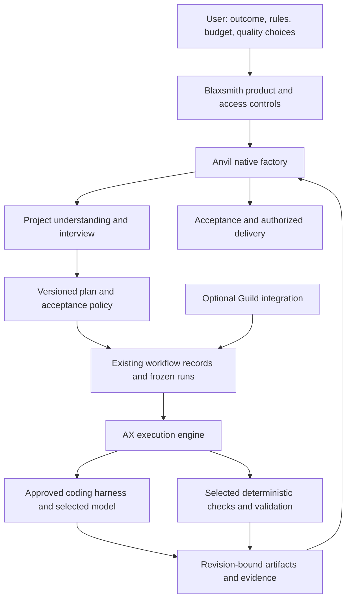

[PRD]

Implementation and qualification status: [implementation ledger](implementation-status.md). Unchecked acceptance criteria are not a completion claim.

# Anvil: Blaxsmith's native software factory

**Status:** implementation plan for discussion and execution planning; application changes are not implemented by this document.

**Prepared:** September 26, 2026.

**Product:** Blaxsmith. **Factory:** Anvil. **Execution engine:** AX.

**Scope:** native planning, project understanding, configurable engineering workflows, implementation, review, validation, model advice, and persistent goals.

**Primary decision:** users choose the depth, cost, and acceptance policy of their work. Anvil supports a fast MVP and thorough production work without imposing one workflow on both.

**Shared platform companion:** [Blaxsmith platform, AX, API, MCP and factory integration plan](prd-blaxsmith-platform-and-factory-integration.md). That plan owns the neutral integration boundary, machine access, runtime compatibility and factory conformance. This plan owns Anvil's native methodology and user experience; shared goal, policy, budget and evidence work is implemented once across both plans.

### Navigation

- [Product decisions and tunable quality](#1-product-intent-and-governing-decisions)
- [Architecture, current code, and native independence](#2-architecture-and-ownership)
- [User journeys](#3-user-journeys)
- [Requirements](#4-functional-requirements-and-traceability)
- [Interviews, plans, and example task packets](#5-interview-and-planning-design)
- [Rules, stack profiles, agents, and knowledge](#6-rules-stack-profiles-agents-and-project-knowledge)
- [Model advice and budgets](#7-model-advice-costs-and-subscription-use)
- [Execution, review, validation, and acceptance](#8-execution-review-validation-and-acceptance)
- [Durable goals](#9-durable-goals-and-long-runs)
- [Product experience](#10-product-experience)
- [Checks for implementing Anvil](#11-quality-gates-for-implementing-anvil-itself)
- [13 phases and 60 implementation tasks](#12-phased-implementation-roadmap)
- [Release sequencing](#13-release-slices-sequencing-and-concrete-demonstrations)
- [Failure scenarios](#14-acceptance-and-failure-scenario-matrix)
- [Metrics and evaluation](#15-metrics-experiments-and-success-criteria)
- [Operations](#16-operational-design-and-data-lifecycle)
- [Risks](#17-risks-and-design-responses)
- [Remaining decisions](#18-decisions-still-to-gather)
- [Research sources](#19-research-basis-and-limits)
- [First implementation handoff](#20-first-implementation-handoff)
- [Release qualification checklist](#21-definition-of-a-qualified-anvil-release)

## 1. Product intent and governing decisions

Anvil is the default software factory inside Blaxsmith. A user describes an outcome, Anvil understands the project, conducts an appropriate interview, prepares an actionable plan, and coordinates work through AX. It tracks what was requested, what changed, what was checked, what remains uncertain, and what the user has accepted.

The factory should make careful software engineering accessible without requiring every user to design an agent system. It should also let experienced users replace defaults, bring their own agents and rules, choose models and providers, and tune the amount of planning and verification to the work.

The same product must handle a two-hour prototype, a small fix in a mature application, and a multi-day feature spanning several milestones. Those jobs need different amounts of ceremony. A large plan is justified for building Anvil; a large plan must not become a prerequisite for every job run through Anvil.

### 1.1 Confirmed decisions from the product discussion

1. **AX stays the engine.** Anvil uses the existing execution, dispatch, identity, isolation, and lifecycle machinery. It does not become a second execution engine.
2. **Anvil is native and standalone.** It has no dependency on Guild installation, Guild schemas, Guild interview tags, Guild prompts, Guild validation, or Guild runtime behavior. Useful interview and handoff ideas can inform the design. Guild remains an optional integration with its own compatibility path.
3. **Users decide their quality gates.** A fast MVP may omit independent review or browser tests. Thorough work may require both and more. Anvil recommends, explains, and records the choice; it does not silently impose a production workflow.
4. **Rules, stack conventions, and agent definitions are first-class inputs.** Users should be able to supply them without repeatedly pasting a giant prompt.
5. **Planning quality matters.** Plans need clear requirements, granular tasks, dependencies, reasoning summaries, examples, completion conditions, and durable handoffs.
6. **Existing code must be understood continuously.** Brownfield, greenfield, and mixed projects require distinct starting behavior. Understanding must be refreshed when relevant code changes.
7. **Clean code, E2E testing, and validation are important capabilities.** Their depth and blocking behavior are configurable. Anvil must support thorough execution well enough that these are useful controls, not decorative checkboxes.
8. **Model choice should be understandable and economical.** Advice must consider phase, difficulty, risk, available accounts, reasoning effort, cash cost, and subscription consumption.
9. **Long goals must survive individual runs.** The objective, accepted work, remaining work, budget, decisions, and evidence must persist through interruptions and replacement workers.
10. **Progress must be honest.** Generated, implemented, checked, accepted, merged, and deployed are different facts. Disabled or unavailable checks never become green passes.

### 1.2 Proposed defaults, subject to user selection

These defaults are implementation recommendations, not additional confirmed product mandates:

- Present three editable starting presets: **MVP**, **Balanced**, and **Thorough**, plus **Custom** after modification. Start the selector on Balanced and make the selection explicit during setup.
- Use a small set of responsibilities: planner, implementer, reviewer, and validator. A responsibility does not necessarily require a separate model session.
- Start execution with one implementation lane. Add parallel work only after serial delivery, cancellation, and integrated validation are reliable.
- Prefer the project's existing stack and conventions. Recommend alternatives with a reason when there is a concrete problem.
- Require a user decision before exceeding an approved spending limit, changing a billing account, or taking an externally consequential action outside an existing authorization.
- Begin with recommendations and explicit model selections. Add policy-driven selection among preapproved candidates after measurement and recovery behavior exist.
- Use PostgreSQL and the existing application services for durable records. Do not introduce a new workflow engine, vector database, event broker, or agent framework for the initial release.

### 1.3 What user-tunable quality means

Every engineering check has a mode:

| Mode | Execution | Effect on acceptance |
|---|---|---|
| Off | Does not run automatically | No check result is claimed; UI says not run by policy |
| Advisory | Runs when its prerequisites are available | Findings are visible but do not block acceptance |
| Required | Runs as an acceptance condition | Failure, missing evidence, or unavailable prerequisites blocks that condition |

Review is configured the same way. A user may require an independent review, make it advisory, or turn it off. Human acceptance and merge authorization are separate settings. An authorized policy can accept routine work automatically under its chosen conditions; the default can remain human acceptance without hardwiring that into every possible Anvil workflow.

The product should offer understandable choices before exposing every detail:

| Setting | MVP starting suggestion | Balanced starting suggestion | Thorough starting suggestion |
|---|---|---|---|
| Interview | Outcome, constraints, one concrete success example | Adaptive clarification of meaningful gaps | Detailed behavior, architecture, failure, operational, and migration questions |
| Plan | Brief plan with bounded tasks | Milestones and complete task handoffs | Milestones, risks, alternatives, acceptance matrix, recovery details |
| Repository exploration | Changed flow and direct callers | Affected flow, contracts, tests, reuse candidates | Broader impact, compatibility, operational and security paths |
| Build/type checks | Required if relevant and available | Required if relevant | Required if relevant |
| Focused tests | Advisory suggestion | Required for changed behavior | Required, including failure paths |
| Independent code review | Off | Advisory | Required |
| Browser/E2E | Off | Advisory for user-facing behavior | Required for applicable critical journeys |
| Security/performance checks | Off unless selected | Suggested when relevant | Required where explicitly configured and applicable |
| Acceptance | User-selected manual or policy-based | User-selected manual or policy-based | User-selected manual or policy-based |
| Concurrency | One lane | One lane initially | Bounded, once qualified |

These are **editable starting suggestions**, not hidden minimums. The user can turn off a build check for a throwaway prototype. Anvil then reports that the prototype was accepted under a policy without build verification. It must not imply production readiness.

Tenant isolation, authorization, secret handling, immutable evidence provenance, and accurate status reporting are platform properties, not optional quality gates. An organization can also choose to lock particular settings for its own projects. Such a restriction must identify its source and the role that can change it; it is not an Anvil-wide engineering mandate.

Changing gates after work begins creates a new policy revision. Completed evidence remains historical fact. Removing a required check changes the acceptance contract; it does not change a failed result to passed. Show the policy revision used for acceptance.

### 1.4 Non-goals for the first useful release

- Replacing AX, Substrate, existing harnesses, or the access authority.
- Reproducing all of Guild or making Guild the internal specification language.
- A universal executable workflow language, arbitrary extension code in the control plane, or a marketplace prerequisite.
- Autonomous production deployment or automatic rollback without separately configured authorization.
- A mandatory swarm, model ensemble, or full-repository audit for small changes.
- A permanent model leaderboard declaring one model best for all work.
- Exact subscription quota accounting when a provider does not expose reliable usage data.
- Full replicas of every third-party service for testing.
- Automatic stack migration merely because a newer framework exists.
- Claims of guaranteed defect-free code or guaranteed savings.

## 2. Architecture and ownership



Anvil owns the software-development workflow: deciding what information is missing, assembling the plan, preparing bounded assignments, evaluating selected acceptance conditions, and carrying a goal forward. AX owns execution. Blaxsmith owns identities, authorization, durable product state, settings, and the user experience. Harnesses own their model/tool interaction loop inside the approved runtime.

Use one set of run, attempt, interaction, artifact, and evidence mechanisms wherever their semantics already fit. Add goal-level records where existing run-bound records cannot represent the requirement. Do not invent a second scheduler just to make the architecture diagram symmetrical.

### 2.1 Terms

| Term | Meaning |
|---|---|
| Goal | Durable desired outcome, its current acceptance contract, and accumulated progress across runs |
| Phase | A planning grouping, such as discovery or delivery; not inherently an execution barrier |
| Milestone | A demonstrable integrated outcome that can be evaluated independently |
| Task | A bounded assignment with inputs, dependencies, output, and completion conditions |
| Run | A frozen executable selection of work, policy, inputs, and runtime choices |
| Attempt | One execution of a task or stage, including retries and replacements |
| Candidate revision | Exact code revision submitted for evaluation |
| Evidence | Recorded observations, check results, artifacts, or review findings with provenance |
| Acceptance policy | User-selected conditions under which work may be accepted |
| Acceptance | Authorized decision against a particular scope, revision, and policy version |
| Check | A deterministic or externally observed verification action |
| Review | A reasoned assessment against a stated rubric; distinct from a deterministic check |
| Knowledge snapshot | Revision-bound understanding of the project, with facts and uncertainty separated |

### 2.2 Repository baseline and gaps

This section describes the local source inspected for this plan. The working tree already contains substantial changes from earlier work. Presence in source is not proof of deployment, live-provider compatibility, or production qualification.

| Existing area | Reuse | Gap relevant to Anvil |
|---|---|---|
| [Recipe contracts](../internal/recipe/recipe.go) and [freezing](../internal/recipe/freeze.go) | Explicit harness/model/effort, stage dependencies, frozen input bytes and digests | Freeze currently calls Guild validation unconditionally; current stage constraints do not express all user-selected Anvil paths |
| [Workflow package](../internal/workflow) | Runs, attempts, scheduling, corrections, review, branches, persistence | Goal and milestone ownership above runs; configurable acceptance beyond existing recipe assumptions |
| [Interaction contracts](../internal/interact/interaction.go) | Questions, options, answers, interview metadata, steering | Current records belong to runs; a pre-run interview needs a goal-level owner |
| [Repository inspection](../internal/repoinspect) | Initial stack/manifest/command discovery | Evidence-backed behavioral understanding, scope, freshness, confidence, and impact mapping |
| [Access package](../internal/access) | Credentials, model availability, grants and leases | Model recommendations, budget projections, and provider-specific usage freshness |
| [Runtime catalog](../internal/catalog) | Tool/runtime release information | This is not a benchmark database; keep model advice conceptually distinct |
| [Tool adapters](../internal/tooladapter) | Approved harness integration and worker communication | Extension materialization currently has harness restrictions; native cross-harness behavior must not assume arbitrary packs already work |
| [Verification](../cmd/blaxsmith/verification.go) and [evidence](../internal/evidence) | Independent checks, protected paths, bounded output and durable artifacts | Rich application environments, longer applicable E2E checks, service lifecycle and artifact limits |
| [API definitions](../proto/blaxsmith/api/v1) | Existing Connect/protobuf contracts and generated clients | Goal, policy, plan, and advisory operations with compatible evolution |
| [Frontend](../frontend/src) | Project settings, runs, model picker, recipe/extension screens, evidence views | Coherent goal-to-plan-to-work experience and understandable policy editing |
| [Architecture notes](../docs/platform-architecture.md) | Existing platform boundaries and source navigation | Keep Anvil-specific ownership explicit rather than replacing platform architecture |

Specific constraints to address deliberately:

- Current freeze reads committed Git content and rejects a scope with no committed files. A truly empty greenfield repository needs an explicit bootstrap/provenance path.
- Current input bundles have bounded artifact counts and sizes. A large plan must be partitioned into relevant task inputs, not stuffed into every prompt.
- Existing recipes limit stage count and correction cycles. A long goal should create bounded runs rather than increasing limits without analysis.
- The verifier currently uses short per-check deadlines and a constrained environment. A full app plus database plus browser may require a separate configured check class or environment lifecycle.
- Existing verification execution is distinct from coding, but admission still has runtime/model-binding assumptions that should be examined before claiming model-free validation works end to end.
- Current protected paths do not automatically prove that every transitive test dependency is protected. A worker-controlled imported helper can still affect the trustworthiness of a check.
- Existing extension support must be evaluated by actual harness capabilities. A manifest declaration alone is not a working portable adapter.
- Existing recipes can retain their historical semantics. Introduce explicit Anvil versions rather than silently changing the meaning of stored Guild runs.

### 2.3 Native independence contract

Anvil must initialize, interview, validate its plan, freeze a run, execute through a supported harness, evaluate its selected gates, and finish without a Guild extension installed or Guild-shaped inputs present.

Use a native schema and native validator. Select validation explicitly at the recipe/bundle boundary. Historical recipes route to historical validation; Anvil recipes route to Anvil validation. Do not use a permissive fallback such as “if Guild validation fails, assume Anvil.” Unknown versions fail with a useful diagnostic.

It is acceptable for the application binary to retain optional Guild integration code. Native execution must never require Guild artifacts, processes, validators, transcript tags, or licenses. A test that only hides Guild in the UI is insufficient.

## 3. User journeys

### 3.1 Brownfield feature

1. The user selects a repository, describes the outcome, and chooses a quality preset and budget preference.
2. Anvil resolves the source revision and reads applicable rules, manifests, relevant code, callers, and tests in the approved environment.
3. It presents a short understanding: current behavior, likely affected areas, reusable code, known test baseline, and material unknowns.
4. It asks focused questions the repository cannot answer. Questions include examples and recommended answers with consequences.
5. The user receives a plan with milestones, tasks, scope exclusions, selected checks, model choices, and cost/allowance uncertainty.
6. Execution produces candidate revisions. Checks and review run according to the selected policy.
7. Each milestone reports implemented behavior and validation coverage separately. The user can steer, pause, change the plan, or accept according to policy.
8. Anvil produces a delivery package for the exact final candidate. Merge and deployment follow separately authorized settings.

### 3.2 Greenfield project

Greenfield setup asks about users, core journeys, data sensitivity, hosting constraints, desired stack or recommendation, and prototype versus durable product intent. It should not ask about every future enterprise feature.

The first milestone creates a small runnable vertical slice with the selected conventions: one meaningful interface, one behavior, persistence where relevant, and the selected checks. It also establishes how to run, build, and validate the project. Later tasks inherit those real conventions.

An empty repository cannot pretend it has a source commit containing instructions. Define an explicit initial snapshot, create or select the initial repository state under the user's existing authorization, and preserve the original inputs. Do not invent a fake commit or silently write to a user's default branch.

### 3.3 Mixed project

A new service in a mature monorepo is greenfield within brownfield constraints. Anvil should inherit organization and repository rules while investigating shared authentication, deployment, build, contracts, logging, and data ownership. Record mode by scope; a single global label is inadequate.

### 3.4 Small fix or fast MVP

The user can start from a compact brief and a minimal gate selection. Anvil investigates enough to identify the change and its direct impact, asks only blocking questions, and prepares a short assignment. It does not demand a multi-round architecture interview for a typo or disposable prototype.

Example: “Add a rough internal dashboard using the existing API; no new backend; skip E2E for now.” The plan records those choices. The result can say “Accepted under MVP policy; browser automation and independent review were not run.” It cannot say “All tests passed” when tests were disabled.

### 3.5 Imported plan

Users can bring a Markdown PRD or structured plan. Anvil preserves the original, extracts requirements and tasks, checks references and contradictions, and asks about material gaps. It should not repeat an interview whose answers are already in the supplied document.

Unsupported fields or imported agent semantics receive a visible compatibility report. Anvil must never silently discard restrictions, checks, or completion conditions during import.

### 3.6 Persistent goal

The user approves a goal and a scope of autonomy. Anvil can create multiple bounded runs, retain accepted milestones, replace interrupted attempts, and ask for decisions when it reaches an actual authority, scope, or resource boundary. A provider outage changes execution state; it does not erase the plan.

On resume, the user sees what was accepted, what is in progress, what became stale, current budget estimates, and the next proposed action. The factory does not require the user to reconstruct the history from terminal logs.

## 4. Functional requirements and traceability

| ID | Requirement | Primary implementation phase |
|---|---|---|
| FR-01 | Native Anvil works with no Guild dependency | P01 |
| FR-02 | User-selectable, editable quality and acceptance policies | P02 |
| FR-03 | Versioned rules, stack profiles, agents, and supported skills | P03 |
| FR-04 | Brownfield, greenfield, and mixed project understanding | P04 |
| FR-05 | Adaptive, durable interviews before execution | P05 |
| FR-06 | Granular, dependency-aware plans with examples and rationale | P06 |
| FR-07 | Explicit model/harness/effort advice and override | P07 |
| FR-08 | Cash, quota, token, and runtime accounting with bounded escalation | P07 |
| FR-09 | Native execution through existing AX and workflow infrastructure | P08 |
| FR-10 | Configurable deterministic checks, independent review, and E2E | P09 |
| FR-11 | Honest evidence, policy-bound acceptance, and change history | P02, P09 |
| FR-12 | Durable multi-run goals with pause, resume, cancellation, and steering | P10 |
| FR-13 | Scoped continuous understanding and stale-evidence invalidation | P04, P10 |
| FR-14 | Bounded parallel execution and integrated revision validation | P11 |
| FR-15 | Clear setup, plan, execution, review, and delivery UX | P02, P05, P06, P08, P12 |
| FR-16 | Local outcome metrics and qualified model/workflow advice | P07, P12 |
| FR-17 | Authorized delivery with exportable provenance and recovery notes | P12 |
| FR-18 | Compatible rollout and optional integration coexistence | P01, P12 |

Every accepted milestone should support this chain:

```text
User outcome
  -> requirement and example
  -> decision or explicit assumption
  -> milestone and task
  -> frozen assignment and selected policy
  -> candidate revision
  -> check/review evidence, including omissions
  -> authorized acceptance decision
  -> delivery reference when applicable
```

This is a navigable relationship between records, not a requirement to copy the entire chain into every prompt.

## 5. Interview and planning design

### 5.1 Interview sequence

The sequence is adaptive, not a fixed form that every project must finish.

| Round | Gather | Example question | Output |
|---|---|---|---|
| Intent | User, problem, desired outcome, non-goals | “Who needs this, and what should they be able to do afterward?” | Goal brief |
| Current state | Existing behavior, repository evidence, constraints | “The current flow requires an admin. Should that remain true?” | Confirmed baseline and constraints |
| Concrete behavior | Happy path, failure examples, edge cases | “If an invitation already exists, should resend reuse it or create a new one?” | Acceptance scenarios |
| Technical decisions | Compatibility, data, interfaces, migration, reuse | “This can reuse the existing permission check. Is a new role actually needed?” | Decision records |
| Quality and resources | Gate modes, review depth, budget, accounts, autonomy | “For this MVP, do you want browser tests off, advisory, or required?” | Selected policy and budget |
| Plan review | Milestones, task boundaries, unresolved assumptions | “The first milestone covers creating invitations; acceptance is a separate milestone.” | Ready plan or explicit blockers |

Ask a few related questions at a time. Explain why an answer matters. Offer a recommendation where the evidence supports one. Allow “recommend for me” and record the resulting assumption. Ask the user about preferences and authority; inspect the repository for facts it can answer.

### 5.2 Readiness rules

A ready assignment needs an identifiable outcome, an actionable scope, applicable rules, an acceptance method selected by the user, and enough environment information to begin. A lightweight task may express these in a short brief. A large task needs a larger contract.

Unknowns are classified:

- **Blocking:** proceeding could violate scope, authority, or a critical requirement. Ask or create a discovery task.
- **Investigable:** the agent can resolve it by reading code, running an approved experiment, or checking primary documentation.
- **Assumed:** the user has delegated the choice or the risk is low enough under the chosen autonomy policy. Record the assumption and consequence.
- **Deferred:** outside the current milestone. Keep it visible without expanding current scope.

Readiness is not a word-count score. A lengthy document can still be unready if its acceptance criteria are contradictory. A short bug report with a reproduction and expected behavior can be ready immediately.

### 5.3 Decision records

Each material decision records its question, selected option, short rationale, considered alternative when useful, evidence references, owner, and revision. Store concise reasoning summaries and engineering tradeoffs, not private model chain-of-thought.

Example:

```yaml
id: DEC-INV-03
question: How should duplicate pending invitations behave?
decision: Reuse the pending invitation and record a resend attempt.
reason: Avoid duplicate membership paths and preserve the existing uniqueness contract.
alternative: Create a separate invitation for every send.
evidence:
  - revision: SOURCE_REVISION
    path: illustrative/path/to/invitation_store.go
status: proposed
owner: user
```

All YAML and JSON examples in this document are **proposed contracts or illustrative content**, not claims that the current parser accepts them. Illustrative product paths do not refer to files in Blaxsmith.

### 5.4 Plan hierarchy and task sizing

A milestone should produce usable behavior: “A project admin can invite someone and see the pending invitation.” A task might implement the transaction and API contract needed for that behavior. Avoid milestones such as “do backend” unless they are genuinely deliverable and independently valuable.

Split tasks when they have different prerequisites, authority requirements, review criteria, failure domains, or a coherent handoff boundary. Do not split every function into a separate agent call. Token savings from a cheaper model disappear when coordination and repeated context exceed the actual work.

Every implementation task includes:

1. Outcome and requirement IDs.
2. Why the task exists and what becomes possible afterward.
3. Relevant source revision, code paths, reusable patterns, and known baseline.
4. Dependencies and expected input artifacts.
5. Clear instructions and important invariants.
6. Examples, including an important negative case where applicable.
7. Scope exclusions and conditions that require replanning.
8. User-selected checks and review modes.
9. Expected output and handoff fields.
10. Model/runtime selection and resource bounds.

### 5.5 Example task packet

```yaml
schema: anvil.task/v1-proposed
id: INV-T03
milestone: INV-M01
title: Persist and list pending project invitations
requirements: [INV-R01, INV-R02]
depends_on: [INV-T02]
source_revision: SOURCE_REVISION
knowledge_snapshot: KS-014
policy_revision: QP-003
outcome: An authorized project admin can create an invitation and see it once in the list.
reason: Establish the complete persistence/API path before adding acceptance behavior.
read_first:
  - Existing project permission helper and all callers affected by this change
  - Existing transaction and error response conventions
instructions:
  - Reuse the shared permission check.
  - Preserve tenant filtering on every query.
  - Make duplicate submission behavior match DEC-INV-03.
  - Add no new role or dependency without a concrete need.
examples:
  - Admin creates invitation; exactly one pending entry is visible after refresh.
  - Non-admin request is rejected and creates no record.
  - Duplicate submission follows the approved idempotency behavior.
out_of_scope: [Email delivery, Invitation acceptance, Role redesign]
checks:
  - id: invitation_store_behavior
    mode: required
  - id: browser_invitation_list
    mode: advisory
review:
  mode: advisory
output:
  - Candidate revision
  - Changed behavior and affected callers
  - Check evidence or explicit not-run reasons
  - Remaining risks and next task inputs
```

The invitation example is a teaching example, not authorization to build invitation functionality in Blaxsmith.

## 6. Rules, stack profiles, agents, and project knowledge

### 6.1 Separate guidance from enforcement

Instructions can tell an agent to preserve tenant filtering. Platform authorization must enforce tenant isolation regardless of whether the model follows that instruction. A prompt asking a model to stay under a budget is not a hard spending cap. A Markdown checkbox is not proof a test ran.

Represent three distinct inputs:

- **Guidance:** architecture preferences, naming conventions, examples, and coding standards.
- **Workflow policy:** selected check modes, acceptance authority, scope of autonomy, budgets, and escalation rules.
- **Platform authority:** identities, tools, credentials, filesystem/network boundaries, and allowed external actions.

Users can tune workflow policy within their authority. Agent definitions request capabilities; they never grant them.

### 6.2 Resolution and conflicts

Resolve applicable inputs from organization policy, project settings, repository instructions, scoped instructions, selected stack/agent profiles, and task-specific instructions. Preserve provenance and scope for each effective rule.

Within user-editable guidance, a more specific setting can override a broader default. Explicit organization locks cannot be relaxed by a lower-authority task. Incompatible required instructions produce a diagnostic before execution rather than relying on whichever prompt appears last.

Example: a project says “use the existing package manager,” a stack template suggests another manager, and the repository contains an established lockfile. The template should adapt or explain a proposed change. It should not silently add a second lockfile.

Imported repository text is evidence and scoped guidance according to its source. A README, dependency file, issue body, or webpage cannot grant credentials, approve spending, or override platform policy. Show the origin of instructions that change behavior.

### 6.3 Stack profile content

A stack profile describes the actual working environment:

- Languages, frameworks, versions or supported ranges, and package manager.
- Repository layout, module boundaries, state/data conventions, and dependency policy.
- Build, run, lint, typecheck, test, and applicable E2E commands.
- Environment prerequisites, temporary services, seed/reset behavior, and test accounts.
- Migration expectations, compatibility constraints, and rollout assumptions.
- Error handling, observability, security, accessibility, and performance conventions.
- Reusable examples from the repository or a small maintained template.

Do not ship dozens of profiles before there is demand. Begin with the existing Blaxsmith stack as a dogfood profile and a small greenfield example. A custom profile can describe other stacks without requiring Anvil to implement a framework-specific plugin.

Discovered commands are suggestions until approved for execution in the appropriate sandbox. Never run package scripts in the control plane merely because a manifest lists them.

### 6.4 Agent definition content

```yaml
schema: anvil.agent/v1-proposed
id: focused-implementer
version: 1
responsibility: Complete one bounded implementation assignment.
instructions:
  - Read the applicable rules and the referenced code before editing.
  - Fix shared root causes and inspect affected callers.
  - Reuse existing helpers before adding abstractions or dependencies.
  - Report uncertainty and missing checks accurately.
skills: []
requested_capabilities: [repository_read, scoped_repository_write, approved_test_execution]
model_policy: focused-implementation
inputs: [task_packet, knowledge_snapshot, effective_rules]
outputs: [candidate_revision, handoff, evidence_references]
completion: Submit the requested artifacts; do not self-authorize acceptance.
```

The native factory maps this definition onto existing supported harness behavior. Start with instructions, supported skills, and typed input/output expectations. Defer arbitrary executable agent hooks. Unsupported harness features are rejected or explicitly omitted with user acknowledgment, never silently assumed to work.

### 6.5 Knowledge snapshots

A snapshot contains facts, evidence locations, source revision, scope, unresolved questions, and relevant constraints. Useful sections include architecture boundaries, important runtime flows, interfaces, persistence, shared helpers, test environment, and known failures.

Each fact should be attributable: “The API uses this permission helper at revision X,” not “authentication is secure.” A snapshot can state “not inspected” and “inferred.” Absence of evidence is not a positive finding.

Refresh when touched paths, their important callers, interface definitions, migrations, dependency versions, or applicable rules change. Begin with explicit path dependencies and conservative invalidation. Add semantic indexing only if measured repeated exploration justifies it.

Do not copy the entire snapshot into every task. Supply the task-relevant subset and references to the rest. Store shared project knowledge once and freeze the exact selected inputs for each run.

## 7. Model advice, costs, and subscription use

### 7.1 Recommendation inputs

Advice should consider phase, ambiguity, implementation complexity, failure impact, how easily correctness can be checked, context size, tools required, latency preference, and the user's available accounts. Separate model identity from reasoning effort and harness version.

The names discussed by the user—Fable 5.1, Astra, GPT-6 Sol, Opus 5.5, Luna, and open-weight alternatives—are candidate families to evaluate. They are not hardcoded permanent assignments. Availability, identifiers, pricing, and relative performance must be verified when a recommendation is generated.

| Work | Capability sought | Initial policy approach |
|---|---|---|
| Ambiguous architecture/interview synthesis | Strong reasoning, constraint reconciliation, high-quality questions | Recommend a capable planner; use higher effort only when the ambiguity warrants it |
| Large cross-cutting change | Repository reasoning, broad impact assessment, reliable tool use | Prefer a model qualified on comparable work |
| Focused implementation | Instruction following, local correctness, efficient iteration | Consider a smaller or cheaper qualified model with clear inputs and checks |
| Independent review | Defect detection, prioritization, skeptical evidence use | Evaluate review quality separately from implementation speed |
| Deterministic validation | Reliable command/environment execution | Avoid using a model where an ordinary check is sufficient |
| Summary/handoff | Accurate compression and citation | Use the least costly qualified option; validate required fields |

A larger model can be cheaper overall if it reduces rework. A smaller model can be excellent for clear bounded tasks. Model advice should explain that tradeoff using the user's work rather than generic prestige rankings.

### 7.2 User-facing controls

Offer three editable preferences: **Preserve allowance**, **Balanced**, and **Quality first**. They influence recommendations, task sizing, reasoning effort, and escalation suggestions. They do not silently change quality gates or accepted scope.

Show a recommendation card:

```text
Phase: Plan a cross-cutting permissions change
Suggested capability: strong repository reasoning
Selected model: a verified model from your connected account
Reason: several callers and a migration need one coherent design
Effort: selected separately
Account: explicitly named
Usage: estimate with range; remaining quota unknown if not exposed
Fallback: only the alternatives you approved
Override: choose another available model or pin this choice
```

The user can pin a model for a phase or task. Frozen attempts never silently switch models. If an attempt must change provider or model, create a new attempt with a recorded reason and newly resolved inputs. Provider-internal routing may be opaque; report observed identity and uncertainty honestly.

### 7.3 Accounting model

Track at least four different quantities:

1. **Cash:** provider API charges or reliable estimates, with currency and pricing version.
2. **Subscription usage:** provider-reported allowance, reset windows, and freshness when available.
3. **Tokens:** input, cached input, cache write, output, and reasoning categories where exposed; unknown categories remain unknown.
4. **Execution resources:** wall time, active runtime, attempts, concurrent workers, and sandbox cost if measurable.

Do not convert a subscription into fictitious dollar savings or assume a fixed number of messages per task. Do not combine incomparable providers' quota percentages into one universal “tokens left” bar.

API forecasts should include planning, implementation, context repetition, failed attempts, review, repair, and validation infrastructure. Expose assumptions and a range. If provider metering arrives late, say the amount is provisional and account for in-flight work.

An illustrative user allocation might reserve 20% for planning, 50% for implementation, 20% for review/repair, and 10% contingency. This is an editable example, not a universal ratio. An MVP with review disabled will allocate differently.

### 7.4 Hard limits versus forecasts

Anvil can stop admitting new attempts when a budget boundary is reached and request cancellation of in-flight work. It cannot promise an exact provider cash cap unless the provider or transport enforces it. Display potential in-flight overrun and settlement uncertainty.

Reserve spending or allowance estimates atomically before dispatch so concurrent workers cannot each consume the same apparent remaining budget. Settle once per attempt using idempotent accounting. Release unused reservations after confirmed termination or final settlement, not merely after a UI timeout.

Escalation can mean increasing effort, selecting a stronger approved model, narrowing the task, running a discovery step, waiting for a quota reset, or asking the user. No silent paid fallback from a subscription to an API account.

### 7.5 Benchmarks and local evidence

Use public evaluations as dated evidence about a particular model/harness/task distribution. They are useful starting points, not direct measurements of Anvil's planning quality or the user's repository.

Store source URL, retrieval date, benchmark version, model identifier, harness, effort, sample size where available, success metric, latency, and price assumptions. Comparisons lacking comparable harness conditions should be labeled accordingly.

Local measurements should include:

- Accepted outcomes per task category and selected quality policy.
- First-attempt acceptance, repair count, escaped defects, and human rework.
- Total cost and time per accepted outcome, including failed attempts.
- Planning omissions that caused later changes or clarification.
- Reviewer precision and missed seeded defects in a qualification corpus.
- Recovery correctness and duplicate side effects under interruption.

Do not improve a success rate by quietly weakening the gates. Segment results by policy. Show sample counts and uncertainty before making recommendations. Keep customer code and private outcomes out of public benchmarks unless separately authorized.

## 8. Execution, review, validation, and acceptance

### 8.1 Task and evidence states

Suggested task states are `draft`, `ready`, `running`, `awaiting_evaluation`, `needs_changes`, `accepted`, `blocked`, and `cancelled`. Implemented code is represented by a candidate revision; it does not require an extra ambiguous “done” state.

A check has its own status: `not_selected`, `pending`, `running`, `passed`, `failed`, `unavailable`, or `cancelled`. A review can similarly be absent, pending, completed with findings, or unavailable. Acceptance evaluates these facts against the selected policy.

An MVP task can be accepted with checks marked not selected. A Thorough task with required E2E cannot be accepted while E2E is unavailable unless an authorized user changes the policy or records a supported explicit exception. The system must preserve what happened.

### 8.2 Review rubric

When review is enabled, apply a consistent rubric scaled to scope:

1. Does the change satisfy the approved behavior and examples?
2. Does it address the root cause and affected callers?
3. Does it fit existing architecture and reuse existing mechanisms?
4. Are authorization, data boundaries, error paths, resource cleanup, and compatibility handled?
5. Do tests exercise behavior rather than mirror implementation?
6. Does the change introduce unnecessary abstraction, dependency, or scope?
7. Are migration, operational, documentation, and user-facing implications addressed where relevant?

Give the reviewer the requirements, applicable rules, relevant baseline, actual diff, and candidate revision. The worker's summary is a convenience, not the source of truth. A separate review context reduces self-assessment bias; using a different model is optional and not proof of independence by itself.

Findings need a location or evidence reference, concrete consequence, severity, and resolution state. Required blocking findings must be resolved or explicitly handled under the user's policy. Advisory findings remain visible without stopping work.

### 8.3 E2E environment contract

An E2E check needs more than a command string. Define the candidate build, runtime image, services, dependency preparation, seed/reset commands, test identities, transient secrets, network allowance, readiness probe, timeout, artifact collection, and cleanup ownership.

Keep application credentials separate from model credentials. The validator should receive only what the selected check needs. Run untrusted repository commands inside the approved environment. Do not let a check turn into arbitrary control-plane execution.

For UI work, applicable scenarios include successful completion, authentication and authorization failures, empty/loading/error states, retries, duplicate actions, persistence after refresh, and keyboard accessibility. Which scenarios block is selected in the policy and acceptance matrix.

A screenshot proves an observation at a moment; it does not prove persistence or authorization. Browser interaction, API checks, database assertions, logs, and traces should be combined where the selected behavior requires them.

### 8.4 Baselines and flaky checks

Capture the selected baseline checks before changing code when practical. Existing failures are classified separately from new regressions. A failed baseline does not permit arbitrary additional failures.

If a check is flaky, record attempts and the classification rule. Never rerun indefinitely until green or report only the last successful attempt. The user can choose whether a known flaky check is advisory, required, or temporarily off. A change to that decision is versioned.

Distinguish product failures, infrastructure failures, missing prerequisites, and evaluator failures. The repair action depends on the cause. A database service outage should not trigger speculative application rewrites.

### 8.5 Evidence integrity and integrated validation

Bind evidence to candidate revision, selected policy, check definition, environment identity, task/attempt, and time. Acceptance must reject stale evidence for a different candidate where the affected conditions need rerunning.

Workers may add regression tests as part of implementation. Platform-owned or user-protected acceptance checks must retain their trusted provenance. Protect relevant dependencies or execute a frozen check bundle; protecting only the top-level test file is not sufficient when imports can change behavior.

After integrating branches, selected integration checks run on the combined revision. Passing individual workers do not prove the merged result passes. Scope invalidation to affected conditions where defensible; conservatively rerun when impact is unknown.

### 8.6 Completion claims

Examples of accurate delivery language:

- “Implemented and accepted under MVP policy. Build and independent review were not selected.”
- “Implemented; required E2E is blocked by unavailable test credentials.”
- “All selected required checks passed on revision X; two advisory review findings remain.”
- “Accepted and merged. Deployment has not been requested.”

No policy selection authorizes fabricated results or a claim stronger than the recorded evidence.

## 9. Durable goals and long runs

### 9.1 State and ownership

Create the minimal goal record early so interviews and plan revisions have a durable owner before a run exists. Add automatic continuation across runs later. This avoids pretending a planning conversation is already a frozen implementation run.

A goal stores objective, project/scope, current plan and policy versions, milestone status, decisions, accepted revision references, remaining work, blockers, usage totals, and authorized autonomy. Runs refer to immutable selections of those inputs.

Planning and repository-analysis calls also consume resources. Before automatic model advice exists, use an explicitly selected available model/account and a bounded planning authorization through existing admission mechanisms. The minimal planning attempt freezes the brief, relevant inputs, capability limits, and planning budget; it does not require a completed implementation plan. Record its usage against the goal. P07 extends this into recommendations and comprehensive accounting rather than being the first point at which spending requires authority. This bootstrap path avoids a circular dependency between using a model to make a plan and requiring that finished plan before any model can run.

Suggested goal lifecycle: `draft`, `ready`, `active`, `waiting_for_user`, `paused`, `blocked`, `completed`, `cancelled`. Waiting for a user answer is different from an infrastructure block. A paused goal should not automatically restart because a worker recovers.

### 9.2 Continuation protocol

At a continuation boundary:

1. Reconcile the previous attempt's authoritative outcome and side effects.
2. Refresh the relevant repository and policy state.
3. Evaluate accepted milestones and remaining criteria.
4. Select the next ready task within the approved plan and resource policy.
5. Resolve availability and reserve resources.
6. Freeze a bounded run and dispatch it through existing machinery.
7. Record the decision and resulting run ID transactionally or with an idempotent recovery path.

Do not let two coordinators create duplicate continuations for the same goal transition. Reuse existing lease/fencing patterns and database constraints. External actions need idempotency keys or reconciliation before retry.

### 9.3 Steering and plan revisions

User steering can clarify an existing task, change future scope, change a policy, or request interruption. Classify it explicitly. A material change creates a new plan or policy revision and identifies affected work. Never silently rewrite the acceptance criteria to make a failing task appear complete.

Completed milestones remain historical facts under their original contracts. A changed objective may require revisiting them; it does not erase their earlier evidence. New runs use the new approved version. In-flight attempts receive a supported steer or are stopped and replaced when their frozen contract no longer fits.

### 9.4 Pause, cancellation, and recovery

Pause stops new admissions and follows the configured treatment of active attempts: finish the current bounded step or request interruption. Display which behavior applies. Cancellation requests termination and tracks confirmation before releasing authority or declaring cleanup complete.

Checkpoint candidate revisions, handoffs, evidence references, unresolved questions, and resource reservations. A replacement worker reconstructs from durable artifacts, not an assumed persistent chat context. Stale workers must not append accepted state after ownership changes.

### 9.5 Detecting lack of progress

Progress means newly satisfied criteria, accepted revisions, resolved blockers, or validated information that changes the plan. Tool calls, token consumption, repeated edits, and wall time alone are not progress.

Use configurable limits for attempts, repeated equivalent failures, elapsed time without new evidence, and total resource consumption. When a limit is reached, stop admitting more identical work and explain options: investigate, change approach/model, narrow scope, wait, or ask the user. The user can authorize continued work without losing the history.

## 10. Product experience

The interface should answer five questions at every stage: What are we trying to do? What does Anvil understand? What will it do next? What will it cost or consume? What evidence supports the current status?

### 10.1 Project setup

Show repository/mode, applicable rules, detected stack, available runtimes/accounts, and selected default quality policy. Keep advanced overrides available without turning setup into a configuration encyclopedia. Distinguish detected settings from user choices.

### 10.2 Goal conversation

Keep the brief, questions, answers, assumptions, and decisions together. Render code references and plan links inline. Allow the user to leave and return without losing interview state. Show blocking questions separately from optional refinements.

### 10.3 Plan workspace

Display milestones and tasks with dependencies, selected checks, estimated effort/cost ranges, and unresolved issues. A task detail view shows the assignment the worker will receive. Users can edit acceptance examples, change check modes, choose models, and inspect the effect before execution.

### 10.4 Execution view

Show current work, recent meaningful progress, candidate revisions, blockers, budget status, and next action. Use explicit status labels rather than a single misleading percentage. Provide pause, cancel, steer, and inspect actions appropriate to authority.

### 10.5 Review and delivery

Present changed behavior, exact revision, required/advisory/off checks, review findings, known limitations, and delivery actions. The acceptance action names its policy and revision. A user can inspect why a gate blocks and, if authorized, change the policy with an audit trail.

Use existing frontend routing and component conventions. Prefer routed configuration screens and existing form primitives; do not add a new drawer/modal framework. Preserve keyboard access, focus management, readable status text, responsive layouts, and usable long-content rendering.

### 10.6 Visual factory workspace — explicit product direction

Anvil is a visual, conversational software factory. Chat, interactive questions, artifacts, and execution views are connected parts of one durable goal workspace. A conversation can begin before a run exists. The user can move between these views without losing the selected goal, task, revision, or pending decision.

| Surface | User interaction | Source of truth |
| --- | --- | --- |
| Goal chat | Describe work, refine scope, reference files and artifacts, steer an active task | Durable goal messages and explicit steering records |
| Question cards | Single/multiple choice, recommended answer with rationale, free text, examples; distinguish blocking from optional | Typed questions and versioned answers, reusing the existing interaction contract where applicable |
| Artifact workspace | Open a plan, task assignment, diff, report, test result, screenshot, or diagram; inspect versions and compare revisions | Artifact identity, exact bytes/digest, originating task and source revision |
| Factory view | Select a phase/task/agent, follow dependencies, inspect its inputs, current work, outputs, model and resource use | Platform task/dependency/event records; no separate UI scheduler |
| Control panel | Tune check modes and models before launch; inspect blockers; pause, resume, retry, cancel, or steer when supported and authorized | Existing platform operations with current access and concurrency checks |

**Delivery sequence and acceptance:**

1. **Visual launch preview (first increment).** Optional server-resolved preview with selectable stage cards, model assignments, check modes, input-file digests, acceptance mode, and blockers. Launch rejects changed preview inputs. This is an inspection view; it does not yet edit graphs, browse artifact contents, or animate live execution.
2. **Durable goal and interview workspace.** Add the goal owner before adding chat-only storage. Reuse question/answer UI patterns with typed goal-owned records, restore pending questions after reload, link answers to plan revisions, and allow optional questions to be deferred. An answer that arrives late cannot replace a newer decision. Explicit task steering is distinct from ordinary conversation.
3. **Interactive plan and artifact workspace.** Show granular tasks, examples and acceptance criteria alongside chat; editing creates an explicit plan revision. Open artifacts inline, compare versions, link findings to exact code/test revisions, and keep untrusted HTML/scripts inert. Display missing/stale evidence honestly. A changed plan shows which assignments and checks must be reconsidered before execution.
4. **Live interactive factory canvas.** Render dependency edges and parallel work, agent assignments, blocked questions, gate outcomes, correction loops, and budget consumption from durable platform events. Clicking any node opens its conversation, artifacts, evidence and available actions. Add zoom, pan, fit, filters, search, keyboard navigation, a list alternative, and links that restore the selected task. Reconnect/replay must converge with a fresh server snapshot. Do not invent percentages or treat motion as evidence of progress.
5. **User-controlled execution.** Enable controls only for operations actually supported by the platform. Show the target task/revision and consequences before irreversible actions. Never silently change a running frozen graph; a replan creates a revision and an explicit continuation. Gate strictness remains the user's choice, subject to their organization's authority rules.

**Example:** The user asks for passwordless sign-in. Anvil shows a question card about supported providers, links the answer to a plan artifact, and displays implementation and verification stages. Selecting verification shows its E2E command and required/advisory/off mode. Later, the live node links to the exact tested revision and screenshots. If a required check fails, the node explains the blocker and offers authorized repair/steering actions. The user can read the same state as a list on a phone or with a screen reader.

**Implementation boundary:** Keep this presentation factory-neutral at the platform level. Anvil supplies its interview and planning behavior through the platform contract. Guild or another factory may supply its own behavior and artifacts without introducing a second task engine or special UI authority.

## 11. Quality gates for implementing Anvil itself

This section concerns validating changes to **Blaxsmith's Anvil implementation**. It does not hardcode these checks into every project Anvil will manage. End-user projects follow their selected policy from section 1.3.

Use the repository's existing commands where applicable:

```sh
make check
make build
make web-check
make proto-check
make example
```

- `make check` runs Go tests and vet. Database-backed tests require `BLAXSMITH_TEST_DATABASE_URL` pointing to an approved isolated test database; an unset variable can skip database coverage. Report skips explicitly.
- `make build` verifies the application builds.
- `make web-check` runs UI convention checks, installs locked frontend dependencies, builds/typechecks, and runs existing auth/workflow tests. Use the Node version range required by `frontend/package.json`.
- `make proto-check` lints and generates protobuf outputs, then checks generated files against Git. On a working tree with intentional generated changes, use a clean expected baseline or a before/after generation comparison rather than misreporting the expected diff as a generation defect.
- `make example` checks the existing Guild example and is relevant to legacy compatibility. Add a separate native Anvil example during P01; do not rename the Guild example and call that native independence.

Select checks appropriate to the changed layer. Backend persistence changes need real database tests. New UI journeys need browser verification appropriate to the agreed implementation scope. Deterministic policy, accounting, concurrency, and authority logic need targeted tests that fail on meaningful errors.

The current frontend scripts are not a full browser E2E suite. Add and document a real browser harness only when implementing those journeys, reusing available tooling where it fits. Do not invent an existing `test:e2e` command in task handoffs before it exists.

For this planning-only document, validate Markdown structure, references, task/dependency consistency, and the resulting diff. Application tests are not necessary to prove a prose-only change.

## 12. Phased implementation roadmap

All tasks below are planned, not completed. Task dependencies identify prerequisites; tasks within a phase do not automatically require all earlier tasks in that phase. File locations are existing integration points unless explicitly labeled proposed. Choose final filenames after tracing the affected code.

Each task includes an implementation intent and testable acceptance criteria. If a task is too large for one focused implementation session, split it at the stated behavioral boundary before dispatch. Keep the requirement and dependency links intact.

### Phase P00 — Establish the baseline and executable contracts

**Outcome:** a source-verified inventory and a small set of explicit contracts that prevent accidental Guild coupling, quality-policy assumptions, and duplicate infrastructure.

**Reason:** implementation should build on what exists, including uncommitted foundations, without mistaking source presence for production readiness.

**Entry:** this plan is selected for implementation. **Exit:** baseline, ownership, and compatibility fixtures are reviewable.

#### ANV-P00-T01 — Inventory the current execution and acceptance flow

**Story:** As an implementer, I need a reliable map of the current flow so Anvil extends the real system.

**Dependencies:** none.

**Work:** Trace API creation, recipe freeze, launch admission, dispatch, worker completion, verification, review, and final acceptance. Record source locations and known limits in a concise implementation note. Separate local changes from deployed behavior. Inspect relevant callers before proposing a seam.

**Acceptance criteria:**

- [ ] The map identifies every current Guild-dependent native-start blocker.
- [ ] Run-bound interview ownership and existing graph restrictions are documented.
- [ ] Existing state, evidence, authority, and scheduling mechanisms have named reuse points.
- [ ] No current check or deployment status is asserted without evidence.

#### ANV-P00-T02 — Define the single native contract and version boundaries

**Story:** As a maintainer, I need every factory to use the same unambiguous native execution contract.

**Dependencies:** ANV-P00-T01.

**Work:** Specify native plan, policy, and frozen-input versions with explicit unsupported-version errors. Use one factory-neutral recipe contract, ordinary typed data, and existing serialization patterns. Do not build a legacy execution branch or infer factory identity from input shapes.

**Acceptance criteria:**

- [ ] Every factory uses the native contract; optional validators are explicitly selected.
- [ ] Frozen artifacts have deterministic byte-level digests and explicit provenance.
- [ ] Unknown versions fail before dispatch with actionable diagnostics.
- [ ] The design requires no Guild-shaped fields in native inputs.

#### ANV-P00-T03 — Create a compact qualification fixture set

**Story:** As a developer, I need representative fixtures that expose product-contract mistakes early.

**Dependencies:** ANV-P00-T02.

**Work:** Prepare fixtures for a tiny MVP, a brownfield feature, an empty greenfield project, a mixed monorepo scope, a policy change, and an interrupted attempt. Reuse existing test patterns. Keep fixtures small enough to understand without a generated miniature enterprise application.

**Acceptance criteria:**

- [ ] Fixtures distinguish off, advisory, and required gates.
- [ ] One fixture proves a native task can legitimately have no independent review.
- [ ] One fixture contains a required unavailable check and cannot silently pass.
- [ ] Fixture descriptions identify expected behavior, not just serialized field shapes.

#### ANV-P00-T04 — Define delivery slices and initial measurements

**Story:** As a product owner, I need a first useful release before the entire roadmap is complete.

**Dependencies:** ANV-P00-T03.

**Work:** Establish the serial native MVP, richer validation, persistent goals, and parallel execution as separate release slices. Define timestamps and outcome facts available from existing records. Write down unknowns requiring a spike instead of assigning invented calendar estimates.

**Acceptance criteria:**

- [ ] The first release can complete one native task under a user-selected policy.
- [ ] Later parallelism and autonomous continuation do not block initial native usefulness.
- [ ] Measurements include policy version so cheap unchecked work is not compared blindly with thorough work.
- [ ] Every release slice names its qualification evidence.

### Phase P01 — Remove native dependence on Guild

**Outcome:** an Anvil recipe can freeze and execute using native inputs.

**Reason:** independence is a product requirement, not an optional refactor.

**Entry:** P00 contracts. **Exit:** native and legacy examples coexist with separate validation.

#### ANV-P01-T01 — Implement explicit validator selection

**Story:** As a user, I can run Anvil without installing or supplying Guild.

**Dependencies:** ANV-P00-T02.

**Work:** Refactor the validation boundary in `internal/recipe/freeze.go` so native inputs use a native validator and legacy inputs retain their selected validator. Keep the dispatch choice small and explicit; do not create a general plugin validation framework for two known formats.

**Acceptance criteria:**

- [ ] A native freeze does not invoke Guild validation or require Guild transcript tags.
- [ ] The existing Guild fixture still validates under its original mode.
- [ ] Unknown/mismatched modes fail deterministically.
- [ ] Bundle provenance records which validator and version were used.

#### ANV-P01-T02 — Add minimal native plan and policy validation

**Story:** As a planner, I can submit native structured inputs with clear diagnostics.

**Dependencies:** ANV-P01-T01, ANV-P00-T03.

**Work:** Validate identifiers, references, bounds, dependency cycles, selected gate modes, and required task outputs. Accept small valid plans without requiring exhaustive production documentation. Distinguish schema validity from optional plan-quality advice.

**Acceptance criteria:**

- [ ] A compact MVP plan validates without architecture review or E2E stages.
- [ ] Missing references and cycles identify the offending task or field.
- [ ] Oversized inputs fail with bounded diagnostics.
- [ ] Optional quality advice cannot masquerade as a schema rejection.

#### ANV-P01-T03 — Freeze native artifacts with verifiable provenance

**Story:** As a reviewer, I can identify the exact native instructions used by a run.

**Dependencies:** ANV-P01-T02.

**Work:** Extend the existing bundle mechanism for approved native artifacts, preserving byte-level digests, origin, version, and source revision. Define how stored interview/plan records become immutable run inputs without trusting a mutable path label.

**Acceptance criteria:**

- [ ] Repeated freezing of identical resolved inputs produces stable identity.
- [ ] A policy, plan, rule, or agent change changes the relevant frozen identity.
- [ ] The stored source distinguishes Git artifacts from approved database-backed plan artifacts.
- [ ] No path collision or omitted artifact can substitute different instructions silently.

#### ANV-P01-T04 — Ship a standalone native example and compatibility proof

**Story:** As a new user, I can understand a native Anvil run without learning Guild.

**Dependencies:** ANV-P01-T03.

**Work:** Add a small proposed `examples/anvil` fixture and documented validation entry point. Use native language throughout. Test with Guild unavailable to the native path. Preserve the existing example and compatibility checks for optional Guild usage.

**Acceptance criteria:**

- [ ] The example uses no Guild spec, transcript, validator, template, or installed extension.
- [ ] Documentation explains Anvil and Guild as separate choices.
- [ ] Native validation succeeds and a malformed native fixture fails for a native reason.
- [ ] Legacy compatibility failures cannot be hidden by the native path.

### Phase P02 — Make quality and acceptance user-tunable

**Outcome:** users can choose and understand exactly what blocks their work.

**Reason:** MVP speed and thorough engineering must both be first-class paths.

**Entry:** native versioning. **Exit:** editable policies drive acceptance without rewriting evidence.

#### ANV-P02-T01 — Add a typed quality-policy model

**Story:** As a user, I can configure each gate as off, advisory, or required.

**Dependencies:** ANV-P01-T02.

**Work:** Define check selection, applicability, review mode, acceptance authority, and relevant organization locks. Persist versioned policies using existing database conventions. Keep policy separate from observed check results.

**Acceptance criteria:**

- [ ] Off, advisory, and required have distinct persisted values and semantics.
- [ ] A user can configure no independent review or no E2E without a hidden native validator rejection.
- [ ] Unknown modes and unauthorized edits are rejected at the API boundary.
- [ ] Locked settings identify the controlling organization rule.

#### ANV-P02-T02 — Add editable presets and an effective-policy preview

**Story:** As a user, I can start fast and see what my preset actually means.

**Dependencies:** ANV-P02-T01.

**Work:** Provide MVP, Balanced, and Thorough starting presets with individual overrides. Resolve project defaults and authorized task overrides into a preview. Editing a preset selection creates a custom effective policy without mutating previously frozen runs.

**Acceptance criteria:**

- [ ] Users can inspect every enabled, disabled, advisory, and required gate before launch.
- [ ] A changed setting is visible and reversible before execution.
- [ ] The preview distinguishes recommendations from enforced organization settings.
- [ ] Selecting a model preference does not silently change the quality preset.

#### ANV-P02-T03 — Implement policy-aware acceptance evaluation

**Story:** As a user, acceptance reflects my selected conditions and the actual evidence.

**Dependencies:** ANV-P02-T01, ANV-P01-T03.

**Work:** Evaluate selected conditions against revision-bound facts. Keep manual acceptance, policy-based acceptance, and delivery authorization distinct. Return structured reasons for blocked or eligible acceptance rather than a single opaque boolean.

**Acceptance criteria:**

- [ ] Advisory failure does not block acceptance by itself.
- [ ] Required failure, unavailability, or missing evidence blocks its condition.
- [ ] Off checks remain not selected, never passed.
- [ ] Acceptance records candidate revision, scope, actor/policy authority, and policy version.

#### ANV-P02-T04 — Support policy changes with history and invalidation

**Story:** As a user, I can change rigor as the project changes without losing the truth of earlier work.

**Dependencies:** ANV-P02-T03.

**Work:** Version policy edits, show their effect on current work, and invalidate affected pending acceptance decisions. Preserve prior evidence and decisions. Require only the authority already appropriate to the edit; do not add repetitive approvals for routine authorized changes.

**Acceptance criteria:**

- [ ] Switching required E2E to off preserves previous failures and records who changed the contract.
- [ ] A stale acceptance action cannot approve a newer candidate or policy accidentally.
- [ ] Enabling a new required check shows pending evaluation on applicable work.
- [ ] Historical accepted work remains explainable under its original policy.

#### ANV-P02-T05 — Build the policy controls and status language

**Story:** As a user, I can understand and tune quality without learning internal recipe stages.

**Dependencies:** ANV-P02-T02, ANV-P02-T04.

**Work:** Extend existing settings/forms and evidence views with preset selection, gate modes, applicability, lock reasons, and acceptance explanations. Keep engineering implementation terms out of the primary flow where they do not help a decision.

**Acceptance criteria:**

- [ ] Keyboard users can select presets and edit individual gate modes.
- [ ] Off and unavailable checks are visually and textually distinct from passed checks.
- [ ] The UI explains the effect of a change before applying it to active work.
- [ ] A complete MVP path and a required-check blocked path are verified in the browser.

### Phase P03 — Resolve rules, stack profiles, and agent definitions

**Outcome:** runs inherit the right instructions and capabilities with visible provenance.

**Reason:** stable inputs reduce repeated prompting and inconsistent implementation.

**Entry:** native artifact/policy contracts. **Exit:** effective inputs can be inspected and frozen.

#### ANV-P03-T01 — Resolve scoped rules and conflicts

**Story:** As a project owner, my rules apply consistently to the right code.

**Dependencies:** ANV-P01-T03, ANV-P02-T01.

**Work:** Reuse existing repository instruction collection, adding explicit source, scope, and precedence metadata. Separate ordinary guidance from organization locks and platform authority. Detect concrete contradictions that can be resolved structurally; surface ambiguous prose conflicts for clarification.

**Acceptance criteria:**

- [ ] A scoped rule applies to its scope and not unrelated sibling code.
- [ ] Lower-authority inputs cannot grant tools or relax locked policy.
- [ ] Effective rules show origin and selected version.
- [ ] Conflict diagnostics name both sources rather than silently choosing prompt order.

#### ANV-P03-T02 — Add a minimal stack-profile contract

**Story:** As a user, I can bring my stack and its working commands.

**Dependencies:** ANV-P03-T01.

**Work:** Define stack metadata, commands, environment prerequisites, architectural conventions, and examples. Reconcile detected repository facts with profile suggestions. Start with a dogfood profile and one small greenfield profile rather than a large catalog.

**Acceptance criteria:**

- [ ] Existing package manager and version constraints are detected and preserved unless changed deliberately.
- [ ] Commands are represented as sandbox execution inputs, not executed while loading settings.
- [ ] Missing prerequisites are reported before a required check starts.
- [ ] Custom profiles can describe a stack without a framework-specific plugin.

#### ANV-P03-T03 — Add versioned agent definitions

**Story:** As a user, I can supply agents with clear responsibilities and supported capabilities.

**Dependencies:** ANV-P03-T01, ANV-P01-T03.

**Work:** Support responsibility, instructions, supported skills, requested capabilities, model policy, input/output expectations, and completion criteria. Map definitions to existing harness profiles. Validate actual adapter support, including current extension restrictions.

**Acceptance criteria:**

- [ ] Definitions request capabilities but cannot bypass grants.
- [ ] Unsupported skill or adapter semantics produce a visible diagnostic.
- [ ] Frozen runs retain exact definition and instruction versions.
- [ ] The default implementation role cannot declare platform acceptance on its own.

#### ANV-P03-T04 — Add import/export and effective-input inspection

**Story:** As a team, we can share project conventions without hidden translation losses.

**Dependencies:** ANV-P03-T02, ANV-P03-T03.

**Work:** Support bounded repository or installed-version inputs and export the resolved human-readable configuration. Produce a compatibility report for imports. Prefer existing file and extension mechanisms where their contracts fit; do not add an arbitrary executable pack format.

**Acceptance criteria:**

- [ ] Import reports unsupported fields and semantics before use.
- [ ] Export identifies version, source, and user overrides.
- [ ] A round trip preserves supported policy and guidance meaning.
- [ ] Untrusted imported text cannot approve spending, tool grants, or external actions.

### Phase P04 — Build continuous project understanding

**Outcome:** planning and implementation are grounded in the actual code and environment.

**Reason:** detailed plans based on imagined architecture cause expensive downstream rework.

**Entry:** scoped inputs. **Exit:** brownfield, greenfield, and mixed assessments with explicit uncertainty.

#### ANV-P04-T01 — Detect mode and capture the repository baseline

**Story:** As a user, Anvil starts appropriately for my existing or new project.

**Dependencies:** ANV-P03-T02, ANV-P00-T03.

**Work:** Extend `internal/repoinspect` to recommend brownfield, greenfield, or mixed scope, resolve source identity, inspect manifests and instructions, and list available check/environment candidates. Let the user correct the mode. Do not run discovered scripts during inspection.

**Acceptance criteria:**

- [ ] Empty, established, and new-subdirectory fixtures produce explainable recommendations.
- [ ] Repository changes invalidate the relevant baseline identity.
- [ ] Missing build/test setup is reported as missing rather than guessed.
- [ ] User-selected mode and detected evidence are stored separately.

#### ANV-P04-T02 — Produce a scoped behavioral map

**Story:** As a planner, I understand the real affected flow before assigning changes.

**Dependencies:** ANV-P04-T01, ANV-P03-T03.

**Work:** Use an approved read-only analysis attempt to map entry points, callers, interfaces, persistence, permission checks, shared helpers, and relevant tests for the requested scope. Scale breadth with task complexity and the user's selected depth.

**Acceptance criteria:**

- [ ] Important claims reference a source revision and code location or explicit observation.
- [ ] Inference, uncertainty, and uninspected areas are labeled.
- [ ] A small fix does not automatically trigger a full repository audit.
- [ ] The map identifies at least the direct contract/caller impact needed by its fixture.

#### ANV-P04-T03 — Capture selected baseline checks and environment readiness

**Story:** As a user, I can distinguish an existing failure from a regression.

**Dependencies:** ANV-P04-T01, ANV-P02-T03.

**Work:** Run only selected baseline checks through existing approved execution paths. Record missing prerequisites, known failures, and flaky history. Keep check admission and command execution inside the established trust boundary.

**Acceptance criteria:**

- [ ] An existing failing test is preserved as baseline evidence.
- [ ] Off checks are not launched automatically.
- [ ] A required unavailable check produces an actionable prerequisite state.
- [ ] Inspection cannot execute a malicious package script on the control plane.

#### ANV-P04-T04 — Store snapshots and invalidate stale understanding

**Story:** As a worker, I receive current relevant context without rereading everything.

**Dependencies:** ANV-P04-T02, ANV-P04-T03.

**Work:** Store compact snapshots with scope, evidence, source identity, path dependencies, and uncertainty. Refresh affected facts after changes. Begin with explicit paths and conservative invalidation; defer a semantic index until repeated work is measured.

**Acceptance criteria:**

- [ ] Changing a referenced interface marks dependent facts stale.
- [ ] Unrelated changes do not force an unjustified full re-analysis.
- [ ] Task packets identify the snapshot version they use.
- [ ] Stale knowledge is visible and cannot be silently presented as current fact.

#### ANV-P04-T05 — Support honest greenfield bootstrap provenance

**Story:** As a user, I can start from an empty repository without fabricating source history.

**Dependencies:** ANV-P04-T01, ANV-P01-T03, ANV-P03-T02.

**Work:** Define and implement the initial snapshot/branch creation path within existing repository authorization. Preserve original brief and selected profile. Make the first proposed milestone a runnable vertical slice with user-selected checks, not a large scaffold with no behavior.

**Acceptance criteria:**

- [ ] A truly empty repository can reach a native planning state.
- [ ] Initial files and instructions have explicit origin and immutable identity.
- [ ] No default-branch mutation occurs outside the configured authorization.
- [ ] Mixed projects inherit parent constraints while allowing a new scoped component.

### Phase P05 — Deliver the native interview

**Outcome:** a useful, resumable conversation produces clear requirements and decisions.

**Reason:** ambiguity should be resolved before repeated implementation attempts consume the budget.

**Entry:** project understanding and policy choices. **Exit:** compact and detailed interview paths produce native plan inputs.

#### ANV-P05-T01 — Add minimal goal ownership for pre-run conversations

**Story:** As a user, my planning conversation exists before an implementation run.

**Dependencies:** ANV-P01-T03, ANV-P02-T01.

**Work:** Add the minimal goal record and goal-owned interaction association using existing persistence/RLS conventions. Reuse question/answer structures from `internal/interact` where possible. Do not add autonomous continuation in this task.

**Acceptance criteria:**

- [x] A goal can own questions and answers without a fabricated run or attempt.
- [x] Cross-tenant reads and writes are rejected by existing authority patterns.
- [x] Duplicate submissions are idempotent and concurrent edits do not lose answers.
- [x] Existing run-owned interactions retain their behavior.

**Implemented foundation (2026-09-26):** [Goal workspace](../docs/goal-workspace.md) adds durable briefs, context messages, optional starter questions, revised answers, pagination, live-session/tenant checks, and a visual browser workspace. Starter questions are deterministic. The subsequent [Anvil planning increment](../docs/anvil-planning.md) connects a bounded repository-aware planning run, live follow-up questions, and immutable structured plan versions. Live AX/model behavior still needs qualification; continuation and plan-to-implementation compilation remain separate work.

#### ANV-P05-T02 — Implement adaptive interview rounds

**Story:** As a user, I answer meaningful questions at the depth appropriate to my task.

**Dependencies:** ANV-P05-T01, ANV-P04-T02, ANV-P02-T02.

**Work:** Prepare prompts and structured outputs for outcome, behavior, constraints, decisions, quality, and budget rounds. Use repository facts to avoid redundant questions. Support recommendations, free text, delegated choices, and a short path for clear work.

**Acceptance criteria:**

- [ ] The small-fix fixture can finish without mandatory multi-round ceremony.
- [ ] The ambiguous-feature fixture asks about its unresolved behavior.
- [ ] Recommendations include a concise reason and do not submit themselves as user decisions.
- [ ] Interview output uses native fields and no Guild tags.

#### ANV-P05-T03 — Extract requirements, assumptions, and decision records

**Story:** As a user, I can see how my answers shape the planned work.

**Dependencies:** ANV-P05-T02.

**Work:** Turn interview answers into stable requirement IDs, examples, non-goals, decisions, and classified unknowns. Preserve links to the original answers. Validate contradictions and distinguish user decisions from agent proposals.

**Acceptance criteria:**

- [ ] Each material requirement can be traced to an answer, imported source, or explicit assumption.
- [ ] Conflicting answers produce a focused clarification or proposed resolution.
- [ ] Unknowns distinguish blocking, investigable, assumed, and deferred.
- [ ] Editing an answer creates an explainable revision rather than erasing history.

#### ANV-P05-T04 — Add imported-spec and resume flows

**Story:** As a user, I can bring an existing brief and return later without starting over.

**Dependencies:** ANV-P05-T03, ANV-P03-T04.

**Work:** Accept bounded Markdown/structured briefs, preserve originals, extract supported content, and ask only about meaningful gaps. Render durable rounds, pending questions, decisions, and readiness in the existing frontend architecture.

**Acceptance criteria:**

- [ ] A supplied answer is not requested again unless it is contradictory or stale.
- [ ] Reloading the browser preserves interview progress and pending questions.
- [ ] Unsupported import semantics are visible before planning.
- [ ] The user can inspect and edit the quality choice as part of the interview flow.

### Phase P06 — Compile actionable plans and handoffs

**Outcome:** a planner can hand bounded work to another agent without relying on hidden conversation context.

**Reason:** task quality and traceability make economical model selection and long-run recovery possible.

**Entry:** native requirements and project evidence. **Exit:** validated task graph with inspectable packets.

#### ANV-P06-T01 — Generate milestones and bounded tasks

**Story:** As a user, I receive a plan that produces useful behavior in understandable increments.

**Dependencies:** ANV-P05-T03, ANV-P04-T04.

**Work:** Generate milestones, task dependencies, outcomes, rationale, examples, exclusions, source references, and handoff requirements. Adapt detail to the selected planning depth. Keep speculative future work outside the current scope.

**Acceptance criteria:**

- [ ] Each milestone describes an observable integrated outcome.
- [ ] Tasks include requirements, prerequisites, instructions, and completion conditions.
- [ ] The MVP fixture yields a short valid plan rather than empty enterprise sections.
- [ ] A task with incompatible or oversized scope is flagged for splitting.

#### ANV-P06-T02 — Validate graph, coverage, and acceptance consistency

**Story:** As a user, I catch plan defects before paying for implementation.

**Dependencies:** ANV-P06-T01, ANV-P02-T03.

**Work:** Check reference integrity, cycles, unassigned requirements, impossible dependencies, missing required-check prerequisites, and contradictions between task completion and policy. Separate deterministic errors from advisory quality suggestions.

**Acceptance criteria:**

- [ ] Cycles and missing dependencies name the affected tasks.
- [ ] A required behavior with no implementing task is reported.
- [ ] A check deliberately off does not generate a blocking missing-check error.
- [ ] Plan validation never asserts code correctness before code exists.

**Implemented foundation (2026-09-26):** Anvil plans validate task references, cycles, requirement coverage, phase membership, bounded instructions, and context citations. The visual workspace displays phases/tasks and saves immutable revisions. This is structural validation, not proof of code correctness, automated scope sizing, contradiction detection, or an execution compiler.

#### ANV-P06-T03 — Compile task-specific input packets

**Story:** As a worker, I get enough relevant context without the cost of the entire project history.

**Dependencies:** ANV-P06-T02, ANV-P03-T04, ANV-P01-T03.

**Work:** Select relevant rules, knowledge, examples, decisions, predecessors, and output expectations within bundle limits. Preserve references to omitted context. Bound handoff sizes and prioritize blockers, candidate identity, and corrective evidence when truncation is necessary.

**Acceptance criteria:**

- [ ] Packets retain the authority, scope, and acceptance information needed to act correctly.
- [ ] Oversized inputs fail or compact explicitly; required constraints are not silently dropped.
- [ ] A fresh worker can reconstruct the assignment from durable inputs.
- [ ] Identical resolved inputs produce the same frozen content identity.

**Implemented foundation:** [Saved-plan execution](../docs/anvil-execution.md) compiles deterministic, bounded task packets with dependency order, phase outcomes, requirement examples, and goal/plan provenance. One implementation worker consumes the packets and shared context. Selective repository knowledge retrieval and independent per-task workers are not implemented.

#### ANV-P06-T04 — Add plan editing and change-impact previews

**Story:** As a user, I can refine the plan and understand which work changes.

**Dependencies:** ANV-P06-T03, ANV-P05-T04.

**Work:** Build milestone/task views with dependencies, examples, policy, model placeholders, and unresolved issues. Support edits as new versions. Show affected downstream tasks and candidate evidence before adopting a material change.

**Acceptance criteria:**

- [ ] Users can inspect the actual worker packet from the plan view.
- [ ] Editing an accepted requirement does not silently rewrite historical acceptance.
- [ ] Invalid dependencies cannot be launched from the UI or API.
- [ ] The plan remains usable with keyboard navigation and long task content.

### Phase P07 — Add model advice and resource control

**Outcome:** users understand model choices and can bound expensive work.

**Reason:** phase-specific choices should reduce total rework and cost, not merely minimize the next call's price.

**Entry:** bounded tasks and connected-account capabilities. **Exit:** explainable selections, accounting, and explicit escalation.

#### ANV-P07-T01 — Resolve actual model and harness availability

**Story:** As a user, recommendations only include choices I can actually run.

**Dependencies:** ANV-P03-T03, ANV-P06-T02.

**Work:** Reuse access/model catalog information and adapter preflight to determine account, model identifier, harness support, reasoning settings, and relevant tool capabilities. Keep tool-release catalog data distinct from performance advice.

**Acceptance criteria:**

- [ ] Unavailable or incompatible choices have a concrete explanation.
- [ ] Model, provider/account, harness version, and effort are distinct fields.
- [ ] Availability is refreshed at launch and cannot be inferred solely from a marketing page.
- [ ] OpenCode or open-weight choices are qualified by the actual provider/model endpoint and supported protocol.

#### ANV-P07-T02 — Implement transparent initial recommendations

**Story:** As a user, I understand why a model suits a phase and can override it.

**Dependencies:** ANV-P07-T01, ANV-P06-T03.

**Work:** Start with a small explicit recommendation policy using task ambiguity, risk, complexity, verifiability, and user preference. Show reasons and evidence freshness. Avoid a learned router before local outcome data exists.

**Acceptance criteria:**

- [ ] Preserve allowance, Balanced, and Quality first produce inspectable recommendations.
- [ ] Users can pin an available model/effort or choose another approved option.
- [ ] Higher reasoning effort is not selected merely because it exists.
- [ ] Recommendation changes never modify frozen attempts or gate modes silently.

#### ANV-P07-T03 — Record usage and price provenance

**Story:** As a user, I can distinguish cash estimates, actual charges, tokens, and subscription usage.

**Dependencies:** ANV-P07-T01.

**Work:** Add normalized usage records around existing attempt events, retaining provider-native fields and confidence. Store pricing version and currency for estimates. Represent missing counters and unknown quota explicitly. Include failed attempts in totals.

**Acceptance criteria:**

- [ ] Replayed completion or usage events do not double-count consumption.
- [ ] Cached and uncached categories are not conflated when the provider distinguishes them.
- [ ] Unknown allowance is not displayed as zero or unlimited.
- [ ] Estimated and settled costs are distinguishable with freshness information.

#### ANV-P07-T04 — Enforce admission budgets and bounded escalation

**Story:** As a user, Anvil respects my approved resource envelope and billing choices.

**Dependencies:** ANV-P07-T03, ANV-P02-T01.

**Work:** Reserve resources before admission, account for in-flight work, and stop new work at configured boundaries. Add explicit alternatives for quota exhaustion or repeated failure. Reuse existing cancellation/lease mechanisms for stopping active work.

**Acceptance criteria:**

- [ ] Concurrent admissions cannot spend the same reservation twice.
- [ ] Subscription exhaustion cannot silently trigger a paid API fallback.
- [ ] The UI distinguishes a provider-enforced cap from an admission limit with possible overrun.
- [ ] Escalation follows preapproved bounds or requests a concrete user decision.

#### ANV-P07-T05 — Add dated benchmark evidence and recommendation explanations

**Story:** As a user, I can inspect the evidence behind advice without mistaking rankings for guarantees.

**Dependencies:** ANV-P07-T02, ANV-P07-T03.

**Work:** Add a small curated source record format and local measurement hooks. Store benchmark/harness/model versions and comparison limitations. Start with manually reviewed updates; add automated ingestion only when maintenance volume warrants it.

**Acceptance criteria:**

- [ ] Advice links to dated sources or explicitly says it is a heuristic.
- [ ] Incomparable configurations are labeled rather than ranked as equivalent.
- [ ] Subscription allowance claims come from account/provider evidence, not API benchmark costs.
- [ ] Public data cannot overwrite private account availability or user-pinned selections.

### Phase P08 — Deliver the first native serial execution loop

**Outcome:** a user can take one native plan through implementation and policy-aware acceptance.

**Reason:** prove the complete vertical path before adding autonomous continuation or parallel workers.

**Entry:** packets, policy, and minimum resource controls. **Exit:** a standalone native MVP completes through AX.

#### ANV-P08-T01 — Compile selected workflow steps into existing runs

**Story:** As a user, only the work selected by my plan and policy is scheduled.

**Dependencies:** ANV-P06-T03, ANV-P02-T03, ANV-P07-T04, ANV-P01-T04.

**Work:** Map native tasks and enabled evaluation steps onto existing workflow records. Version any recipe graph changes needed to allow omitted review/verification stages. Do not retain a hidden mandatory architect-review stage for native MVPs.

**Acceptance criteria:**

- [ ] An MVP plan schedules implementation without unwanted review or E2E steps.
- [ ] A required check is scheduled with the correct dependencies.
- [ ] Factory-neutral recipe contracts remain consistent across integrations.
- [ ] All execution still passes through existing AX dispatch and admission controls.

**Implemented foundation:** Saved plans compile through the existing PreviewRun/LaunchRun path, with required preview hashes, current-goal/plan identity checks, user-selected acceptance and attempt limits, and unchanged project verification policy. The visual preview exposes packet bytes and links launched runs. This does not qualify live AX execution or complete the phase’s broader budget, workflow-selection, and evaluation requirements.

#### ANV-P08-T02 — Dispatch bounded implementation attempts and collect handoffs

**Story:** As a user, native work produces a candidate and a useful account of what happened.

**Dependencies:** ANV-P08-T01.

**Work:** Use existing worker adapters with frozen task packets, explicit model/effort, capability grants, and source revision. Validate handoff shape and store candidate identity, changed behavior, evidence references, and blockers. Treat model output as claims until validated.

**Acceptance criteria:**

- [ ] A worker starts from the specified source and receives the intended packet.
- [ ] Completion without required artifacts cannot become accepted work.
- [ ] Unsupported harness behavior fails before or at a clear adapter boundary.
- [ ] Handoff content cannot grant acceptance or expand authority.

#### ANV-P08-T03 — Implement bounded correction and failure classification

**Story:** As a user, Anvil repairs concrete failures without looping blindly.

**Dependencies:** ANV-P08-T02, ANV-P02-T03.

**Work:** Route product failures, missing prerequisites, runtime failures, and policy blocks differently. Reuse correction-cycle limits and prioritize actionable diagnostics in handoffs. Include selected budget and attempt bounds in retry decisions.

**Acceptance criteria:**

- [ ] A required failing check produces a focused correction assignment with its evidence.
- [ ] An advisory failure can remain visible without forcing a correction loop.
- [ ] Infrastructure failure does not automatically trigger application-code edits.
- [ ] Repeated failure stops or escalates within the configured bounds.

#### ANV-P08-T04 — Expose native execution and acceptance in the UI

**Story:** As a user, I can follow meaningful progress and act at the right boundary.

**Dependencies:** ANV-P08-T03, ANV-P06-T04, ANV-P02-T05.

**Work:** Connect goal/plan views to run details, candidate evidence, current resource status, and acceptance actions. Reuse existing live-update and interaction mechanisms. Distinguish implemented, awaiting evaluation, blocked, accepted, and delivered.

**Acceptance criteria:**

- [ ] A user can complete a native MVP journey with Guild absent.
- [ ] The acceptance action names the candidate and policy it will accept.
- [ ] Disabled checks are visible without implying failure or success.
- [ ] Reloading during work preserves state and does not create duplicate runs.

#### ANV-P08-T05 — Qualify the first serial release slice

**Story:** As a maintainer, I have evidence that the minimum native product works end to end.

**Dependencies:** ANV-P08-T04, ANV-P04-T05.

**Work:** Run a small brownfield MVP and a greenfield vertical slice through interview, plan, frozen dispatch, candidate creation, and selected acceptance. Include a stopped worker and unavailable model case. Record observed limitations without claiming later phases are complete.

**Acceptance criteria:**

- [ ] Native execution succeeds without Guild dependencies.
- [ ] User-selected minimal gates remain minimal through launch and acceptance.
- [ ] Worker failure leaves recoverable state and no false accepted result.
- [ ] The release note separates proven local behavior from untested live-provider/deployment behavior.

### Phase P09 — Add thorough review and real application validation

**Outcome:** users who choose stronger assurance get real independent review and E2E evidence.

**Reason:** configurable rigor must be implemented fully, even though it is not mandatory for every task.

**Entry:** serial native execution. **Exit:** selected thorough policies work on runnable applications.

#### ANV-P09-T01 — Implement configurable independent review

**Story:** As a user, I can require or request a consistent review of the actual candidate.

**Dependencies:** ANV-P08-T02, ANV-P03-T03, ANV-P02-T03.

**Work:** Supply reviewer inputs from requirements, rules, source baseline, and actual diff. Use the shared rubric and structured findings. Keep reviewer context independent from the implementation conversation. Do not require a different provider unless selected.

**Acceptance criteria:**

- [ ] Review off launches no reviewer; advisory and required have distinct effects.
- [ ] Findings reference concrete code/evidence and consequences.
- [ ] Worker praise or a bare “looks good” does not substitute for the review output contract.
- [ ] Candidate changes invalidate affected review conclusions before acceptance.

#### ANV-P09-T02 — Extend verification environments for application checks

**Story:** As a user, selected checks can run the actual application with its prerequisites.

**Dependencies:** ANV-P08-T02, ANV-P04-T03.

**Work:** Extend current verification admission/environment handling for approved runtime classes, dependency preparation, temporary services, seed data, readiness, timeouts, artifacts, and cleanup. Address current deadline and model-binding assumptions explicitly. Keep the control plane free of repository command execution.

**Acceptance criteria:**

- [ ] A fixture application starts with an isolated database and deterministic seed data.
- [ ] A failed readiness probe produces an infrastructure result, not a product pass.
- [ ] Cleanup runs after success, failure, cancellation, and coordinator recovery.
- [ ] Validator credentials and network access are limited to the selected check needs.

#### ANV-P09-T03 — Add browser journeys and evidence collection

**Story:** As a user, E2E results reflect observable behavior in a running application.

**Dependencies:** ANV-P09-T02, ANV-P02-T03.

**Work:** Reuse suitable browser tooling or add the smallest appropriate harness. Capture interaction results, screenshots, traces/logs, and persistence observations for selected scenarios. Respect artifact size/retention limits and redact sensitive values.

**Acceptance criteria:**

- [ ] A selected success journey and a permission/error journey run against the candidate.
- [ ] Persistence after refresh is verified where required by the scenario.
- [ ] Failure artifacts identify the scenario and candidate revision.
- [ ] Off E2E never launches; advisory failure does not become a hidden blocker.

#### ANV-P09-T04 — Harden evidence trust and acceptance freshness

**Story:** As a user, a green result belongs to the code and check I actually accepted.

**Dependencies:** ANV-P09-T01, ANV-P09-T03, ANV-P02-T04.

**Work:** Bind evidence to environment/check definitions and candidate identity. Protect or freeze relevant trusted check dependencies. Re-evaluate stale approval races and integrated revision changes. Use existing evidence storage and constraints before adding new systems.

**Acceptance criteria:**

- [ ] Editing a trusted check dependency cannot silently manufacture a trusted pass.
- [ ] Evidence from another candidate cannot satisfy affected required conditions.
- [ ] Concurrent acceptance and candidate update cannot accept the wrong revision.
- [ ] Baseline failures, retries, and flaky classifications remain visible.

#### ANV-P09-T05 — Qualify configurable thoroughness end to end

**Story:** As a user, the same project can move from MVP speed to thorough validation deliberately.

**Dependencies:** ANV-P09-T04, ANV-P08-T05.

**Work:** Run one feature with minimal policy, then enable independent review and selected E2E on a new policy revision. Demonstrate blocked, corrected, and accepted outcomes. Include clean-code findings and a known flaky/infrastructure case.

**Acceptance criteria:**

- [ ] The policy transition preserves historical omissions and results.
- [ ] Required review/E2E failures block for clear reasons and can be repaired.
- [ ] Users can change optional gates without changing platform security boundaries.
- [ ] The final review package accurately states evidence coverage and remaining advisory findings.

### Phase P10 — Persist goals across runs and interruptions

**Outcome:** long work continues coherently without relying on one ever-growing session.

**Reason:** durability, clear scope, and recovery matter more than keeping one process alive.

**Entry:** qualified serial execution and policy-aware evaluation. **Exit:** a multi-milestone goal survives replacement and steering.

#### ANV-P10-T01 — Add milestone progress and continuation decisions

**Story:** As a user, one goal can span several bounded runs while retaining accepted work.

**Dependencies:** ANV-P05-T01, ANV-P08-T05, ANV-P09-T04.

**Work:** Extend the minimal goal record with milestone states, run links, accepted candidate references, remaining criteria, and next-action decisions. Reuse existing scheduler/lease patterns. Keep continuation idempotent under coordinator retries.

**Acceptance criteria:**

- [ ] A goal can complete two milestones using separate runs.
- [ ] Replayed continuation events cannot create duplicate next runs.
- [ ] Completion derives from the current selected criteria and authority.
- [ ] Accepted work is retained across failed later runs.

#### ANV-P10-T02 — Implement pause, resume, cancellation, and checkpoint recovery

**Story:** As a user, I can stop and resume long work without losing control or progress.

**Dependencies:** ANV-P10-T01.

**Work:** Define admission stopping, active-attempt treatment, termination confirmation, checkpoint records, resource settlement, and replacement-worker inputs. Fence stale workers. Reuse existing attempt-control and lease-renewal mechanisms.

**Acceptance criteria:**

- [ ] Paused goals admit no new work and do not restart on coordinator recovery.
- [ ] Cancellation tracks requested versus confirmed termination.
- [ ] Replacement workers resume from durable candidate/handoff evidence.
- [ ] A stale worker cannot accept work or consume a released reservation as the current owner.

#### ANV-P10-T03 — Apply steering and plan changes safely

**Story:** As a user, I can change direction while preserving an intelligible work history.

**Dependencies:** ANV-P10-T02, ANV-P06-T04, ANV-P02-T04.

**Work:** Classify clarification, scope change, policy change, and interruption. Compute affected tasks and knowledge/evidence invalidation. Adopt a new version for future runs and stop/replace incompatible active work when necessary.

**Acceptance criteria:**

- [ ] A changed requirement identifies affected downstream tasks.
- [ ] Historical acceptance remains attributable to its original contract.
- [ ] Active attempts cannot silently adopt a materially different frozen plan.
- [ ] User steering is not lost when a coordinator or browser reconnects.

#### ANV-P10-T04 — Detect stalls and offer bounded recovery choices

**Story:** As a user, long runs stop wasting resources when they cease making progress.

**Dependencies:** ANV-P10-T01, ANV-P07-T04, ANV-P08-T03.

**Work:** Track meaningful progress, repeated failure signatures, attempts, elapsed time, and resource bounds. Offer investigate, change approach/model, narrow scope, wait, or request help. Keep thresholds configurable and explanations visible.

**Acceptance criteria:**

- [ ] Repeated equivalent failures trigger the configured boundary.
- [ ] Activity without new accepted work or useful evidence is not counted as completion progress.
- [ ] An authorized continuation preserves prior failures and budget history.
- [ ] No automatic escalation selects an unapproved account or weakens required gates.

#### ANV-P10-T05 — Qualify a long goal with faults and user changes

**Story:** As a maintainer, I can demonstrate durable work rather than a long uninterrupted demo.

**Dependencies:** ANV-P10-T02, ANV-P10-T03, ANV-P10-T04, ANV-P09-T05.

**Work:** Exercise a two-or-more-milestone feature with worker interruption, coordinator restart, account unavailability, user steering, policy change, and resume. Verify state and external side-effect reconciliation. Measure cost and accepted progress across all attempts.

**Acceptance criteria:**

- [ ] No accepted milestone disappears or duplicates after faults.
- [ ] Budget reservations and observed usage reconcile after recovery.
- [ ] Required evidence is rerun when relevant source or policy changes.
- [ ] The final goal summary distinguishes accepted, deferred, cancelled, and unresolved work.

### Phase P11 — Add bounded parallel work and integrated delivery

**Outcome:** independent tasks can run concurrently without corrupting shared work or acceptance.

**Reason:** parallelism is useful after ownership, budgets, and integration are reliable.

**Entry:** qualified durable serial goals. **Exit:** bounded concurrency produces a validated combined candidate.

#### ANV-P11-T01 — Select safe parallel tasks and reserve capacity

**Story:** As a user, concurrency speeds suitable work within my chosen limits.

**Dependencies:** ANV-P10-T05, ANV-P07-T04.

**Work:** Start with explicit dependency readiness, declared write scopes, shared contract constraints, and a user-set worker limit. Conservatively serialize likely conflicts. Reserve account/runtime capacity atomically. Avoid a predictive scheduling platform.

**Acceptance criteria:**

- [ ] Dependent tasks never start before their required inputs are accepted or otherwise ready by policy.
- [ ] Conflicting write scopes are serialized unless explicitly handled.
- [ ] Concurrency respects both resource reservations and configured worker limits.
- [ ] A one-worker setting behaves like the qualified serial path.

#### ANV-P11-T02 — Isolate work and reconcile candidates

**Story:** As a user, concurrent workers cannot overwrite each other's changes.

**Dependencies:** ANV-P11-T01.

**Work:** Reuse existing workspace/branch machinery for isolated task candidates. Integrate onto a designated candidate branch with recorded source parents. Treat conflict resolution as explicit work with selected checks, not an invisible scheduler trick.

**Acceptance criteria:**

- [ ] Each worker edits an isolated candidate with traceable ancestry.
- [ ] Conflicts produce a visible blocked or repair assignment.
- [ ] Integration retries do not duplicate commits or external delivery actions.
- [ ] Cancelled or stale workers cannot overwrite the integrated candidate.

#### ANV-P11-T03 — Revalidate combined revisions and invalidate affected knowledge

**Story:** As a user, the delivered combination is evaluated under my policy.

**Dependencies:** ANV-P11-T02, ANV-P09-T04, ANV-P04-T04.

**Work:** Determine affected acceptance conditions after integration and run selected checks/review on the combined revision. Invalidate dependent knowledge and downstream packets. Use conservative reruns when impact is unknown.

**Acceptance criteria:**

- [ ] Two individually passing branches can still fail integrated acceptance in the fixture.
- [ ] Acceptance names the combined revision, not the last worker revision.
- [ ] Off checks remain off; integration does not secretly enable Thorough policy.
- [ ] Downstream work receives current integrated contracts and knowledge.

#### ANV-P11-T04 — Qualify concurrency, fairness, and cancellation

**Story:** As a maintainer, I can trust bounded parallelism under realistic failures.

**Dependencies:** ANV-P11-T03.

**Work:** Exercise multiple ready tasks, one conflict, one failing account, one cancelled worker, and coordinator failover. Reuse existing fairness and fencing patterns. Compare elapsed time and total cost with serial execution on the same fixture and policy.

**Acceptance criteria:**

- [ ] One failing dispatch does not indefinitely starve unrelated ready work.
- [ ] No duplicate acceptance or resource settlement occurs after failover.
- [ ] Cancelled work cannot be integrated after its ownership is revoked.
- [ ] Reported speedup includes integration/review overhead and does not hide added cost.

### Phase P12 — Qualify, deliver, and improve the native factory

**Outcome:** Anvil is supportable, measurable, and useful beyond a controlled demo.

**Reason:** reliable operation and understandable delivery distinguish a product from an agent script.

**Entry:** release slices may enter progressively; parallelism is required only for the parallel release. **Exit:** documented qualification and rollout criteria are met for the selected slice.

#### ANV-P12-T01 — Produce an exportable delivery package

**Story:** As a user, I can review or hand off the result without reconstructing terminal history.

**Dependencies:** ANV-P09-T05, ANV-P06-T04.

**Work:** Assemble outcome summary, requirement coverage, candidate revision, changes, selected/off checks, findings, known limitations, decisions, usage, and operational notes. Link immutable evidence instead of copying unbounded logs. Support a readable Markdown export.

**Acceptance criteria:**

- [ ] The package can be understood without the original interview chat.
- [ ] Every completion claim has evidence or explicitly names its policy limitation.
- [ ] Secrets and private runtime tokens are excluded from exports.
- [ ] Exported links or bundled references have clear access and retention behavior.

#### ANV-P12-T02 — Connect authorized merge and delivery actions

**Story:** As a user, accepted work can be delivered under my explicit project policy.

**Dependencies:** ANV-P12-T01, ANV-P02-T04.

**Work:** Reuse available repository/provider integration for draft review requests and authorized merge actions. Bind delivery to the accepted candidate and reconcile retries. Keep deployment a separately configured action; do not infer it from code acceptance.

**Acceptance criteria:**

- [ ] Delivery cannot silently switch to an unaccepted newer revision.
- [ ] Retried provider calls reconcile an existing action rather than creating duplicates.
- [ ] Actions outside existing authorization request a concrete decision at the final boundary.
- [ ] The UI distinguishes accepted, review-requested, merged, and deployed.

#### ANV-P12-T03 — Measure outcomes and qualify advice

**Story:** As a user, recommendations improve using relevant observed results.

**Dependencies:** ANV-P07-T05, ANV-P12-T01.

**Work:** Build a compact evaluation corpus across task modes and quality policies. Compare matched model/harness configurations and include failed attempts, human rework, and escaped defects. Publish internal sample counts and uncertainty. Recommend changes before enabling automatic policy-driven selection.

**Acceptance criteria:**

- [ ] Results are segmented by task type and acceptance policy.
- [ ] Cost per accepted outcome includes unsuccessful work.
- [ ] Planner omissions and reviewer false positives/misses are measured separately.
- [ ] No customer code or private outcome data is published without authorization.

#### ANV-P12-T04 — Add operational visibility and recovery documentation

**Story:** As an operator, I can diagnose stuck work and recover it without guessing.

**Dependencies:** ANV-P10-T05, ANV-P12-T01.

**Work:** Expose goal/run/attempt correlation, admission reasons, leases, reservations, pending interactions, cleanup state, and evidence failures through existing observability patterns. Document restart, provider outage, stale worker, migration, and rollback procedures.

**Acceptance criteria:**

- [ ] A stuck goal has an actionable reason and owning component.
- [ ] Logs and exported diagnostics avoid secrets and sensitive prompt payloads by default.
- [ ] Recovery procedures preserve accepted state and reconcile active attempts.
- [ ] Retention/deletion behavior covers goal data, evidence, exports, and usage records.

#### ANV-P12-T05 — Roll out by capability and preserve optional integrations

**Story:** As a maintainer, I can enable Anvil safely without breaking existing projects.

**Dependencies:** ANV-P08-T05, ANV-P12-T01, ANV-P12-T03.

**Work:** Roll out native serial use, richer validation, durable goals, and parallelism as separately qualified capabilities. Preserve existing recipe/run semantics. Document Anvil as the native default and Guild as an optional independent integration. Require later-phase proofs before enabling their capabilities broadly.

**Acceptance criteria:**

- [ ] Existing stored runs remain readable and resumable under supported historical contracts.
- [ ] Disabling new Anvil admissions does not destroy active or accepted work.
- [ ] Capability flags do not bypass policy or platform authority.
- [ ] Release documentation names tested harnesses, supported modes, known limits, and unqualified capabilities.

#### ANV-P12-T06 — Evaluate recurring maintenance only after delivery is proven

**Story:** As a user, I may later schedule bounded maintenance using the same proven contracts.

**Dependencies:** ANV-P12-T02, ANV-P12-T04.

**Work:** Treat recurring dependency updates, repository checks, and deployment observation as optional follow-on proposals. Reuse goals, policies, budgets, and authorization. Do not build recurring autonomous production actions until there is a concrete use case and an approved delivery policy.

**Acceptance criteria:**

- [ ] A proposal names the actual user need and why a scheduled existing workflow is insufficient.
- [ ] Any recurrence has bounded scope, resources, duplicate prevention, and stop controls.
- [ ] Deployment observation does not imply automatic rollback authority.
- [ ] This optional work does not block completion of the native software factory release.

## 13. Release slices, sequencing, and concrete demonstrations

### 13.1 Serial native alpha

Deliver P00–P08 with the minimum supported policy and verification capabilities needed for the selected demo. Tasks in P07 that only enrich external benchmark evidence can follow the first internal proof; explicit availability, pinned choices, usage honesty, and admission bounds cannot be skipped for real spending.

The demonstration is a small existing-project feature and an empty-project vertical slice. Show the selected MVP policy, a compact interview, a native plan, AX execution, a candidate, and honest acceptance. Guild must be absent from the native dependency path. The alpha should be useful even before independent review and full browser validation are complete; unavailable optional capabilities must be labeled, not presented as working toggles.

### 13.2 Thorough-work beta

Add P09 and the delivery package from P12. Use a feature with UI, API, persistence, and a permission failure case. Run the same feature under two explicit policies so the difference is observable. Required checks must have working prerequisites. Review and E2E must evaluate the actual candidate.

### 13.3 Durable-goal beta

Add P10 and operational visibility. Complete at least two meaningful milestones across different runs. Interrupt a worker, restart a coordinator, change a requirement, and resume. The value demonstrated is coherent recovery and preserved acceptance history, not an impressive uninterrupted runtime counter.

### 13.4 Parallel and broader availability

Add P11 only after serial qualification. Compare against the same task and policy executed serially. Broaden harness/model support one supported configuration at a time, with explicit capability matrices. A manifest entry is not qualification.

### 13.5 Initial critical path

```text
Native version/validation boundary
  -> Native frozen inputs
  -> User-selected policy + goal-owned interview
  -> Repository understanding + actionable plan
  -> Explicit runtime/model choice + resource admission
  -> AX serial implementation
  -> Policy-aware evaluation and acceptance
  -> Thorough validation capability
  -> Durable continuation and recovery
  -> Parallel integration
```

Rules, UI, model advice, and qualification can be developed alongside their prerequisites, but do not claim the end-to-end capability until the full path is demonstrated. Implementation sequencing is not an instruction to spawn multiple agents automatically.

## 14. Acceptance and failure scenario matrix

| Scenario | Expected observation | Release slice |
|---|---|---|
| Native run with Guild unavailable | Interview, freeze, execution, and acceptance work without Guild artifacts | Serial alpha |
| MVP with review/E2E off | No hidden reviewer/browser attempts; omissions remain visible | Serial alpha |
| Advisory check fails | Finding is visible; acceptance is evaluated without treating it as required | Serial alpha |
| Required check unavailable | Clear blocked condition with missing prerequisite; no fabricated pass | Serial alpha/beta by check type |
| User disables a failed required gate | New policy revision; prior failure retained; acceptance names new policy | Serial alpha |
| Unauthorized policy override | Request rejected; source of restriction visible | Serial alpha |
| Existing repository uses another package manager | Existing convention is preserved or a deliberate change is proposed | Serial alpha |
| Empty repository | Explicit initial provenance; no invented committed source | Serial alpha |
| Imported spec answers interview questions | No unnecessary repeated interview; contradictions still surfaced | Serial alpha |
| Unavailable selected model | No dispatch under a silently substituted account/model | Serial alpha |
| Unknown subscription allowance | Unknown state with freshness explanation, not fabricated remaining tokens | Serial alpha |
| Budget boundary with in-flight work | New admissions stop; possible settlement overrun is explained | Serial alpha |
| Worker claims tests passed without evidence | Claim remains unverified and cannot satisfy a required condition | Serial alpha |
| Candidate changes after review | Relevant review/check evidence becomes stale | Thorough beta |
| Worker edits trusted test dependency | Trusted check provenance prevents silent acceptance manipulation | Thorough beta |
| Browser displays success but data is not persisted | Applicable persistence scenario fails | Thorough beta |
| Flaky test passes on retry | All attempts remain visible under the chosen flaky-check policy | Thorough beta |
| Coordinator restarts during continuation | At most one next run is admitted for the transition | Durable beta |
| User pauses goal | No new admissions; active-attempt treatment matches displayed policy | Durable beta |
| Stale worker completes after replacement | Cannot become current accepted state | Durable beta |
| Repeated correction with no progress | Configured stall boundary triggers with actionable options | Durable beta |
| Two passing branches conflict semantically | Integrated selected checks can fail and block their required condition | Parallel release |
| Delivery API times out after creating a review request | Retry reconciles the existing action | Delivery capability |
| Goal export contains sensitive logs | Redaction/access policy prevents unintended disclosure | All export-capable slices |

## 15. Metrics, experiments, and success criteria

### 15.1 Product success

The first useful success criterion is behavioral: a user can complete a native software task without Guild, select appropriate rigor, understand model/resource choices, and inspect an accurate result. Later success adds durable goals and parallel delivery.

Measure time to first actionable plan, questions required before readiness, plan edits before launch, clarification loops during implementation, accepted outcomes, user intervention time, and abandoned/blocked goals. Interpret them by task size and policy. Fewer questions are not automatically better if omissions cause expensive rework.

### 15.2 Engineering outcome measures

| Metric | Definition | Interpretation caution |
|---|---|---|
| First-attempt acceptance | Tasks accepted from the initial candidate under their chosen policy / evaluated tasks | Segment by gate rigor and task complexity |
| Cost per accepted outcome | Total attributable cost, including failed work, divided by accepted outcomes | Keep unknown costs and infrastructure estimates explicit |
| Human rework | Human time or edits needed after factory submission | Collect voluntarily and define observation window |
| Escaped defects | Confirmed defects found after acceptance in a defined period | Lack of reports is not proof of no defects |
| Planning omission rate | Material missing requirements/constraints discovered during execution | Separate user scope changes from planner omissions |
| Review precision | Actionable confirmed findings / reported findings in an evaluated sample | Requires independent adjudication |
| Review recall | Seeded or independently known defects found / known defects in the corpus | Does not establish recall on unknown real-world defects |
| Recovery correctness | Fault scenarios preserving state, authority, and side-effect consistency | Test specific faults; do not generalize from a clean restart |
| Honest status rate | Audited completion claims consistent with evidence and policy | Treat false success as a correctness defect |
| Context efficiency | Repeated input and analysis cost relative to useful accepted progress | Optimize without dropping constraints or provenance |

### 15.3 Initial evaluation corpus

Start with a small maintained set, not a benchmark platform:

- A focused brownfield bug with a shared root cause and multiple callers.
- A feature with UI, API, persistence, and authorization behavior.
- A schema change with compatibility or migration constraints.
- A greenfield runnable vertical slice.
- A new component inside an existing monorepo.
- A repository with a known failing baseline and a flaky check.
- An ambiguous brief where a missing interview question changes the implementation.
- A trusted-check tampering case and an instruction-injection fixture.
- An interrupted multi-run goal with a stale worker.
- A parallel integration conflict and an uncertain external action result.

Run matched comparisons with the same source, plan, policy, harness, and environmental constraints where possible. Record seeds and nondeterminism rather than claiming perfectly repeatable model behavior. Use repeated samples before changing defaults, and show uncertainty when the sample is small.

Do not set arbitrary public savings percentages before collecting baseline data. A useful model policy improves accepted outcomes per resource unit while preserving the chosen quality contract.

## 16. Operational design and data lifecycle

### 16.1 Persistence and API evolution

Prefer additive migrations and existing tenant/RLS patterns. Use constraints for invariants such as unique continuation ownership, immutable version identifiers, and idempotent usage settlement. Keep large artifacts in the existing artifact mechanism rather than duplicating entire logs in goal rows.

Add API fields and operations with explicit optionality. Generate Go and TypeScript outputs from protobuf sources. Old clients should receive clear unsupported-capability behavior rather than misreading new states as success.

Do not assign migration numbers from this document. The working tree already contains migrations through recent workflow/evidence changes; choose the next available number when implementing and coordinate with concurrent repository work.

### 16.2 Retention, privacy, and deletion

Goals, interviews, code references, screenshots, test logs, and provider usage can contain sensitive information. Reuse project/organization access controls, redact secrets at collection/export boundaries, and define retention by artifact category. Do not add cross-tenant shared model memory.

Deleting a goal should have a documented effect on linked runs and evidence. Preserve required audit records according to the configured policy while removing user content where appropriate. Mark expired evidence clearly; an old acceptance record should not imply its artifacts are still retrievable.

### 16.3 Compatibility and rollback

Rollout controls should stop new Anvil admissions without deleting active state. Existing runs must continue under their frozen contract or enter an explicit supported stop state. A rollback must not reinterpret native artifacts as Guild inputs.

Before a breaking schema change, test historical fixtures and export/recovery behavior. Prefer additive readers and versioned writers. Do not mutate digests of historical bundles in place to fit a new schema.

### 16.4 Performance and context bounds

Bound plan size, task count per run, artifact sizes, question/answer length, queued interactions, concurrent workers, and retained inline output. Use existing limits first. A large goal can partition into multiple bounded runs.

Measure database query shape and UI rendering with realistic large plans. Use existing pagination/virtualization only where needed. Avoid speculative caching and indexing until a measured path warrants it; do not sacrifice tenant filtering or correctness to reduce query count.

## 17. Risks and design responses

| Risk | Consequence | Response |
|---|---|---|
| Guild coupling remains beneath native branding | Anvil cannot operate independently | Explicit native validator and no-Guild end-to-end fixture |
| Quality presets become hidden mandates | MVP users pay for unwanted ceremony | Off/advisory/required semantics throughout compiler, scheduler, and acceptance |
| Optional gates become dishonest green checks | Users overtrust unverified results | Separate observations, policy, and acceptance; explicit omissions |
| A plan over-specifies imagined code | Workers implement the wrong architecture | Source-backed understanding, inspectable assumptions, replan on contradiction |
| Too much task splitting | Coordination and context cost exceed useful work | Bound assignments around coherent behavior and measure overhead |
| Too little task detail | Cheap workers need repeated clarification | Required packet fields and fresh-worker handoff qualification |
| Rules are just prompt text | Security and authority can be bypassed | Platform enforcement separate from guidance |
| Model advice ages quickly | Bad cost/quality recommendations | Dated evidence, runtime availability, overrides, local outcomes |
| Subscription limits are opaque | False promises of remaining capacity | Unknown states, provider freshness, no invented universal quota |
| Review becomes a rubber stamp | Defects survive while costs rise | Concrete rubric, independent context, seeded-defect qualification |
| E2E environment is unreliable | False failures and wasteful repairs | Explicit prerequisites, failure classification, cleanup and baseline evidence |
| Worker can alter acceptance checks | False trusted passes | Protected/frozen checks including relevant dependencies |
| Goal continuation duplicates work | Cost, inconsistent state, duplicate side effects | Idempotent transitions, leases/fencing, reconciliation |
| Parallel workers each pass but integration fails | Broken delivery | Combined candidate identity and selected integration checks |
| Budget limits ignore in-flight work | Unexpected overrun | Reservations, late-settlement handling, honest cap semantics |
| Product adds too much infrastructure early | Slow delivery and maintenance burden | Existing PostgreSQL, scheduler, adapters, artifacts, and UI first |

## 18. Decisions still to gather

These are product or implementation choices to resolve at the relevant phase, not reasons to stop writing or using this plan. Use proposed defaults for reversible internal work; ask when the answer changes user-facing behavior, authority, or material cost.

| Decision | Proposed starting point | Needed by |
|---|---|---|
| Default quality preset | Balanced, explicitly visible and editable | P02 UI |
| Whether organizations can lock gates | Yes, only through visible authorized policy | P02 persistence |
| Native artifact file layout | Small versioned contracts; exact paths chosen with existing conventions | P01 |
| First dogfood feature | Small existing-project feature with a meaningful negative case | P00/P08 qualification |
| Initial greenfield stack template | One maintained example; preserve user choice | P03/P04 |
| Initial supported harnesses | Qualify existing adapters individually; do not promise universal parity | P07/P08 |
| Default acceptance authority | Human unless the user selects an authorized automatic policy | P02 |
| Default budget allocation | Editable estimate with review/repair reserve when those are enabled | P07 |
| Initial E2E tooling | Reuse suitable available browser tooling; add only what the fixture needs | P09 |
| Retention and export behavior | Inherit existing project policy, add explicit artifact categories | P12 |
| Default parallelism | One; increase only after P11 qualification and user selection | P11 |
| Automated recommendation updates | Curated dated sources first; local evidence before automation | P07/P12 |
| Recurring maintenance/deployment observation | Separate follow-on use cases | After core delivery |

The user's latest clarification settles two formerly ambiguous points: **gates are user-tunable** and **Anvil is not Guild-dependent**. Neither should be reopened as an implementation convenience.

## 19. Research basis and limits

Research context was gathered during the September 26, 2026 product discussion. External products, model availability, prices, and benchmarks change quickly. Recheck primary sources when implementing catalog data or making a current recommendation. The architectural choices here are Anvil design proposals, not claims that a vendor has proven this exact system.

| Source | Relevant observation | Implication for Anvil |
|---|---|---|
| [OpenAI: Codex as a platform](https://developers.openai.com/blog/codex-as-a-platform) | Describes building on an existing agent harness through supported integration surfaces | Reuse harness behavior and keep product workflow/authority in Blaxsmith |
| [OpenAI: long-horizon tasks](https://developers.openai.com/blog/run-long-horizon-tasks-with-codex) | Discusses durable planning artifacts and milestone-based work for long tasks | Preserve goals, plans, status, and recovery inputs outside one conversation |
| [Anthropic: harness design for long-running applications](https://www.anthropic.com/engineering/harness-design-long-running-apps) | Explores planner/generator/evaluator roles, structured handoffs, and weaknesses in self-evaluation | Provide independent review as a configurable capability and evaluate runnable behavior |
| [Anthropic: managed agents architecture](https://www.anthropic.com/engineering/managed-agents) | Discusses separating durable session state, harness, and execution environment | Keep durable goal/workflow state distinct from worker lifetime |
| [Cursor: Projects](https://cursor.com/blog/projects) | Describes persistent coordination and delegated work as a product direction | Make ongoing work and retained context understandable to users; treat vendor scale claims as claims |
| [Cursor changelog](https://cursor.com/changelog) | Records evolving review and deployment-observation capabilities | Treat delivery observation as a later capability with explicit action authority |
| [StrongDM software factory](https://factory.strongdm.ai/) | Emphasizes scenario-based evaluation and external service simulation | Use behavioral scenarios; add service simulation only for concrete testing needs |
| [METR: productivity experiment update](https://metr.org/blog/2026-02-24-uplift-update/) | Explains limitations and selection effects in measuring developer uplift | Measure Anvil outcomes locally; avoid unsupported productivity multipliers |
| [METR: task time horizons](https://metr.org/time-horizons/) | Reports task-completion reliability against human task-duration estimates | Do not interpret a horizon as guaranteed autonomous production runtime |
| [SWE-bench](https://www.swebench.com/) | Evaluates repository issue resolution under specified benchmark conditions | Useful implementation evidence; insufficient to rank interviewing or product planning |
| [SWE-bench Pro](https://labs.scale.com/leaderboard/swe_bench_pro) | Provides another repository engineering evaluation distribution | Use complementary evidence and preserve harness/task differences |
| [Terminal-Bench](https://www.tbench.ai/benchmarks) | Evaluates terminal-oriented tasks | Relevant to tool execution, not a complete software-factory quality score |
| [Artificial Analysis coding agents](https://artificialanalysis.ai/agents/coding-agents) | Compares coding-agent outcomes and resource measures under its methodology | Treat measured API cost as distinct from subscription consumption and full operating cost |
| [OpenAI Codex models](https://developers.openai.com/codex/models) | Documents model selection and availability guidance | Verify current supported identifiers and effort options rather than freezing marketing names |
| [OpenAI API pricing](https://developers.openai.com/api/docs/pricing) | Documents price categories and service conditions | Version pricing data and distinguish token categories |
| [ChatGPT plan usage limits](https://learn.chatgpt.com/docs/pricing#what-are-the-usage-limits-for-my-plan) | Documents plan-dependent usage behavior | Avoid fixed messages-per-task assumptions |
| [Anthropic Opus](https://www.anthropic.com/claude/opus) and [Fable](https://www.anthropic.com/claude/fable) | Provider descriptions and current product information | Candidate model evidence to verify; vendor claims are not local qualification |
| [OpenCode Go documentation](https://dev.opencode.ai/docs/go/) | Documents a subscription offering, available models, limits, and account behavior | Evaluate actual provider/model combinations and make any paid spillover explicit |

No exact model pricing or permanent leaderboard ordering is embedded in this plan. Doing so would make a long-lived implementation artifact stale quickly. Store current catalog facts as dated data and retain the source used for each recommendation.

## 20. First implementation handoff

When implementation is requested, begin with the following bounded sequence:

1. Read current applicable repository instructions and inspect the working tree without overwriting unrelated changes.
2. Complete ANV-P00-T01 and ANV-P00-T02 against the current source, updating any drift in this plan.
3. Add the smallest native/legacy compatibility fixtures from ANV-P00-T03.
4. Implement explicit native validation selection in ANV-P01-T01 and prove that native inputs require no Guild artifacts.
5. Implement minimal native validation and frozen provenance before adding UI or automatic planning.
6. Add typed off/advisory/required policy semantics and acceptance tests before compiling more workflow stages.
7. Prove the compiler/dispatch boundary with a small manually authored native fixture as early as its prerequisites allow. Complete the interview, planning, and resource-control dependencies before presenting P08 as a complete user-facing native journey.
8. Keep each change reviewable, run checks appropriate to it, and record actual qualification evidence.
9. Revisit task sizing when source inspection reveals a better boundary. Preserve requirements and dependencies rather than following file suggestions mechanically.
10. Stop at an actual missing authority or material product decision; do not interrupt routine authorized implementation to reconfirm reversible choices.

This handoff authorizes no implementation, merge, deployment, external message, or spending by itself. It describes how to proceed when the user requests implementation.

## 21. Definition of a qualified Anvil release

- [ ] Native Anvil works without Guild inputs, installation, validation, or runtime behavior.
- [ ] A user can choose MVP speed or thorough work and inspect every selected gate.
- [ ] Off, advisory, required, unavailable, failed, and passed remain distinct throughout the product.
- [ ] Rules, agent definitions, stack profiles, plans, and policies have visible provenance and frozen versions.
- [ ] Brownfield, greenfield, and mixed projects receive appropriate evidence-backed understanding.
- [ ] Interviews are adaptive and durable; tasks are actionable from their handoff packets.
- [ ] Model advice considers actual account/harness availability, effort, resource uncertainty, and user override.
- [ ] Resource admission and escalation respect selected budgets and billing authority.
- [ ] Implementation uses AX and the existing platform trust boundaries.
- [ ] Selected review and E2E capabilities evaluate real candidate behavior and preserve evidence integrity.
- [ ] Acceptance names the revision, scope, and policy; omitted checks never become claimed passes.
- [ ] Qualified long-goal releases survive interruption, steering, pause, and recovery without losing accepted work.
- [ ] Qualified parallel releases evaluate the integrated revision and preserve ownership under faults.
- [ ] Delivery is separately authorized and produces an understandable, exportable result.
- [ ] Metrics include failures and policy differences; external benchmarks are dated and qualified.
- [ ] Supported capabilities and remaining limits are documented accurately.

[/PRD]
