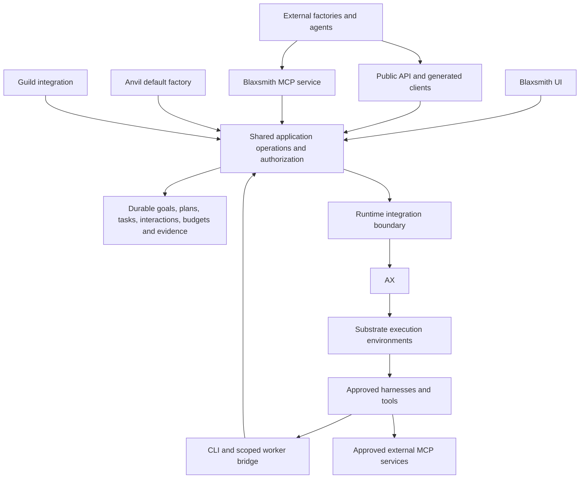

[PRD]

Implementation and qualification status: [implementation ledger](implementation-status.md). Unchecked acceptance criteria are not a completion claim.


> Design correction (2026-09-26): this is a new platform, with no legacy compatibility requirement. One factory-neutral recipe contract is implemented; Guild validation is explicit integration behavior. The implementation contract in [docs/git-recipes.md](../docs/git-recipes.md) supersedes earlier compatibility-path language below. Anvil alone is the default seed; the remaining API/MCP and full factory roadmap is not marked complete by this separation.

# Blaxsmith: independent platform, AX compatibility, and factory integration

**Status:** proposed implementation plan grounded in source review; not a claim of completed implementation or runtime qualification.

**Prepared:** September 26, 2026.

**Companion:** [Anvil native software factory plan](prd-anvil-software-factory.md).

**Purpose:** establish Blaxsmith as the shared, factory-agnostic platform with robust APIs, MCP access, agent integration, durable execution, and documented contracts. Ship Anvil as the default factory. Allow Guild and other factories to integrate without depending on Anvil or becoming dependencies of the platform core.

**Execution decision:** AX remains the chosen execution engine, with Substrate providing the underlying execution environment. This plan does not propose building a second execution engine or an arbitrary multi-engine abstraction.

## Navigation

- [1. Decisions and scope](#1-decisions-and-scope)
- [2. Ownership and architecture](#2-ownership-and-architecture)
- [3. Source baseline and current gaps](#3-source-baseline-and-current-gaps)
- [4. AX compatibility and upgrade plan](#4-ax-compatibility-and-upgrade-plan)
- [5. Lessons from other platforms and protocols](#5-lessons-from-other-platforms-and-protocols)
- [6. Shared resource and operation contracts](#6-shared-resource-and-operation-contracts)
- [7. Public API reliability and machine access](#7-public-api-reliability-and-machine-access)
- [8. MCP and agent-facing integration](#8-mcp-and-agent-facing-integration)
- [9. Factory integration modes and lifecycle](#9-factory-integration-modes-and-lifecycle)
- [10. Anvil and Guild integration](#10-anvil-and-guild-integration)
- [11. Documentation and developer experience](#11-documentation-and-developer-experience)
- [12. Functional requirements](#12-functional-requirements)
- [13. Implementation phases and tasks](#13-implementation-phases-and-tasks)
- [14. Qualification and failure scenarios](#14-qualification-and-failure-scenarios)
- [15. Release sequencing and relationship to Anvil](#15-release-sequencing-and-relationship-to-anvil)
- [16. Operations, metrics, and maintenance](#16-operations-metrics-and-maintenance)
- [17. Risks and remaining decisions](#17-risks-and-remaining-decisions)
- [18. Research and source references](#18-research-and-source-references)
- [19. Implementation handoff and release checklist](#19-implementation-handoff-and-release-checklist)

## 1. Decisions and scope

Blaxsmith should provide the durable engineering platform: projects, identities, permissions, connections, versioned inputs, goals, tasks, execution, interactions, resource controls, evidence, acceptance, and authorized delivery. A factory supplies a methodology for turning a desired outcome into work using those capabilities.

Anvil is the factory shipped by default. It supplies the native interview, planning experience, development workflow, model advice, and user-editable quality presets described in the companion plan. Guild is an optional integration. Other factories can be installed or operate as external clients through supported interfaces.

The architectural test is simple: removing Guild must not break Anvil; selecting another factory must not require invoking Anvil; and a manually authored task must be executable without pretending it came from either factory.

### 1.1 Confirmed product direction

1. Blaxsmith must be independent of Guild-specific formats, tags, validators, prompts, and runtime assumptions.
2. Anvil is the native default, not the only allowed factory.
3. AX remains the execution engine. Its details stay inside the runtime integration boundary.
4. APIs, MCP, CLI/worker bridges, and agent integrations must expose coherent platform behavior.
5. Factories need clear instructions and working examples for full integration.
6. Guild may require changes to use platform-managed interactions, delegation, lifecycle, and evidence fully.
7. Engineering gates are user-tunable. Off, advisory, and required are distinct throughout planning, execution, and acceptance.
8. Authorization, tenant isolation, secret handling, ownership fencing, and truthful evidence remain platform guarantees.
9. Brownfield understanding, greenfield creation, long goals, review, and E2E are supported through shared capabilities plus factory behavior, with clear ownership.
10. Compatibility must be demonstrated through source checks, tests, and runtime qualification; a manifest or documentation claim alone is insufficient.

### 1.2 What agnostic means

| Dimension | Required behavior | Explicit limit |
|---|---|---|
| Factory | Anvil, Guild, custom workflow, or external coordinator can use shared capabilities | Factories may expose different methodologies and supported settings |
| Harness | Supported coding harnesses integrate through explicit adapters/capabilities | No promise that every harness supports every feature |
| Model/provider | Explicit account, model, and effort selection from actual available capabilities | Provider limits, credentials, and metering remain provider-specific |
| Client | Browser, generated client, automation, CLI, and MCP use the same operations | Some administrative capabilities need not appear as agent tools |
| Project stack | Projects supply commands, environment needs, rules, and profiles | Stack-specific behavior belongs in profiles/factories, not core validation |
| Runtime | Public contracts avoid unnecessary AX implementation details | AX is the supported engine; a multi-engine plugin system is not required |

Avoid reducing every integration to the least capable common feature set. Expose a stable core and typed, versioned capabilities. A requested required capability must either work or be rejected before execution. Optional features may be omitted only with a visible compatibility result.

### 1.3 Scope exclusions

This plan does not require a new workflow framework, general-purpose plugin language, vector database, message broker, or mandatory agent swarm. It does not require adopting Temporal, LangGraph, or OpenHands as dependencies. Their design lessons are reference material.

It does not claim arbitrary factories can exchange all private state or be substituted mid-attempt. It does not grant automatic production merge/deploy authority. It does not make an external orchestrator's claims equivalent to platform-observed evidence.

All new schema names, operation names, JSON, and tool examples below are **proposed interfaces**, not assertions that these interfaces already exist. Existing integration points are linked separately.

## 2. Ownership and architecture



The shared operations layer is a responsibility, not a mandate to create a large new package or service. Extract concrete operations from existing services as needed so transports can supply an authenticated caller without duplicating authorization and domain logic. Reuse existing stores and transaction patterns.

### 2.1 Ownership matrix

| Concern | Blaxsmith platform | Factory | AX/runtime integration |
|---|---|---|---|
| Goal | Durable identity, scope, versions, status, ownership | Objective interpretation and next-work proposals | Executes admitted attempts |
| Interview | Questions, answers, actor attribution, persistence, delivery | Question selection, sequencing, recommendations | Runs analysis/planning attempts when needed |
| Plan | Version storage, reference integrity, dependency validation | Task decomposition, rationale, examples, methodology | Receives bounded executable assignments |
| Rules | Sources, scopes, authorized resolution, frozen provenance | Default conventions and engineering instructions | Materializes approved resolved inputs |
| Stack | Environment declarations and readiness observations | Stack recommendations and project-specific conventions | Prepares/runs approved environments |
| Quality | Gate modes, evidence facts, acceptance authority | Recommended checks and review rubric | Executes selected checks |
| Models | Account access, availability, execution binding, usage records | Advice and role-specific model preferences | Launches the chosen supported configuration |
| Delegation | Child admission, grants, budgets, ownership, cancellation | Which child task is useful and why | Isolated task execution |
| Recovery | Durable decisions, reconciliation, fencing | Replanning within delegated authority | Runtime readback, suspend/resume/termination |
| Knowledge | Scoped artifact storage, access, provenance, freshness metadata | Code understanding and knowledge synthesis | Approved inspection execution |
| Delivery | Revision binding, authorization, idempotent external action | Suggested summary and delivery intent | Executes only approved action where applicable |

A factory can recommend a check. Only the authorized policy determines whether it blocks acceptance. A factory can request a model or tool. Only platform grants determine whether it can use it.

### 2.2 One owner for each decision

Blaxsmith owns platform task admission, attempts, resource reservations, accepted platform state, and delivery authorization. A factory owns its next-step proposal and private methodology state within its declared integration mode.

If Guild internally retries a subagent in embedded mode, Blaxsmith sees activity within that one platform attempt unless explicitly reported otherwise. If Guild requests a platform-managed child, Blaxsmith owns that child's launch/retry/cancellation lifecycle. Guild must not independently launch a replacement for the same platform child after a response timeout.

Use ownership generations or equivalent existing fencing on mutable coordinator control. An external coordinator reconnecting after replacement cannot submit authoritative transitions as the old owner. Ownership is not established by including a run ID in a JSON body.

### 2.3 Native does not mean privileged

Anvil can ship built in and use direct in-process calls to shared operations for efficiency. It must obey the same validation, authorization, policy, budget, and evidence semantics as other factories. An external conformance client should be able to reproduce the relevant supported operations without accessing Anvil internals.

The platform need not expose every internal implementation detail. It must expose enough supported capability to complete an equivalent authorized workflow. Hidden shortcuts that are essential to Anvil's operation indicate a missing platform contract.

## 3. Source baseline and current gaps

The reviewed working tree includes substantial prior implementation and uncommitted changes. This document does not overwrite or reclassify those changes. Tests reported in earlier work are not substitutes for qualification of the new contracts proposed here.

| Area | Existing foundation | Gap or constraint |
|---|---|---|
| [API definitions](../proto/blaxsmith/api/v1/workflow.proto) | Typed workflow operations, launch key, review idempotency, event retrieval, interactions and evidence reads | Neutral goals/plans, external coordinator operations, capability discovery, complete lifecycle surface |
| [Workflow service](../cmd/blaxsmith/workflow_service.go) | Application service with tenant-aware stores and authorization checks | Inspected service uses `BrowserGuard`; machine clients need supported authentication without cookie reuse |
| [Identity guard](../internal/identity/browser.go) | Browser sessions, origin checks, CSRF protection | Machine/delegated identity path with equivalent domain authorization |
| [Recipe validation](../internal/recipe/recipe.go) | Bounded recipes, explicit profiles, stage dependencies | Required stage shape includes planning/review/verification/final reviews; cannot encode all user-selected native paths |
| [Freezing](../internal/recipe/freeze.go) | Committed inputs, digests, frozen extensions | Unconditional Guild validation and Guild-specific bundle field |
| [Extension manifest](../internal/extension/manifest.go) | Versioned declarations for stages, skills, agents, MCP, hooks and permissions | Declared mode/capability must be distinguished from actually runnable support |
| [Extension freeze](../internal/recipe/freeze.go) | Runtime checks against the selected extension | Current executable template path permits embedded Claude Code templates only |
| [Worker bridge](../internal/tooladapter/bx.go) | Questions, events, steering, artifact/gate commands | Platform-managed child delegation remains a planned contract rather than an implemented command here |
| [Workflow persistence](../internal/workflow) | Attempts, ownership, scheduling, corrections, acceptance and evidence | Goal ownership, external coordinator control, neutral plan versions and broader policy semantics |
| [AX bridge](../internal/axbridge) | Pinned CLI integration, readback, recovery, completion | New upstream task lifecycle and removed Gateway require migration |
| [AX overlays](../integrations/ax/README.md) | Security, networking, identity/bootstrap, resource and recovery adaptations | Each overlay needs re-evaluation against the new upstream revision |
| MCP | Approved extension MCP configuration inside workers | No product-level Blaxsmith MCP server was found in inspected code |
| Documentation | Architecture, runtime, extension and interaction guides | Some sections describe future contracts or older implementation state; integration instructions need executable examples |

The baseline supports an incremental separation. It does not justify claiming a complete external factory API, cross-harness extension parity, or fully independent native execution today.

### 3.1 Existing documents to reconcile

- [Platform architecture](../docs/platform-architecture.md): retain platform/runtime boundaries; update concrete runtime details when the AX migration is qualified.
- [Extensions and runtimes](../docs/extensions-and-runtimes.md): preserve useful manifests and embedded integration, clearly mark implemented versus proposed commands.
- [Interactive sessions](../docs/interactive-sessions.md): retain durable questions/steering, add goal ownership and machine-client semantics.
- [Tool adapter contract](../docs/tool-adapter-contract.md): reconcile version-specific runtime assumptions rather than copying stale claims into public SDK docs.
- [Anvil plan](prd-anvil-software-factory.md): this companion owns shared platform integration work; Anvil owns the native factory behavior built on it.

## 4. AX compatibility and upgrade plan

### 4.1 Observed revisions

At research time on September 26, 2026:

| Item | Revision |
|---|---|
| Blaxsmith documented supported upstream AX | `f009cc81c9a571073bc1dd58cd2ed934bf2d5b1c` |
| AX upstream `main` observed through remote/API read | `d0bc38bcf90bb2ad9c012ff1be9d68ff05347ba9` |
| Observed difference | 13 commits ahead |
| Latest observed commit timestamp | September 26, 2026, 04:44:39 UTC |

These values are a dated baseline, not a moving `latest` dependency. Re-read the remote and choose an explicit target before implementation. Keep the currently qualified runtime available until replacement qualification is complete.

**Local alignment completed during planning:** the clean `../reference/ax` checkout was fast-forwarded from `f009cc8` to `d0bc38b` with `git pull --ff-only origin main`. Its `HEAD` matches the fetched `origin/main`, and the working tree remains clean. The API, server, workspace setup and lifecycle source diff was then inspected locally. No Blaxsmith runtime pin, overlay, image or deployment was upgraded by that reference pull.

The current [AX build script](../integrations/ax/build.sh) intentionally requires the old supported commit as its input checkout. It will reject the newly updated reference checkout until migration is qualified. To rebuild the old supported runtime meanwhile, supply a separate clean checkout/worktree at `f009cc81c9a571073bc1dd58cd2ed934bf2d5b1c`; do not bypass the version guard or reset the updated reference casually.

### 4.2 Material changes

| Upstream change | Affected Blaxsmith behavior | Required migration work |
|---|---|---|
| Gateway resource removed | Gateway creation/readback, egress translation, cleanup, admission assumptions | Map network intent to supported Substrate/runtime enforcement and preserve deny-all behavior |
| `UpdateTask` replaced with `CreateTask`; immutable tasks | Launch retries, existing-task reconciliation, attempt replacement | Create once; compare existing immutable launch inputs; replace only through a new authorized attempt |
| New tasks suspended; explicit lifecycle operations | Bootstrap, launch sequencing, recovery, readiness | Separate creation from resume; confirm required policy/bootstrap state before execution |
| Inline workspace files | Instruction/task artifact materialization | Evaluate as a bounded, digest-checked transport for non-secret frozen inputs |
| Protobuf field numbers changed in `TaskSpec` and `WorkspaceSpec` | Generated clients, mixed-version services and any serialized protobuf state | Treat the target as wire-incompatible; inventory storage encoding, regenerate against the target and define a coordinated upgrade path |
| Resource names validated as RFC 1123 labels | Generated task/workspace/model names | Validate and map identifiers deterministically before dispatch |
| Skip reconcile while deleting | Deletion/recovery races | Retest termination and late-create behavior; do not assume all tombstone needs disappear |

The [comparison](https://github.com/google/ax/compare/f009cc81c9a571073bc1dd58cd2ed934bf2d5b1c...d0bc38bcf90bb2ad9c012ff1be9d68ff05347ba9) and [versioned API schema](https://github.com/google/ax/blob/d0bc38bcf90bb2ad9c012ff1be9d68ff05347ba9/pkg/apis/v1alpha1/ax.proto) are the source references. A few changes are conveniences; task immutability and networking are compatibility boundaries.

### 4.3 Migration invariants

1. Removing an upstream abstraction must not remove its security effect. Required egress policy must be enforceable and observed before launch.
2. No raw Git/model credentials are placed in task metadata, inline workspace files, factory manifests, events, or exported examples.
3. Creation is not execution, runtime readiness is not task success, and command success is not acceptance.
4. A lost response is an uncertain outcome requiring readback/reconciliation, not permission to repeat a side effect blindly.
5. A task whose immutable inputs differ from the requested attempt cannot be adopted merely because its name matches.
6. A cancelled or deleted attempt must not be recreated by a delayed launch or resume request.
7. Existing ownership, bootstrap, credential release, and stale-result fences remain in force until an equivalent mechanism is proven.
8. Workspaces and other referenced resources that remain mutable upstream must still be pinned or checked against frozen launch intent. Immutable tasks alone do not freeze their dependencies.
9. The reviewed schema renumbers existing fields; keeping the same `v1alpha1` package label does not imply wire compatibility. Old and new clients/servers must not be mixed without a tested translation or compatibility boundary.
10. The reviewed inline-file writer accepts absolute destinations and logs/continues on directory or write errors. Before using it for mandatory frozen inputs, enforce intended path containment, account for symlinks/collisions, verify exact materialized bytes, and fail launch if required inputs are missing or wrong. Do not expose raw upstream file destinations as unrestricted factory input.

The inspected `CreateTask` implementation checks for an existing task before saving. Qualification must include concurrent duplicate creates and late-create/delete races against the actual store; the API's immutability intent alone is not evidence of atomic create-if-absent behavior.

### 4.4 Overlay audit

For every patch in the current integration inventory, record: purpose, affected upstream symbols, overlapping upstream change, target treatment, remaining invariant, tests, and live proof. Use one of `retain`, `port`, `replace with upstream`, or `retire with evidence`.

Prioritize bootstrap phase separation, secret custody, egress enforcement, signed completion/readback, deletion/tombstones, consumer ownership, Redis transport, resources, and provider-specific credential handling. Do not resolve a patch conflict by dropping its behavior because the build passes afterward.

The existing pinned CLI may remain the runtime transport during migration. A direct AX API client is useful only if it reduces concrete error-handling or lifecycle ambiguity. Do not combine a transport rewrite with a security-sensitive upstream migration without a clear need and separate qualification.

### 4.5 Runtime capability report

The runtime adapter should report qualified capabilities, such as immutable creation, suspend/resume semantics, workspace input support, enforced network controls, supported resource classes, and completion evidence. Include upstream revision, overlay/build identity, and probe status for operators.

Factory clients receive product-level capability outcomes rather than needing to understand AX protobuf internals. If a factory requests a network restriction that the selected runtime cannot enforce, reject the request or require an explicit supported alternative; never downgrade silently.

Upstream roadmap items such as task identity, telemetry, setup actors, and branching remain roadmap items until source and runtime tests establish support. [AX roadmap](https://raw.githubusercontent.com/google/ax/main/docs/roadmap.md)

## 5. Lessons from other platforms and protocols

| Source | Observed pattern | Blaxsmith design implication |
|---|---|---|
| [OpenHands architecture](https://docs.openhands.dev/sdk/arch/overview) | Agent behavior, remote agent server, and consuming applications have explicit boundaries | Keep factories and client applications above supported platform operations |
| [LangGraph persistence](https://docs.langchain.com/oss/python/langgraph/persistence) | Execution checkpoints and cross-thread stores have different responsibilities | Separate recovery state from shared project knowledge and preferences |
| [Temporal execution](https://docs.temporal.io/workflow-execution) | Workflow identity, execution history, messages, and recovery are explicit | Define durable transitions and side-effect reconciliation; do not equate a process with a goal |
| [MCP specification](https://modelcontextprotocol.io/specification/2026-07-28) | Tools, resources, prompts, and negotiated extensions expose capabilities to clients | Add an MCP projection over shared operations, with explicit compatibility |
| [ACP overview](https://agentclientprotocol.com/protocol/v1/overview) | Client/agent sessions, updates, permissions, cancellation, and optional resume | Use an adapter for a concrete compatible coding agent; preserve capability differences |
| [A2A specification](https://a2a-protocol.org/latest/specification/) | Agent discovery and task-oriented communication across services | Consider external delegation when needed, without replacing internal authority/state |

These sources motivate separation and explicit contracts. They do not demonstrate that importing a library will solve Blaxsmith's recovery, security, or product semantics. Start with the existing code and the smallest missing capability.

### 5.1 Protocol roles must remain distinct

The public Blaxsmith API is the complete supported product automation interface. MCP offers agent-oriented tools and context over selected shared operations. ACP is a possible harness-control adapter. A2A is a possible remote-agent delegation adapter. The worker bridge is an attempt-scoped channel from a sandbox back to the platform.

All of them need stable IDs and compatible status meaning. They do not need identical transport envelopes or an artificial one-to-one mapping of every operation. A protocol's optional task support should not become a prerequisite for durable Blaxsmith work.

## 6. Shared resource and operation contracts

### 6.1 Core resources

| Resource | Minimum responsibility | Important invariant |
|---|---|---|
| Project | Repository/source configuration, defaults, grants and scope | Tenant/project membership is enforced on every access |
| Factory installation/version | Source, declared capabilities, approved permissions and compatibility | Version identity and content are immutable |
| Goal | Desired outcome, ownership, current plan/policy, progress across runs | Goal state survives factory process and attempt replacement |
| Plan version | Requirements, tasks, dependencies, selected artifacts, factory provenance | Historical versions do not change in place |
| Policy version | Gate modes, acceptance authority, resource/autonomy choices | Lower-authority inputs cannot relax locked policy |
| Task | Bounded work, requirements, dependencies, outputs and scope | A factory proposal is validated before admission |
| Run/attempt | Frozen selection and one execution of work | Candidate/runtime ownership is fenced |
| Interaction | Question, answer, decision request or steering record | Actor identity and answer version are attributable |
| Operation | Status of an asynchronous API action | Connection lifetime is independent of operation lifetime |
| Artifact/evidence | Content reference, provenance, revision and observation | A reported claim and trusted check result remain distinguishable |
| Acceptance | Authorized decision for revision, scope and policy | Cannot approve a different candidate through stale state |
| Usage/reservation | Account-specific resource estimates and observed settlement | Retries do not double count or reserve the same capacity twice |

Reuse existing run/attempt/evidence records. Add only missing goal/plan/operation semantics. A named resource in this table does not automatically require a new table if an existing durable representation already has the right contract.

### 6.2 Neutral task envelope

```json
{
  "schema": "blaxsmith.task/v1-proposed",
  "goal_id": "goal_example",
  "plan_version": "plan_3",
  "task_id": "task_7",
  "factory": {"id": "anvil", "version": "1.0.0"},
  "title": "Implement the approved behavior",
  "requirement_ids": ["REQ-12"],
  "depends_on": ["task_6"],
  "source": {"revision": "COMMIT_ID", "scope": ["approved/path"]},
  "inputs": [
    {"artifact_id": "artifact_assignment", "sha256": "CONTENT_DIGEST"}
  ],
  "policy_version": "policy_4",
  "execution": {
    "harness": "qualified-harness-id",
    "model_selection_id": "selection_2",
    "runtime_profile_id": "runtime_1"
  },
  "required_capabilities": ["repository.scoped_write", "interactions.ask"],
  "outputs": ["candidate_revision", "handoff", "evidence_references"]
}
```

The platform validates structure, permissions, references, bounds, and execution feasibility. The factory validates its own interview/specification methodology before submitting this envelope. Native input validity must not depend on Guild transcripts. Guild's private validators may run inside its integration boundary under appropriate isolation.

Opaque factory metadata may be stored in a bounded namespace for round trips, but it must not change platform authority or acceptance semantics. Reject unsupported required semantics rather than hiding them inside an opaque blob.

### 6.3 Operation catalog

Proposed operation groups:

| Group | Representative operations | Access considerations |
|---|---|---|
| Capabilities | Describe platform, factory, runtime, account and project capabilities | Filter discovery by caller; availability is not authorization |
| Goals/plans | Create goal, publish plan version, inspect/change current version | Scope changes need current-version checks and delegated authority |
| Execution | Validate launch, launch work, inspect attempt, request pause/cancel/resume | Idempotent mutations; asynchronous status where appropriate |
| Delegation | Request child task, inspect child, collect outputs | Parent scope, depth/concurrency limits, explicit ownership |
| Interactions | Ask, list pending, answer, steer | An agent cannot impersonate a human decision-maker |
| Artifacts | Register/upload/finalize content, read authorized evidence | Size, digest, path, tenant, retention and secret controls |
| Evaluation | Submit observation, publish review, request evaluation, inspect eligibility | Declared evidence provenance and selected policy |
| Acceptance/delivery | Accept candidate, request changes, request authorized delivery | Separate scope/authority from producing code |
| Resources | Inspect reservation, report usage, request escalation | Estimates versus actuals and provider freshness |

Choose final RPC names after examining current services. Preserve existing useful operations rather than renaming everything for uniformity.

### 6.4 Validation before launch

A launch preview resolves versions and returns selected capabilities, effective permissions, gate modes, environment prerequisites, resource estimate, and blockers. A preview is not an authorization token or a promise that availability will remain unchanged.

At launch, recheck authority and mutable prerequisites, freeze the approved inputs, atomically reserve/admit the work, and return the durable identity. If policy or source version changed, report the conflict; do not silently use a materially different configuration from the reviewed preview.

Planning and analysis are also work. They can start from a brief plus bounded planning permissions and budget without requiring a finished implementation plan. Their inputs and usage are recorded against the goal.

### 6.5 User-tunable evaluation

The neutral graph does not require a planner, architect review, human review, or E2E stage for every task. Those are factory recommendations or selected policy conditions. Historical recipes retain their old semantics under their version.

Gate facts and policy remain separate:

```json
{
  "check_id": "browser-critical-journey",
  "mode": "advisory",
  "observation": "failed",
  "candidate_revision": "COMMIT_ID",
  "evidence_ids": ["evidence_8"],
  "acceptance_effect": "does_not_block_by_itself"
}
```

Changing required to off creates a new policy version and preserves the old failure. Required unavailable checks remain unsatisfied. Platform security and honest reporting cannot be disabled through a quality preset.

## 7. Public API reliability and machine access

### 7.1 Shared application operations

Continue using protobuf/Connect as the existing typed contract foundation. Expose documented supported HTTP usage and generated clients where appropriate. Add a separate REST facade only if a concrete client needs it; do not maintain duplicated business logic or independent schemas.

Browser requests retain cookie/origin/CSRF protections. Machine requests use a deliberately supported authentication path. Both resolve to an authenticated caller and invoke the same domain authorization. Never fix machine access by weakening the browser guard or allowing arbitrary caller IDs from request bodies.

### 7.2 Identity types

Support delegated user clients and service principals as distinct actor types. A factory executing inside a worker uses an attempt-scoped identity or the existing trusted worker bridge, not an organization administrator's credential.

Authorization evaluates tenant/project access, operation permission, resource grants, factory installation rights, selected billing account, and relevant run/attempt scope. Scope strings are not a replacement for object-level authorization. Effective permission is the intersection of all applicable bounds.

Credentials need expiration, revocation, rotation and audit attribution. A child identity cannot gain capabilities that its parent could not delegate. Reading a goal should not imply launching work, reading secrets, changing gates, approving work, or spending on another account.

Revoking a credential stops future API authority promptly. Existing runs follow the documented revocation/cancellation policy; token expiry must not be confused with proof that a process stopped. Critical revocation may request termination, with confirmation tracked separately.

### 7.3 Idempotency and optimistic concurrency

Mutations that can create work, charge/reserve resources, publish evidence, or perform delivery need idempotency scoped to caller/tenant and operation. Repeating the same key and equivalent payload returns the same durable outcome. Reusing a key with different material input returns a conflict.

Mutable selections and policy changes require an expected version or equivalent compare-and-set. Concurrent edits must not silently overwrite one another. Persist the decision and its causal version before performing dependent side effects, or use a recoverable recorded intent.

For an uncertain external outcome, reconcile using the durable operation/resource identity. Do not promise exactly-once side effects when the provider cannot support them. State the actual guarantee: deduplicated admission plus reconciliation, with explicit unknown outcomes where necessary.

### 7.4 Asynchronous operation semantics

An API call accepting a cancellation request returns a request/operation status, not proof of termination. Suggested operation states are `pending`, `running`, `succeeded`, `failed`, and `cancelled`, with an explicit target-resource reference and result/error.

The underlying task may still be stopping after a request is accepted. A client can reconnect and inspect the operation. Cancelling a status request or closing an MCP session does not implicitly cancel the goal. Explicit operation cancellation and target work cancellation must be distinguishable.

Avoid adding an operation record around every fast read. Use it for actions whose durable completion meaning exceeds the transport request.

### 7.5 Events and subscriptions

Reuse current event retrieval and live-update mechanisms. Specify event ID, sequence/cursor scope, resource ID, event type/version, time, actor, correlation ID, and bounded payload. Preserve actor-reported versus platform-observed provenance.

Document ordering per stream; do not imply a global total order unless one exists. Clients deduplicate by event ID and resume from a cursor. If retention has removed their cursor, return an explicit gap/resnapshot requirement. A snapshot plus a defined continuation cursor avoids missing events during reconnect.

Streaming is a delivery optimization. Durable state and event retrieval remain usable by clients without streaming. Signed webhooks can be added for a concrete external coordinator use case; they need replay protection, delivery IDs, bounded retries, and safe destination handling. A new broker is not a prerequisite.

### 7.6 Structured errors

Errors should preserve the existing transport code and add machine-actionable detail: reason, field/resource reference, retryability, current version where authorized, and corrective action.

Examples: `CAPABILITY_UNSUPPORTED`, `POLICY_CONFLICT`, `SOURCE_CHANGED`, `RESOURCE_LIMIT_REACHED`, `MODEL_UNAVAILABLE`, `OWNERSHIP_STALE`, `EVIDENCE_STALE`, `PREREQUISITE_MISSING`, and `OUTCOME_UNKNOWN`. Final names should fit current error conventions.

Do not leak cross-tenant resource existence or secret values in diagnostics. Distinguish a transient failure from a request that requires user action; a generic “try again” can cause waste or duplicated work.

### 7.7 Compatibility and limits

Version schemas independently where their lifecycle requires it: API, events, factory manifest, neutral plan/task envelope, and worker bridge. Publish supported combinations and deprecation policy. Additive evolution is preferred; incompatible changes need explicit negotiation or a new version.

Bound payloads, artifacts, task count per run, fan-out depth, concurrent workers, queued interactions, polling, and rate limits. Long goals use bounded runs. Limits should be inspectable and return useful errors rather than fail unpredictably inside a harness.

## 8. MCP and agent-facing integration

### 8.1 Inbound Blaxsmith MCP service

Expose Blaxsmith as a server for external agents. Suggested initial tools are capability discovery, project/goal reads, create goal, publish/validate plan, launch authorized work, inspect operation/status, answer an authorized interaction, steer, cancel, and read evidence references.

Tool names and descriptions should explain effects and limits. A tool that launches billable execution must say so. A tool that records acceptance must identify the required authority and exact revision/policy binding. Do not expose a generic “execute arbitrary backend method” tool.

Resources can provide goal summaries, plans, effective rules, capabilities, and evidence. Prompts or skills can teach normal workflows. All resources and tools still enforce tenant/project permissions. Discovery cannot reveal a secret-bearing inventory or grant access merely because a client can list a tool.

### 8.2 Long operations and client differences

The MCP specification observed during research is dated July 28, 2026, and identifies an optional Tasks extension. Pin the chosen protocol/SDK versions at implementation time and test actual clients. Use negotiated task support where available; otherwise return durable Blaxsmith operation IDs with status/result tools. [MCP specification](https://modelcontextprotocol.io/specification/2026-07-28), [Tasks extension](https://modelcontextprotocol.io/extensions/tasks/overview)

Support user questions through durable platform interactions. A capable MCP client may render an elicitation flow; other clients can inspect pending questions and submit authorized answers. Never assume every MCP host supports the same UI, resources, prompts, or extension set.

### 8.3 MCP authorization

For protected remote HTTP access, follow the selected MCP authorization specification, including appropriate discovery and token audience validation. Reuse a suitable existing identity component/provider where possible; do not write a new OAuth server casually.

Tokens for a model provider or another MCP server are not valid Blaxsmith credentials. The server must not accept or transit unrelated tokens. Local stdio clients have a different credential-delivery model and still resolve to a scoped platform identity. [MCP authorization](https://modelcontextprotocol.io/specification/2026-07-28/basic/authorization)

Token consent and scope selection must fit the user's previously granted authority. Routine authorized agent operations should not require repetitive confirmation merely because they use MCP. Higher-impact operations outside the grant require an explicit decision at the appropriate boundary.

### 8.4 Outbound MCP access from workers

Workers may connect to approved MCP services through declared runtime configuration. Track endpoint/tool capability, origin/version where available, credentials, egress, and permission scope. Separate server discovery from approval to execute its tools.

Extension installation may declare required and optional servers. If a required server is unsupported or unavailable, fail preflight clearly. If an optional server is omitted, expose the reduced capability. Do not silently claim a verification stream ran when its tool was unavailable.

Treat server descriptions and tool results as untrusted content for authority purposes. Tools cannot grant their own permissions or override the selected policy. Apply bounded output handling and preserve provenance when results are used as evidence or future context.

### 8.5 Worker bridge, ACP, and A2A

Extend the existing `bx` bridge incrementally. Preserve file/event durability and current attempt binding; add platform-managed delegation only after child ownership, budgets, cancellation, and evidence contracts exist. Examples in old documentation are not proof that a command is implemented.

For ACP, qualify one concrete compatible harness and its advertised session, cancellation, interaction, and resume behavior. Retain direct adapters where ACP cannot represent required behavior. For A2A, begin with an actual remote specialist integration if demand exists; map remote task/artifact identities to platform evidence without treating remote status as trusted local acceptance.

ACP and A2A implementation tasks are conditional on a named integration. API and MCP are explicit platform deliverables in this plan.

## 9. Factory integration modes and lifecycle

### 9.1 Three modes

| Mode | Execution owner | State and visibility | Best initial use |
|---|---|---|---|
| Embedded | Blaxsmith owns one attempt; factory owns internal steps | One sandbox with reported internal progress and exported artifacts | Existing Guild compatibility |
| Platform-managed | Blaxsmith owns task/attempt scheduling; factory proposes work | Per-task isolation, lifecycle, usage, evidence and recovery | Anvil; adapted Guild stages/delegation |
| External coordinator | Factory proposes through authenticated API; Blaxsmith owns admitted execution | Durable platform state plus bounded external methodology state | Organization-specific factories and remote agents |

External coordinator is a deployment/control mode, not permission to access AX directly. It may submit a bounded graph or request children within its delegation grant. Use one owner token/generation for authoritative coordinator changes and reconcile after disconnection.

### 9.2 Factory manifest and compatibility report

Extend the existing extension contract only where required, or define a small related descriptor if execution modes need a separate resource. Decide from concrete Anvil/Guild/client fixtures rather than creating a universal plugin specification.

```yaml
schema: blaxsmith.factory/v1-proposed
id: example-factory
version: 1.0.0
platform_api: supported-version-range
modes: [platform-managed]
required_capabilities:
  - interactions.ask
  - tasks.submit
  - artifacts.publish
optional_capabilities:
  - tasks.children
  - checks.browser
supported_harnesses: [qualified-harness-id]
configuration_schema: config-schema.json
artifacts:
  task_input: blaxsmith.task/v1-proposed
  handoff: blaxsmith.handoff/v1-proposed
quality_controls:
  independent_review: [off, advisory, required]
  browser_checks: [off, advisory, required]
requested_permissions:
  - project.read
  - work.propose
  - evidence.publish
```

A manifest describes compatibility and requests permission. Installation approval and per-project/run grants establish actual authority. A factory's claim that it supports a capability must be backed by conformance evidence for its qualified version.

### 9.3 Lifecycle

1. Install or register a version from a known source; record immutable content identity.
2. Validate schema, paths, compatibility and declared permissions without executing extension code in the control plane.
3. Review/approve installation and grant use to the appropriate project/principals.
4. Resolve selected configuration, quality policy, model/account choices and environment needs.
5. Freeze exact inputs and factory version for a run or attempt.
6. Execute through supported operations and report structured progress/artifacts.
7. Evaluate evidence against the selected policy and authority.
8. Upgrade by installing a new version; existing runs retain their pinned version.
9. Disable new admissions or revoke grants with documented treatment of active work.

Preserve original factory artifacts for audit and debugging. Store normalized platform references beside them. Do not make the platform parse arbitrary factory logs to recover authoritative task state.

### 9.4 Portable handoffs

A handoff includes originating task/attempt, source and candidate revisions, requirement IDs, selected policy, outputs with digests, observed checks, unresolved findings, assumptions, and next-step expectations. It distinguishes successful delivery of an artifact from acceptance of the software.

Example: Anvil plans and implements a feature, a Guild integration reviews the candidate, and a browser specialist validates a selected journey. Each task declares compatible input/output schemas and acts within its grant. The reviewer does not inherit implementation write authority automatically; the browser specialist does not inherit merge authority.

Private methodology state can remain private to its factory. Anvil need not understand Foundry's internal ledger to consume a normalized review finding. If required meaning cannot be represented without loss, reject or propose an explicit adapter; never silently discard it.

### 9.5 Quality settings across factories

The platform presents the effective capabilities of the selected factory. A Guild version that always runs an internal review cannot honestly advertise that internal review as disableable. The UI can explain its fixed behavior and offer another compatible configuration/factory.

Blaxsmith's selected acceptance policy remains authoritative for platform acceptance. A factory may have stricter internal behavior, but must disclose it before launch because it affects time and cost. A factory may not secretly weaken platform-required conditions.

## 10. Anvil and Guild integration

### 10.1 Anvil

Anvil should consume shared goal, plan, interaction, task, policy, usage, artifact and acceptance operations. Its native schema validator checks native planning content; the shared compiler checks neutral execution structure and feasibility. Keep these responsibilities separate even if they initially share a package.

Default installation can be built in. Version its effective prompts, rules, agent definitions and compiler behavior so a run remains explainable after an application upgrade. Test with Guild completely unavailable to the native path.

### 10.2 Guild baseline and scope of knowledge

The local reference inspected during the research was commit `dda6154`, dated September 13, 2026. The public repository page was not available through the research fetch. This plan does not claim that local reference is current upstream Guild.

That reference uses Claude Code plugins, `AskUserQuestion`, Claude delegation/team instructions, and Foundry's own state, transitions, evidence and MCP machinery. Its integration is more than renaming a command. Reinspect the intended Guild version before implementing modifications.

### 10.3 Guild adaptation matrix

| Existing concern | Embedded compatibility | Fuller platform integration |
|---|---|---|
| Forge questions | Map to durable `bx` interactions | Native interaction IDs, answer attribution and resumable rounds |
| Foundry progress | Existing observed signals where supported | Direct structured events with stable task/phase IDs |
| Internal subagents | Remain within the one sandbox; disclose visibility/isolation limits | Request platform-managed children with bounded delegated authority |
| Internal state/ledger | Preserve and publish relevant artifacts | Link internal IDs to goal/task/attempt IDs and recover from platform state |
| Internal gates | Record reported results with correct provenance | Publish evidence against selected platform policy without self-acceptance |
| Usage | Report known internal consumption and unknown coverage | Per-child observed usage and shared budget admission |
| Stop/retry | Stop the enclosing attempt and reconcile its result | Honor platform ownership, cancellation, retry and stale-result fencing |
| Model/harness assumptions | Declare Claude-specific requirements | Adapt only supported semantics; do not advertise cross-harness parity prematurely |

Start with an adapter/bridge where it preserves semantics. Change Guild internals only where direct reporting, delegation or lifecycle behavior cannot be reliably provided at the boundary. Preserve standalone Guild use where practical. Changes to the Guild repository are a separate implementation scope, not authorized by writing this plan.

### 10.4 Three independence proofs

1. **Anvil proof:** create/interview/plan/execute/evaluate a native goal with Guild unavailable.
2. **Integration proof:** an optional factory can submit and complete supported work without invoking Anvil's planner or private services.
3. **Neutral proof:** a small manually authored or external-client task can run under a user-selected minimal policy without either methodology.

Add a cross-factory handoff proof after these basics. Two factories merely appearing in a selector is not evidence of agnosticism.

## 11. Documentation and developer experience

### 11.1 Integration guide deliverables

| Guide | Must answer | Runnable evidence |
|---|---|---|
| Architecture/ownership | What does the factory own versus Blaxsmith/AX? | Resource and lifecycle walkthrough |
| Quickstart | How does an authorized client submit one bounded task? | Small example against a disposable environment |
| Authentication | How do delegated users, service principals and workers authenticate? | Scope/expiration/revocation examples with dummy credentials |
| API reference | What are the messages, errors, versions, limits and async semantics? | Generated contract docs and client calls |
| Events/recovery | How does a client reconnect and handle uncertain outcomes? | Disconnect/replay/idempotency example |
| MCP | What tools/resources exist and what clients support them? | Supported-client smoke tests and inspector checks |
| Factory authoring | How are inputs, permissions, checks, artifacts and compatibility declared? | Minimal factory fixture |
| Guild migration | Which assumptions map directly and which need changes? | Version-specific adaptation checklist |
| Agent instructions | How should an agent plan, call tools, wait, recover and report results? | Concise versioned guide exercised by a fresh client |
| Operations | How are versions upgraded, revoked, observed and recovered? | Fault/rollback runbook |

Use the fewest useful documentation files. Generate schema/reference material from the existing source where possible. A short `llms.txt` index can point agents at versioned guides; it is not an authority mechanism. Provide copyable instructions and examples without requiring an agent to ingest the entire architecture document.

### 11.2 Example agent instructions

```text
1. Discover the project's supported capabilities and your effective permissions.
2. Read the current goal/plan/policy versions before proposing changes.
3. Validate bounded work and resolve material blockers before launch.
4. Use an idempotency key for each logical mutation; retain returned IDs.
5. Inspect durable status after timeout or reconnect before retrying.
6. Submit evidence with candidate identity and provenance; do not invent passes.
7. Ask through durable interactions when a decision exceeds your authority.
8. Honor cancellation and ownership changes; do not launch replacement work yourself.
9. Report implemented, evaluated, accepted and delivered as separate facts.
```

These instructions help an agent behave correctly. Server-side enforcement remains necessary if the agent ignores them. No prompt grants authority.

### 11.3 SDK strategy

Start with existing generated Go and TypeScript clients plus documented HTTP examples. Guild's Python integration can use a small supported client or generated binding if the underlying tooling supports it cleanly. Add convenience helpers for repeated real flows, not a second orchestration framework hidden in an SDK.

Test examples against the server and publish the compatible API version. A stale SDK that silently drops required fields is a compatibility failure. Keep transport retries conservative for mutations; idempotency belongs in the contract, not optimistic client guessing.

## 12. Functional requirements

| ID | Requirement | Primary phase |
|---|---|---|
| BXP-FR-01 | Core runs without Guild or Anvil-specific required formats | P01 |
| BXP-FR-02 | AX upgrades preserve runtime/security semantics with explicit qualification | P02 |
| BXP-FR-03 | Shared operations enforce equivalent behavior across clients | P03 |
| BXP-FR-04 | Delegated and machine identities support bounded integration access | P04 |
| BXP-FR-05 | API mutations, events and long operations are recoverable and versioned | P05 |
| BXP-FR-06 | Inbound MCP exposes useful authorized platform operations | P06 |
| BXP-FR-07 | Outbound tool/harness integrations negotiate real capabilities | P07 |
| BXP-FR-08 | Embedded, platform-managed and external factories have explicit ownership | P08 |
| BXP-FR-09 | Gate depth is user-selected with truthful evidence/acceptance | P01, P03, P08 |
| BXP-FR-10 | Anvil and Guild use shared integration contracts | P09 |
| BXP-FR-11 | Compatible factories exchange explicit versioned handoffs | P09 |
| BXP-FR-12 | Integrators receive tested docs, examples and agent instructions | P10 |
| BXP-FR-13 | Failure/recovery, permissions and cross-client parity are qualified | P11 |
| BXP-FR-14 | Usage, budgets and escalation apply across integration modes | P03, P08 |
| BXP-FR-15 | Capability/version discovery distinguishes supported from planned features | P03, P07 |
| BXP-FR-16 | Rollout preserves historical artifacts, runs and optional integrations | P01, P11 |

## 13. Implementation phases and tasks

All tasks are planned. Each task names dependencies and independently verifiable outcomes. Existing paths are integration points, not permission to rewrite entire packages. Split a task before dispatch if its concrete implementation exceeds a focused session; preserve requirement links and behavioral boundaries.

The roadmap contains 12 phases and 48 tasks. Work that depends on an optional protocol integration is explicitly conditional. Core API, MCP, native independence, and documented factory integration are required deliverables.

### Phase P00 — Freeze the baseline and ownership decisions

**Outcome:** a source-verified map of coupling, contracts, supported behavior and runtime versions.

**Reason:** separate existing implementations from proposed behavior before modifying security-sensitive execution paths.

**Exit:** fixtures and an ownership matrix make the separation reviewable.

#### BXP-P00-T01 — Trace the platform-to-runtime flow

**Story:** As an implementer, I need to know where each decision is currently made.

**Dependencies:** none.

**Work:** Trace browser/API entry, identity, recipe validation/freezing, dispatch, AX launch, worker bridge, evidence, acceptance and recovery. Inspect callers of shared functions. Record source locations, current limits and local/deployed qualification distinctions. Start in `cmd/blaxsmith`, `internal/recipe`, `internal/workflow`, `internal/dispatch`, and `internal/axbridge`.

**Acceptance criteria:**

- [ ] The trace identifies Guild-specific fields/validation and fixed stage assumptions.
- [ ] Browser-bound service entry points and reusable domain operations are named.
- [ ] Proposed commands in documentation are distinguished from implemented commands.
- [ ] No deployed or live-provider support is inferred merely from code presence.

#### BXP-P00-T02 — Record AX target and overlay decisions

**Story:** As a maintainer, I need an explicit upgrade target and preserved invariants.

**Dependencies:** BXP-P00-T01.

**Work:** Refresh upstream metadata, select a review target, and compare it with the supported pin. Inventory all current overlays and assign provisional retain/port/replace/retire treatment. Record networking, immutable lifecycle and workspace-reference implications. Do not update the supported pin yet.

**Acceptance criteria:**

- [ ] The chosen target is an exact commit with source references and retrieval date.
- [ ] Every current overlay has an owner/invariant and proposed treatment.
- [ ] Gateway removal and create/resume changes have named migration requirements.
- [ ] Unimplemented upstream roadmap items are excluded from capability claims.

#### BXP-P00-T03 — Define core and factory ownership contracts

**Story:** As a factory author, I know which operations I may request and which decisions the platform owns.

**Dependencies:** BXP-P00-T01.

**Work:** Ratify neutral task/plan, policy, interaction, handoff and capability boundaries using a small Anvil fixture, Guild example and manually authored task. Specify coordinator ownership and reported-versus-observed results. Reuse current resource identities where semantics fit.

**Acceptance criteria:**

- [ ] Every execution/retry/acceptance decision has one authoritative owner.
- [ ] Native tasks require no Guild tags or documents.
- [ ] A third-party factory can use shared capabilities without Anvil private state.
- [ ] MVP gate selection is valid without a hidden mandatory review path.

#### BXP-P00-T04 — Establish contract and failure fixtures

**Story:** As a developer, I can test separation with small understandable cases.

**Dependencies:** BXP-P00-T02, BXP-P00-T03.

**Work:** Add or identify fixtures for neutral execution, explicit Guild integration, browser/machine caller parity, unsupported capabilities, advisory/required checks, duplicate mutation, stale ownership and uncertain runtime launch. Keep each fixture bounded and map it to an invariant.

**Acceptance criteria:**

- [ ] Each fixture has a concrete expected outcome and negative case.
- [ ] At least one workflow succeeds with independent review and E2E off.
- [ ] At least one required unavailable capability fails before execution.
- [ ] Fixtures avoid relying on live paid models for deterministic contract checks.

### Phase P01 — Separate neutral execution from factory methodology

**Outcome:** native and external work can use platform execution without Guild or Anvil-specific prerequisites.

**Reason:** correcting this boundary first prevents new APIs from exposing existing accidental coupling.

**Exit:** neutral and integration fixtures retain explicit, versioned meanings.

#### BXP-P01-T01 — Introduce explicit validation and bundle versions

**Story:** As a user, the platform validates the selected format rather than assuming Guild.

**Dependencies:** BXP-P00-T03, BXP-P00-T04.

**Work:** Refactor `internal/recipe/freeze.go` to select validation explicitly and keep Guild semantics in its explicitly selected integration. Add neutral/native provenance fields under a versioned contract. Keep the initial implementation a small known-format dispatch rather than an arbitrary executable validator registry.

**Acceptance criteria:**

- [ ] Neutral freezing never calls Guild validation or requires Guild-shaped inputs.
- [ ] Historical bundles retain their digest interpretation and validation behavior.
- [ ] Unknown/mismatched formats return clear errors without permissive fallback.
- [ ] Tests prove missing Guild artifacts do not break the neutral path.

#### BXP-P01-T02 — Make the neutral graph honor selected policy

**Story:** As a user, my chosen gate depth determines required workflow steps.

**Dependencies:** BXP-P01-T01.

**Work:** Add versioned graph semantics that validate dependencies, cycles, bounds and selected conditions without requiring one universal stage sequence. Preserve old recipe behavior. Separate graph errors from factory planning advice and optional completeness suggestions.

**Acceptance criteria:**

- [ ] A one-task minimal workflow is valid under an authorized minimal policy.
- [ ] Required checks create actual scheduling/acceptance dependencies.
- [ ] Advisory failures and off checks have their documented distinct effects.
- [ ] Existing recipe versions do not silently gain or lose required stages.

#### BXP-P01-T03 — Freeze neutral inputs and preserve original factory artifacts

**Story:** As a reviewer, I can identify exactly what a factory submitted and what the platform executed.

**Dependencies:** BXP-P01-T02.

**Work:** Reuse bounded artifacts and digest handling for plans, instructions, rules, agent definitions and factory inputs. Distinguish Git content from approved goal/database-backed artifacts. Preserve originals beside normalized references; reject unsupported required semantics and collisions.

**Acceptance criteria:**

- [ ] Identical resolved inputs have stable identity; material changes alter identity.
- [ ] Original factory artifacts can be inspected without becoming executable authority.
- [ ] Scope/permissions/required policy cannot disappear during normalization.
- [ ] Oversized or ambiguous artifacts fail with bounded diagnostics.

#### BXP-P01-T04 — Prove neutral, Anvil and explicit Guild integration paths

**Story:** As a maintainer, I can demonstrate independence rather than a renamed Guild wrapper.

**Dependencies:** BXP-P01-T03.

**Work:** Exercise a manually authored neutral workflow, a small native Anvil input and the existing Guild fixture through the appropriate validation/freeze paths. Coordinate with Anvil P01 so these changes are implemented once. Document the boundary and remaining runtime qualifications.

**Acceptance criteria:**

- [ ] Neutral and Anvil fixtures require no Guild installation or transcript conventions.
- [ ] The Guild integration example still selects its own validator.
- [ ] An optional integration does not invoke Anvil's planner to freeze work.
- [ ] Unsupported factory semantics fail explicitly rather than being silently dropped.

### Phase P02 — Migrate and qualify the AX integration

**Outcome:** a reviewed AX target preserves Blaxsmith's execution and security contracts.

**Reason:** upstream changes affect launch, networking and recovery, not just package versions.

**Exit:** build/provenance plus isolated runtime proofs justify adopting the new pin.

#### BXP-P02-T01 — Port immutable task creation and lifecycle control

**Story:** As an operator, retries and recovery work with the new AX task lifecycle.

**Dependencies:** BXP-P00-T02, BXP-P00-T04.

**Work:** Update the bridge/overlays for create-once tasks, explicit resume/suspend, generated-name validation and deletion semantics. Reconcile existing tasks against immutable expected input and test concurrent create atomicity. Inventory the protobuf field renumbering, generated clients and persisted wire formats; define coordinated upgrade/recovery behavior. Retain a supported old-runtime path during qualification if necessary; avoid a broad adapter rewrite.

**Acceptance criteria:**

- [ ] Create timeout followed by retry reconciles the same intended task.
- [ ] Same name with different immutable input is refused.
- [ ] A created suspended task cannot start before required launch controls are ready.
- [ ] Cancellation/deletion races cannot silently recreate executable work.
- [ ] Concurrent creates cannot overwrite immutable intent; incompatible old/new wire schemas cannot be mixed silently.

#### BXP-P02-T02 — Replace Gateway translation with enforced network intent

**Story:** As a project owner, upgrading AX preserves my network restrictions.

**Dependencies:** BXP-P02-T01.

**Work:** Trace current Gateway policy/readback/cleanup and map it to supported Substrate/runtime primitives. Define a platform network intent independent of the removed upstream resource. Preserve empty deny-all, supported destination semantics, setup/runtime separation and observable enforcement.

**Acceptance criteria:**

- [ ] Allowed and denied destinations behave as declared in isolated probes.
- [ ] Missing/failed policy application prevents execution.
- [ ] Unsupported hostname/port semantics are rejected rather than approximated silently.
- [ ] Recovery and cleanup preserve the same restrictions as fresh launch.

#### BXP-P02-T03 — Port remaining overlays and evaluate workspace inputs

**Story:** As a maintainer, no security or recovery behavior disappears while resolving upstream conflicts.

**Dependencies:** BXP-P02-T02, BXP-P01-T03.

**Work:** Complete the overlay audit for bootstrap, secret delivery, completion, resources, Redis and ownership recovery. Evaluate inline files only for approved non-secret frozen inputs, including path containment, symlink/collision behavior and required-write failure handling. Verify mutable referenced workspace/model resources cannot alter frozen execution intent unnoticed.

**Acceptance criteria:**

- [ ] Every retained/replaced/retired overlay has evidence for its invariant.
- [ ] Credentials stay out of metadata, inline input files and logs.
- [ ] Changed referenced workspace content is detected or prevented before use.
- [ ] Resource limits and completion provenance remain observable and qualified.
- [ ] Missing, misplaced or mismatched required inline inputs stop execution despite upstream warning-and-continue behavior.

#### BXP-P02-T04 — Qualify and adopt the new runtime pin

**Story:** As an operator, I can deploy or roll back a known compatible runtime build.

**Dependencies:** BXP-P02-T03.

**Work:** Run the repository's AX build/provenance workflow and targeted runtime probes in an isolated environment. Include launch, suspend/resume, private checkout, denied egress, interruption, deletion, stale results and resource enforcement. Update pin/provenance/docs only after evidence supports it.

**Acceptance criteria:**

- [ ] Upstream, overlay, image/binary and probe identities are recorded.
- [ ] All required migration invariants pass against the target runtime.
- [ ] A rollback/stop-new-admissions procedure preserves durable platform state.
- [ ] Unsupported capabilities are reported as unsupported rather than inferred from upstream schema presence.

### Phase P03 — Expose shared application operations and capabilities

**Outcome:** clients and factories use one coherent set of platform behaviors.

**Reason:** API/MCP wrappers cannot be reliable if each duplicates browser service logic.

**Exit:** neutral work, goals, policy and discovery have typed operations with parity tests.

#### BXP-P03-T01 — Extract shared operations at concrete service seams

**Story:** As an integrator, I receive the same authorization and behavior as the UI.

**Dependencies:** BXP-P01-T04.

**Work:** Move transport-specific caller resolution away from reusable domain operations where necessary. Preserve existing stores, transactions and resource checks. Start with launch, read/status, interactions and acceptance rather than restructuring all services at once.

**Acceptance criteria:**

- [ ] Browser entry points still enforce origin/CSRF/session protections.
- [ ] Shared operations take authenticated caller context, not caller IDs trusted from request bodies.
- [ ] Equivalent authorized calls produce equivalent domain results.
- [ ] Existing authorization and tenant-isolation regression cases continue to pass.

#### BXP-P03-T02 — Add minimal goal and plan ownership above runs

**Story:** As a factory, I can plan and ask questions before creating an implementation run.

**Dependencies:** BXP-P03-T01, BXP-P01-T03.

**Work:** Add missing goal/plan version records and interaction ownership using current persistence conventions. Support the initial bounded planning attempt without requiring a finished implementation plan. Coordinate with Anvil P05 and goal work rather than creating parallel schemas.

**Acceptance criteria:**

- [ ] Pre-run questions have a durable goal owner without a fabricated run.
- [ ] Plan updates use version checks and preserve historical inputs.
- [ ] A fresh client can reconstruct current goal/plan status after reconnect.
- [ ] Planning execution still requires explicit model/account authority and resource bounds.

#### BXP-P03-T03 — Publish effective capabilities and launch validation

**Implementation increment (2026-09-26):** Browser-authenticated capability discovery and optional `PreviewRun` now share source preparation with `LaunchRun`. Preview returns resolved stages, artifact digests, selected checks, and readiness blockers; launch can require both preview digests. The launch UI provides selectable stage cards. Machine authentication/MCP coverage and broader capability negotiation remain open; this does not complete the entire API phase.


**Story:** As a factory, I know what I can request before starting work.

**Dependencies:** BXP-P03-T01, BXP-P01-T02.

**Work:** Return versioned platform/factory/runtime capability descriptions filtered by access. Add launch preview for effective policy, grants, account/runtime compatibility and missing prerequisites. Reuse current launch availability and catalog data without conflating model availability with runtime release catalogs.

**Acceptance criteria:**

- [ ] Unsupported required capabilities yield specific preflight errors.
- [ ] Optional omissions are visible and do not become claimed support.
- [ ] Launch rechecks authority and material mutable prerequisites after preview.
- [ ] Discovery reveals no unauthorized project resources or credentials.

#### BXP-P03-T04 — Unify policy, usage and evidence operations

**Story:** As a user, factories follow the same resource and acceptance contract.

**Dependencies:** BXP-P03-T02, BXP-P03-T03.

**Work:** Expose shared policy resolution, usage/reservation hooks and evidence submission/eligibility operations. Reuse Anvil's planned policy/accounting work as shared functionality. Preserve actor-reported versus trusted observations and user-selected gate modes.

**Acceptance criteria:**

- [ ] A factory cannot self-grant budget, credentials or acceptance authority.
- [ ] Failed/advisory/off/unavailable evidence remains distinguishable.
- [ ] Usage settlement is idempotent and unknown metering remains explicit.
- [ ] Acceptance binds scope, candidate, policy and authorized actor.

### Phase P04 — Add machine and delegated identities

**Outcome:** external tools can use Blaxsmith without borrowing browser sessions or broad administrator credentials.

**Reason:** API completeness depends on a supported authentication and delegation path.

**Exit:** scoped machine calls and browser calls share domain authorization with independent transport protections.

#### BXP-P04-T01 — Define principals, scopes and delegation bounds

**Story:** As an administrator, I can grant only the capabilities an integration needs.

**Dependencies:** BXP-P03-T01, BXP-P00-T03.

**Work:** Specify delegated user, service principal and worker identity semantics. Map scopes to existing role/resource checks and project restrictions. Define grant expiration, delegation depth, account spending access and acceptance separation. Choose a concrete supported credential mechanism.

**Acceptance criteria:**

- [ ] Read-only access cannot launch work or change policy.
- [ ] Work-production permission does not imply human approval or merge authority.
- [ ] Child authority cannot exceed delegated parent authority.
- [ ] Every action is attributable to both principal and relevant delegation context.

#### BXP-P04-T02 — Implement machine authentication and revocation

**Story:** As an integration operator, I can rotate and revoke credentials without breaking browser security.

**Dependencies:** BXP-P04-T01.

**Work:** Add a supported machine authentication path that resolves into shared caller context. Store credentials securely using established identity/access mechanisms. Validate expiration, audience and revocation as applicable. Keep browser CSRF rules intact.

**Acceptance criteria:**

- [ ] Expired/revoked/wrong-audience credentials cannot invoke protected operations.
- [ ] Tokens and secrets do not appear in responses, URLs, events or ordinary logs.
- [ ] Rotation has documented overlap/revocation behavior.
- [ ] Tenant/project checks apply even when a token has a broad operation scope.

#### BXP-P04-T03 — Bind worker and coordinator authority to ownership

**Story:** As a user, a replaced or cancelled agent cannot keep controlling my work.

**Dependencies:** BXP-P04-T02, BXP-P03-T04.

**Work:** Bind worker/coordinator credentials or bridge messages to goal/run/attempt ownership generations. Define revocation effects on new calls and active attempts. Reuse current lease/fencing patterns and termination confirmation rather than assuming credential expiry stops processes.

**Acceptance criteria:**

- [ ] A stale coordinator cannot submit authoritative next-work transitions.
- [ ] A stale worker cannot attach accepted results as the current attempt.
- [ ] Revocation and termination-request states are distinguishable.
- [ ] Reconnection recovers legitimate authority only through supported ownership reconciliation.

#### BXP-P04-T04 — Qualify cross-client authorization parity

**Story:** As a maintainer, I can prove a new client transport does not bypass policy.

**Dependencies:** BXP-P04-T03.

**Work:** Exercise equivalent browser and machine operations across read-only, member, administrative, delegated and worker contexts. Include cross-tenant references, stale versions, revoked grants and unauthorized billing accounts. Use existing database/RLS fixtures where possible.

**Acceptance criteria:**

- [ ] Equivalent caller authority gives equivalent domain outcomes.
- [ ] Unauthorized identities cannot learn protected resource existence through diagnostics.
- [ ] Browser origin/CSRF regressions are covered independently from bearer-token behavior.
- [ ] Audit records distinguish user, service, worker and delegated actions accurately.

### Phase P05 — Complete reliable API operations and events

**Outcome:** external integrations can handle long work, retries and reconnects without guessing.

**Reason:** a successful happy-path RPC is insufficient for an agent platform.

**Exit:** durable operations, event replay and structured conflicts have executable examples.

#### BXP-P05-T01 — Standardize idempotency and expected-version checks

**Story:** As a client, I can retry uncertain requests without duplicating work.

**Dependencies:** BXP-P04-T04, BXP-P03-T04.

**Work:** Reuse launch/review idempotency patterns across work creation, policy/plan changes, evidence finalization and delivery requests. Specify key scope, equivalent payload comparison, retention and conflict behavior. Add expected-version checks for mutable selections.

**Acceptance criteria:**

- [ ] Repeating a mutation returns its original durable outcome.
- [ ] Reusing the key for different material input fails with conflict.
- [ ] Concurrent edits cannot silently overwrite plan or policy changes.
- [ ] Side-effect uncertainty remains explicit when reconciliation cannot determine the outcome.

#### BXP-P05-T02 — Add durable asynchronous lifecycle operations

**Story:** As a client, I can distinguish a requested action from completed execution.

**Dependencies:** BXP-P05-T01.

**Work:** Add or reuse operation records for launch preparation, pause/cancel/resume and other long actions. Define target identity, result/error, ownership, polling and cancellation semantics. Keep target termination confirmation separate from request acknowledgment.

**Acceptance criteria:**

- [ ] Closing a client connection does not cancel accepted work implicitly.
- [ ] A cancellation acknowledgment does not claim the worker has stopped.
- [ ] Operations remain inspectable after server/client restart.
- [ ] Repeated lifecycle requests converge on a coherent target state.

#### BXP-P05-T03 — Specify event replay, snapshots and retention gaps

**Story:** As a client, I can reconnect without losing or double-applying progress.

**Dependencies:** BXP-P05-T02.

**Work:** Extend existing `EventsAfter`/live mechanisms with documented event versions, cursor scope, ordering and bounded payloads. Define snapshot-to-stream handoff and expired-cursor behavior. Add webhook delivery only for an actual client requirement.

**Acceptance criteria:**

- [ ] A disconnected client resumes using a cursor and deduplicates events.
- [ ] Retention gaps require explicit resnapshot rather than silent omission.
- [ ] Events distinguish factory claims from platform observations.
- [ ] Sensitive data and unbounded tool output are excluded from normal event payloads.

#### BXP-P05-T04 — Publish capability-aware errors and generated clients

**Story:** As an integrator, I can respond correctly to unsupported features and recoverable failures.

**Dependencies:** BXP-P05-T03, BXP-P03-T03.

**Work:** Add typed reason details using current transport error conventions. Document retryability, current-version conflict information and corrective actions. Regenerate existing Go/TypeScript bindings and verify a minimal HTTP/client flow.

**Acceptance criteria:**

- [ ] Unsupported capability, policy conflict, stale ownership and unavailable prerequisite are distinguishable.
- [ ] Generated clients match schema and preserve required semantics.
- [ ] Errors expose no credentials or unauthorized resource details.
- [ ] A client can validate, launch, reconnect, inspect evidence and request cancellation using documented operations.

### Phase P06 — Expose Blaxsmith through MCP

**Outcome:** compatible external agents can operate the platform through a scoped, useful MCP interface.

**Reason:** inbound agent access is a separate capability from workers consuming MCP tools.

**Exit:** supported clients complete a bounded workflow with API-equivalent behavior.

#### BXP-P06-T01 — Define the MCP projection and supported client matrix

**Story:** As an agent user, I see a small understandable set of platform tools and context.

**Dependencies:** BXP-P05-T04.

**Work:** Select initial tools/resources/prompts and map each to shared operations and required authority. Pin the protocol/SDK version after checking current official guidance. Define fallback behavior for clients without tasks, elicitation, resources or prompts.

**Acceptance criteria:**

- [ ] Each tool documents its side effects, scope and result identity.
- [ ] Administrative methods are not indiscriminately exposed as model tools.
- [ ] The compatibility matrix names actual tested client capabilities.
- [ ] A client without optional extensions can still use durable status and interaction tools.

#### BXP-P06-T02 — Implement protected MCP transport and authorization

**Story:** As a user, my MCP client connects with the intended identity and project scope.

**Dependencies:** BXP-P06-T01, BXP-P04-T04.

**Work:** Use a supported MCP SDK where it fits, shared operations, and the selected remote authorization standard. Integrate appropriate discovery/audience handling and client scope flows. Define local stdio support only if required by the initial clients.

**Acceptance criteria:**

- [ ] Wrong-audience, expired and revoked tokens fail correctly.
- [ ] Model-provider credentials cannot authenticate to Blaxsmith.
- [ ] Tool/resource access respects the same project/tenant policy as API calls.
- [ ] Client disconnect and protocol cancellation cannot bypass durable lifecycle semantics.

#### BXP-P06-T03 — Add durable task, question and evidence flows

**Story:** As an agent, I can start bounded work and return later for results or user decisions.

**Dependencies:** BXP-P06-T02.

**Work:** Map long actions to negotiated task support or ordinary durable operation IDs. Surface pending questions and authorized answers through a supported elicitation or tool flow. Return artifact references with bounded previews and explicit access rules.

**Acceptance criteria:**

- [ ] Both an extension-capable and a basic client can track long work.
- [ ] A question survives MCP disconnect and can be answered without duplicating it.
- [ ] An agent cannot fabricate human approval through the answer tool.
- [ ] Evidence reads preserve candidate identity and reported-versus-trusted provenance.

#### BXP-P06-T04 — Qualify MCP parity and publish a working example

**Story:** As an integrator, I have evidence that MCP is a supported product interface.

**Dependencies:** BXP-P06-T03.

**Work:** Exercise discovery, scoped read, plan/task submission, launch, timeout/reconnect, interaction, evidence and cancellation through selected clients and inspector tooling. Compare results with equivalent direct API calls. Publish dummy-credential setup instructions.

**Acceptance criteria:**

- [ ] Equivalent API/MCP actions yield the same authorization and domain result.
- [ ] Duplicate requests do not duplicate work or usage settlement.
- [ ] A full minimal-policy workflow completes without hidden required review stages.
- [ ] Documentation lists unsupported optional client features accurately.

### Phase P07 — Qualify outbound tools and harness capabilities

**Outcome:** factories can request real supported tool/harness features without silent compatibility loss.

**Reason:** supporting a manifest field or protocol name is not equivalent to a working runtime integration.

**Exit:** capability declarations match qualified adapter behavior.

#### BXP-P07-T01 — Build the capability negotiation and preflight matrix

**Story:** As a factory author, I know which runtime/harness combinations satisfy my requirements.

**Dependencies:** BXP-P03-T03, BXP-P02-T04.

**Work:** Reconcile manifest declarations with actual adapters, model access and runtime capabilities. Describe supported hooks, skills, MCP, questions, delegation, structured output, cancellation and resume by qualified version. Keep required and optional capabilities separate.

**Acceptance criteria:**

- [ ] Unsupported required features fail before launch.
- [ ] Optional omissions appear in launch preview and final provenance.
- [ ] A manifest cannot claim cross-harness support without adapter qualification.
- [ ] Capability changes do not mutate already frozen attempts.

#### BXP-P07-T02 — Complete outbound MCP materialization and permission reporting

**Story:** As a user, workers connect only to approved services with appropriate authority.

**Dependencies:** BXP-P07-T01, BXP-P04-T03.

**Work:** Reuse current extension/adapters for approved MCP configuration, credential delivery, egress and tool access. Document endpoint/version uncertainty and optional server failure behavior. Keep server metadata/tool output from becoming policy authority.

**Acceptance criteria:**

- [ ] Undeclared/unapproved services are not materialized as usable capabilities.
- [ ] Required missing service blocks; optional missing service produces an explicit reduced-capability state.
- [ ] Credentials remain scoped to the intended service and execution context.
- [ ] Malicious tool descriptions/results cannot grant permissions or satisfy trusted checks by assertion.

#### BXP-P07-T03 — Qualify one concrete ACP adapter when selected

**Story:** As a user of an ACP-compatible harness, I can use its supported capabilities through Blaxsmith.

**Dependencies:** BXP-P07-T01.

**Work:** Conditional on a named harness requirement, implement the smallest adapter for version negotiation, sessions, updates, permission requests, cancellation and supported resume. Preserve existing direct adapters when they cover behavior ACP does not. Otherwise record this task as deferred with the missing use case.

**Acceptance criteria:**

- [ ] If implemented, the named harness/version passes lifecycle and permission tests.
- [ ] Unsupported optional ACP behavior is reported rather than simulated inaccurately.
- [ ] Resume and cancellation map to explicit platform states and authority.
- [ ] Deferral does not block core API, MCP or Anvil independence releases.

#### BXP-P07-T04 — Define and qualify remote specialist delegation when needed

**Story:** As a user, a concrete external specialist can participate without becoming a second platform authority.

**Dependencies:** BXP-P07-T01, BXP-P05-T04.

**Work:** Conditional on a named integration, evaluate A2A or an existing supported API for remote task/artifact exchange. Bind identities, delegated scope, remote IDs, timeouts, cancellation and metering uncertainty. Do not build a generic federation layer without a consumer.

**Acceptance criteria:**

- [ ] Remote status/artifacts are attributed and do not self-authorize local acceptance.
- [ ] Timeout/retry reconciles the existing remote task where supported.
- [ ] Unsupported remote stop/metering capabilities remain visible limitations.
- [ ] Deferral is explicit and does not weaken the required local factory integration path.

### Phase P08 — Support factory modes and bounded delegation

**Outcome:** factories can integrate deeply while preserving one execution authority.

**Reason:** delegation and external coordination require explicit ownership, resource and recovery semantics.

**Exit:** embedded and platform-managed/external fixtures behave predictably under interruption.

#### BXP-P08-T01 — Version factory descriptors and installation compatibility

**Story:** As an administrator, I know what a factory requires and what it can actually do.

**Dependencies:** BXP-P01-T04, BXP-P07-T01.

**Work:** Extend existing extension metadata or add the smallest related descriptor for factory modes, configuration, supported gate controls and artifact contracts. Reuse immutable installs, approval/grants and pinned versions. Installation must parse content without executing arbitrary code in the control plane.

**Acceptance criteria:**

- [ ] Required/optional capabilities and fixed internal behaviors are inspectable before launch.
- [ ] Permission requests do not become grants automatically.
- [ ] New versions do not change existing run inputs.
- [ ] Unknown required semantics produce a compatibility error rather than silent import loss.

#### BXP-P08-T02 — Add platform-managed child task requests

**Story:** As a factory, I can delegate bounded work through Blaxsmith instead of spawning an invisible worker.

**Dependencies:** BXP-P08-T01, BXP-P05-T04, BXP-P04-T03, BXP-P03-T04.

**Work:** Implement child request/admission/result contracts and then the matching worker-bridge command. Enforce parent ownership, approved templates/models, scope, depth, concurrency and budget reservations. Define parent cancellation and uncertain-result reconciliation before adding fan-out.

**Acceptance criteria:**

- [ ] Duplicate child requests return the same child identity.
- [ ] Children cannot exceed delegated scope or reserve the same budget twice.
- [ ] Parent cancellation applies the documented child-stop behavior and tracks confirmation.
- [ ] Returned candidate/artifact identities are durable and revision-bound.

#### BXP-P08-T03 — Support external coordinator ownership and reconnect

**Story:** As an external factory, I can coordinate authorized work without direct database or AX access.

**Dependencies:** BXP-P08-T02, BXP-P05-T03.

**Work:** Expose proposal, ownership renewal/transfer, status reconciliation and next-work operations through machine-authenticated APIs. Fence old coordinator generations and preserve platform task ownership. Do not require an always-connected process to retain goal history.

**Acceptance criteria:**

- [ ] A disconnected coordinator reconstructs state from supported API/event reads.
- [ ] Replacement ownership prevents the old coordinator from issuing authoritative transitions.
- [ ] Two coordinators cannot create duplicate continuation work for one decision.
- [ ] The external client needs no Anvil private service or direct AX credentials.

#### BXP-P08-T04 — Qualify modes, budgets and cancellation under faults

**Story:** As a user, integration mode changes visibility but not platform guarantees.

**Dependencies:** BXP-P08-T03, BXP-P07-T02.

**Work:** Run equivalent bounded jobs in embedded and platform-managed/external modes. Inject parent interruption, child timeout, stale ownership, quota exhaustion and late results. Document embedded internal-visibility limits rather than manufacturing per-child guarantees.

**Acceptance criteria:**

- [ ] Each mode accurately reports observed versus internal/unobserved work.
- [ ] Budget and billing fallback behavior respects the same user authority.
- [ ] Stale/late results cannot become current accepted state.
- [ ] Cancellation completion and unresolved cleanup are visible in all supported modes.

### Phase P09 — Integrate Anvil, adapt Guild, and prove handoffs

**Outcome:** real factories exercise the shared contracts without special hidden paths.

**Reason:** abstraction quality is demonstrated by concrete independent consumers.

**Exit:** three independence proofs plus one compatible cross-factory handoff.

#### BXP-P09-T01 — Wire Anvil to shared operations

**Story:** As an Anvil user, the native factory benefits from the same platform guarantees as other clients.

**Dependencies:** BXP-P03-T04, BXP-P08-T01, BXP-P01-T04.

**Work:** Connect the Anvil plan's interview, planning, task compilation and selected policy behavior to shared operations. Use direct in-process calls only through the same validated/authorized semantics. Version native content and expose its supported capabilities.

**Acceptance criteria:**

- [ ] A native goal works with Guild unavailable throughout the path.
- [ ] Anvil cannot bypass gates, budgets or grants through private shortcuts.
- [ ] Its effective prompts/rules/definitions are attributable to a version.
- [ ] Minimal and thorough policy choices retain their intended differences.

#### BXP-P09-T02 — Qualify a pinned embedded Guild integration

**Story:** As a Guild user, I can run the supported version with honest visibility and constraints.

**Dependencies:** BXP-P08-T01, BXP-P07-T02, BXP-P05-T03.

**Work:** Reinspect the chosen Guild revision, adapt the existing manifest/bridge, and test questions, progress, artifacts, selected gates, stop/resume and model/runtime prerequisites. Replace brittle signal observation with direct reporting where needed and feasible.

**Acceptance criteria:**

- [ ] The qualified Guild version, harness and runtime are explicit.
- [ ] Questions and answers survive reconnect with correct attribution.
- [ ] Internal subagents are not represented as independently isolated platform tasks.
- [ ] Fixed internal gate behavior and unsupported controls are disclosed before launch.

#### BXP-P09-T03 — Adapt Guild for platform-managed delegation where authorized

**Story:** As a Guild user, I can use platform-managed workers, resource controls and recovery.

**Dependencies:** BXP-P09-T02, BXP-P08-T04.

**Work:** Implement the adapter and, when separately authorized, necessary Guild changes for task-ID mapping, direct event/evidence reporting, child delegation and cancellation. Preserve standalone behavior where practical. Define ownership of Foundry state versus platform attempts and acceptance.

**Acceptance criteria:**

- [ ] Guild does not independently retry/replace a platform-owned child after uncertainty.
- [ ] Internal records link to stable platform task/attempt/evidence IDs.
- [ ] Platform ownership changes and cancellation are respected.
- [ ] If Guild modification is outside current authorization, the precise required change and remaining integration limitation are documented.

#### BXP-P09-T04 — Prove neutral execution and cross-factory handoffs

**Story:** As a user, I can compose compatible capabilities without depending on one factory's private format.

**Dependencies:** BXP-P09-T01, BXP-P09-T02, BXP-P08-T04.

**Work:** Run a manually authored task through the public interface, then demonstrate a bounded Anvil-to-Guild or specialist handoff using compatible neutral inputs/outputs. Bind requirement, candidate, policy and artifacts. Use the supported mode; do not require arbitrary mid-run factory replacement.

**Acceptance criteria:**

- [ ] The neutral client uses neither Anvil planning nor Guild validation.
- [ ] A handoff preserves candidate identity, requirements and selected policy.
- [ ] Incompatible required output semantics fail explicitly.
- [ ] Review or specialist completion cannot bypass platform acceptance authority.

### Phase P10 — Ship tested integration documentation and examples

**Outcome:** humans and agents can integrate from documented contracts without reading private implementation code.

**Reason:** a platform is not complete until another client can use it correctly.

**Exit:** guides and examples pass against the qualified server capabilities.

#### BXP-P10-T01 — Publish API, event and authentication reference

**Story:** As an integrator, I can understand messages, authority and failures from maintained documentation.

**Dependencies:** BXP-P05-T04, BXP-P04-T04.

**Work:** Generate reference content from schemas where practical and write concise conceptual guides for versioning, idempotency, expected versions, operations, events and revocation. Mark proposed/deprecated/qualified behavior distinctly. Reconcile stale existing documentation.

**Acceptance criteria:**

- [ ] Every documented public mutation states authority, idempotency and completion meaning.
- [ ] Error and event examples match actual contracts.
- [ ] Authentication examples contain dummy values and supported flows.
- [ ] Documentation does not describe planned worker commands as implemented.

#### BXP-P10-T02 — Publish factory quickstarts and Guild adaptation guide

**Story:** As a factory author, I can build one supported integration and understand its limits.

**Dependencies:** BXP-P09-T04, BXP-P10-T01.

**Work:** Provide minimal embedded, platform-managed and external examples for supported release capabilities. Document manifests, configuration, inputs/outputs, evidence and lifecycle ownership. Add a pinned Guild adaptation matrix and preserve native independence instructions.

**Acceptance criteria:**

- [ ] A quickstart completes against a disposable configured environment.
- [ ] Each example declares the mode and required platform/runtime versions.
- [ ] Guild-specific instructions stay in its integration guide, not generic platform prerequisites.
- [ ] Unsupported modes/features have explicit status and alternatives.

#### BXP-P10-T03 — Publish agent instructions and MCP client guides

**Story:** As an agent user, I can operate Blaxsmith with clear tool guidance and recovery behavior.

**Dependencies:** BXP-P06-T04, BXP-P10-T01.

**Work:** Write a short versioned agent guide, optional discoverable documentation index, and tested MCP connection/use examples. Cover capability discovery, launch effects, durable IDs, pending questions, evidence, cancellation and accurate result reporting.

**Acceptance criteria:**

- [ ] A fresh client can perform the bounded workflow using the guide alone.
- [ ] The guide does not require ingesting the entire planning document.
- [ ] Tool instructions never grant permissions or imply provider tokens are platform credentials.
- [ ] Basic and extension-capable MCP clients have accurate documented paths.

#### BXP-P10-T04 — Make examples and conformance checks reproducible

**Story:** As a maintainer, integration documentation stays correct as the platform changes.

**Dependencies:** BXP-P10-T02, BXP-P10-T03.

**Work:** Add a small contract/conformance runner or reuse existing test harnesses to execute examples with disposable data. Check schemas, SDK generation, supported versions and failure behavior. Keep paid-model calls optional for deterministic tests and explicit for live qualification.

**Acceptance criteria:**

- [ ] Documented examples fail visibly when contracts drift.
- [ ] The suite covers both permitted and denied operations.
- [ ] Live-provider/runtime checks are separated from offline contract checks.
- [ ] Results record the exact server, factory, harness and runtime versions exercised.

### Phase P11 — Qualify, roll out and operate the shared platform

**Outcome:** supported integration paths remain reliable under faults, upgrades and real usage.

**Reason:** correctness includes recovery, accurate capabilities and understandable operations.

**Exit:** release-specific conformance evidence and rollback/runbooks support availability claims.

#### BXP-P11-T01 — Run the platform conformance and fault matrix

**Story:** As a user, the platform behaves consistently when requests or workers fail.

**Dependencies:** BXP-P10-T04, BXP-P08-T04, BXP-P02-T04.

**Work:** Exercise the matrix in section 14 across API, MCP and worker bridge where applicable. Include duplicate/uncertain launch, ownership transfer, stale evidence, revocation, required unavailable checks, cancellation and restart. Use the qualified runtime target for runtime-dependent proofs.

**Acceptance criteria:**

- [ ] No stale or duplicate request produces unauthorized accepted work.
- [ ] Resource reservations and usage reconcile after failure.
- [ ] Cross-client authorization and gate semantics remain equivalent.
- [ ] Failures produce actionable states rather than false success or indefinite hidden work.

#### BXP-P11-T02 — Add correlation, operational views and runbooks

**Story:** As an operator, I can locate the owner and cause of stuck work.

**Dependencies:** BXP-P11-T01.

**Work:** Extend existing observability with goal/run/attempt/operation/factory correlation, lease ownership, reservations, interaction queues, event lag and cleanup state. Add runbooks for provider outage, runtime migration, expired cursor, stale coordinator and revocation.

**Acceptance criteria:**

- [ ] A stuck operation has an owning component and actionable reason.
- [ ] Logs omit credentials and sensitive prompt payloads by default.
- [ ] Runbooks reconcile side effects before retrying work.
- [ ] Operators can distinguish platform failure, factory failure, harness failure and unavailable prerequisites.

#### BXP-P11-T03 — Roll out capabilities with historical compatibility

**Story:** As an administrator, I can adopt the new platform without invalidating existing runs.

**Dependencies:** BXP-P11-T01, BXP-P10-T04, BXP-P09-T04.

**Work:** Roll out neutral execution, machine API, MCP, new AX runtime and deeper factory delegation as qualified capabilities. Preserve historical readers and frozen semantics. Stop new admissions independently from active work. Publish supported version combinations and known limits.

**Acceptance criteria:**

- [ ] Existing supported runs remain explainable and recoverable under their original contracts.
- [ ] Disabling a new capability does not erase accepted evidence or history.
- [ ] Runtime rollback has a documented treatment for tasks created on the newer runtime.
- [ ] Release notes distinguish implemented, qualified, experimental and deferred features.

#### BXP-P11-T04 — Measure integration quality and maintain upstream compatibility

**Story:** As a maintainer, I can improve the platform based on actual failures and usage.

**Dependencies:** BXP-P11-T02, BXP-P11-T03.

**Work:** Track integration completion, human setup effort, conflicts, reconnect/recovery success, false status claims, cost accounting uncertainty and unsupported capability requests. Schedule read-only upstream review and qualify upgrades deliberately. Keep overlay retirement evidence and deprecation notices current.

**Acceptance criteria:**

- [ ] Metrics distinguish client/factory/harness/runtime and policy versions.
- [ ] Unknown usage and unsupported behavior are measured rather than hidden.
- [ ] Upstream changes trigger review, not automatic unqualified deployment.
- [ ] New abstractions or protocols require an observed consumer/problem before being added.

## 14. Qualification and failure scenarios

### 14.1 Platform conformance matrix

| ID | Scenario | Required outcome | Primary evidence |
|---|---|---|---|
| CF-01 | Guild absent from native path | Anvil validates, freezes and executes without Guild inputs/processes | Native fixture and runtime demonstration |
| CF-02 | Anvil planner unavailable | Authorized neutral/external task still executes | Public-client example |
| CF-03 | Minimal policy, review/E2E off | No hidden review/check attempts; omissions reported honestly | Graph, event and acceptance records |
| CF-04 | Advisory failure | Visible finding, no implicit required blocker | Policy/evidence result |
| CF-05 | Required check unavailable | Unsatisfied condition with actionable prerequisite | Preflight/evaluation error |
| CF-06 | Policy changed after a failure | New version; old observation retained | Policy and acceptance history |
| CF-07 | Wrong tenant/project reference | Access denied without inappropriate information disclosure | API/MCP parity tests |
| CF-08 | Wrong audience/revoked token | Protected calls refused; revocation policy applied | Identity tests and audit |
| CF-09 | Same idempotency key, same payload | Original durable outcome returned | Mutation replay test |
| CF-10 | Same key, different payload | Conflict; no second side effect | API error and store state |
| CF-11 | Create response lost | Reconcile intended AX task; no duplicate execution | Bridge/runtime fault proof |
| CF-12 | Existing AX name with different immutable input | Refused; no adoption of unrelated runtime | Input readback proof |
| CF-13 | Gateway removed upstream | Required network restrictions still enforced | Allowed/denied egress probes |
| CF-14 | Referenced workspace changes | Frozen intent mismatch detected/prevented | Workspace provenance test |
| CF-15 | Pause/cancel acknowledged before stop | Request and actual stop remain distinct | Operation plus runtime observation |
| CF-16 | Delayed create/resume after cancellation | No unauthorized executable resurrection | Race/recovery test |
| CF-17 | Event reconnect with duplicates | Correct state after deduplication | Client event replay test |
| CF-18 | Cursor expired by retention | Explicit resnapshot requirement | Snapshot/cursor test |
| CF-19 | Coordinator replaced | Old generation cannot admit authoritative continuation | Ownership test |
| CF-20 | Worker finishes after replacement | Stale result cannot become current accepted work | Attempt/evidence test |
| CF-21 | Parent requests duplicate child | One child and one resource reservation | Delegation test |
| CF-22 | Parent cancelled with active child | Declared stop policy and confirmed cleanup state | Parent/child lifecycle proof |
| CF-23 | Budget exhausted or subscription unavailable | No silent billing-account fallback | Admission and account test |
| CF-24 | MCP client lacks Tasks/elicitation | Supported durable-ID/question tool fallback works | Client compatibility test |
| CF-25 | MCP connection closes | Goal continues or stops only under explicit lifecycle policy | Reconnect test |
| CF-26 | Worker/tool claims all checks passed | Claim cannot substitute for selected trusted evidence | Evidence provenance test |
| CF-27 | Candidate changes after review | Affected evidence/acceptance becomes stale | Revision conflict test |
| CF-28 | Integration lacks required capability | Explicit refusal before paid execution | Capability preflight test |
| CF-29 | Guild embedded internal subagents | Reported as internal work, not fabricated isolated attempts | UI/API record inspection |
| CF-30 | Cross-factory handoff | Required semantics and revision preserved, or rejected explicitly | Handoff compatibility test |
| CF-31 | Delivery call times out after side effect | Reconcile existing action; expose unknown outcome if needed | Provider stub/live proof |
| CF-32 | New platform version reads old frozen run | Historical semantics preserved or clearly unsupported | Compatibility fixtures |
| CF-33 | Old AX protobuf client meets new server, or old serialized state is read | Explicitly supported translation or refused combination; no silent reinterpretation | Wire/schema and storage upgrade tests |
| CF-34 | Required inline workspace write fails or escapes intended path | No launch with missing/wrong inputs; constrained destinations | Materialization and digest tests |
| CF-35 | Two concurrent AX creates use the same identity | One immutable result; no overwrite of different intent | Real-store concurrency test |

Not every fixture requires a paid model or a complete cluster. Use deterministic store/service tests for invariants, a small protocol client for API/MCP parity, and isolated runtime tests for actual sandbox/network/lifecycle effects. Do not claim live isolation from a mocked test.

### 14.2 Checks for implementing this platform

Use existing repository checks appropriate to the change:

```sh
make check
make build
make web-check
make proto-check
make example
```

`make check` includes Go tests and vet. Persistence/authorization work needs real isolated database coverage using `BLAXSMITH_TEST_DATABASE_URL`; missing-environment skips must be reported. Frontend changes use the supported Node range and relevant browser verification. `make proto-check` compares generated files against Git, so intentional generated changes require a clean expected baseline or a before/after generation comparison.

The existing example covers Guild compatibility. Add a distinct neutral/native example rather than replacing the historical fixture. AX changes use the existing build/provenance process against an exact supported checkout and isolated runtime probes; passing application unit tests alone does not qualify a runtime upgrade.

Additional protocol checks should use a supported MCP SDK/inspector and actual selected clients. No `test:mcp` or `test:e2e` command is assumed to exist today; add documented commands when their implementation is delivered.

These are checks for developing Blaxsmith itself. End-user project checks remain selected by their quality policy. For this document-only change, check Markdown, references, task dependencies and whitespace; application/runtime tests are not needed to validate prose.

### 14.3 Conformance levels

| Level | What is demonstrated | What it does not imply |
|---|---|---|
| Contract | Parsing, schema, permissions and state invariants using controlled fixtures | Live runtime/provider behavior |
| Integration | Real services/DB/protocol clients with deterministic worker/provider substitutes where identified | Qualification of all harnesses/models |
| Runtime | Exact AX/Substrate/image combination exercises execution and enforcement | General compatibility with newer upstream versions |
| Factory | Named factory version completes the selected workflow under faults | Arbitrary factory/harness parity |
| Operational | Rollout, observability, recovery and retention procedures exercised | Guaranteed absence of all production defects |

Publish the achieved level per capability/version. Avoid one global “fully supported” badge when only part of a configuration was exercised.

## 15. Release sequencing and relationship to Anvil

### 15.1 Release slices

**Slice A: independent native and neutral execution.** Complete P00/P01 and the necessary shared operation work. Anvil and a manually authored task freeze without Guild. The existing qualified AX pin may remain in use while migration is separately qualified. This slice proves the ownership boundary, not complete external coordination.

**Slice B: supported machine API.** Add P03–P05: goal/plan ownership, capability discovery, machine identities, idempotency, long operations and event replay. An external client can submit and inspect bounded work without browser-cookie borrowing or private database access.

**Slice C: agent access through MCP.** Add P06 and tested client guides. Demonstrate the same authorization and policy outcomes as the direct API. Client extension differences are visible.

**Slice D: upgraded qualified runtime.** Complete P02 and dependent runtime capability checks. Migration can proceed alongside platform separation, but the new runtime must not be enabled before its network/bootstrap/lifecycle invariants are proven.

**Slice E: deeper factory integration.** Add P07/P08 and pinned Guild qualification. Platform-managed children and external coordination require explicit ownership, budget and cancellation proofs. Embedded Guild compatibility can remain supported while deeper adaptation proceeds.

**Slice F: cross-factory and operational qualification.** Complete the applicable P09–P11 work. Publish supported configurations, conformance results, tested examples, recovery instructions and remaining limitations.

ACP and A2A are conditional extensions for named consumers. They are not prerequisites for Slices A–F unless a selected factory/harness integration specifically requires them.

### 15.2 Avoid duplicate implementation between plans

| Anvil work | Shared platform work here | Factory-specific work retained in Anvil |
|---|---|---|
| ANV P00/P01 independence and freezing | BXP P00/P01 owns neutral boundary, versions and explicit integrations | Native plan content validation and examples |
| ANV P02 quality policy | BXP P01/P03 owns policy semantics, evidence/acceptance operations | Presets, recommendations and native UX |
| ANV P03 rules/agents/stacks | BXP P03/P07/P08 owns provenance, grants, capability compatibility | Default profiles, agent responsibilities and stack advice |
| ANV P04 understanding | Shared artifact/access/freshness metadata | Repository investigation and knowledge synthesis |
| ANV P05 interview | BXP P03 owns goal-level interaction primitives | Adaptive questions, readiness and decisions |
| ANV P06 plans | BXP P01/P03 owns neutral task/graph/version contracts | Milestone decomposition and detailed task packets |
| ANV P07 models/budgets | Shared access, reservation, usage and admission hooks | Model advice, benchmark interpretation and user explanation |
| ANV P08/P09 execution/evaluation | Shared dispatch, evidence, policy and check capabilities | Native sequencing and review/scenario content |
| ANV P10/P11 goals/parallelism | Shared ownership, child lifecycle, continuation and integration records | Next-work proposals and native planning behavior |
| ANV P12 delivery/qualification | BXP P10/P11 owns public integration docs and cross-client/runtime conformance | Factory outcomes, model/workflow evaluation and Anvil experience |

The two roadmaps describe complementary responsibilities, not two implementations of goals, budgets or evidence. Link implementation issues to both relevant requirements and select one owning change. If contracts overlap, this document governs shared platform integration boundaries; the Anvil plan governs native methodology and product experience. Neither document overrides the confirmed user choices on gate tuning or Guild independence.

### 15.3 Dependency interpretation

Task dependencies are a planning DAG. They do not mandate separate teams or simultaneous agents. Some tasks can be developed with deterministic fixtures before all live prerequisites are qualified; release claims still require the complete relevant path.

Anvil's first useful native path does not need to wait for every external protocol. Conversely, an Anvil demo is not proof that external factory access works. Keep the release gates specific.

## 16. Operations, metrics, and maintenance

### 16.1 Operational ownership

Use existing application persistence and observability. Correlate project, goal, plan, factory version, run, attempt, operation, runtime identity and selected model/account without logging secrets. An operator should locate the authoritative owner and pending action from one resource ID.

Track admissions awaiting prerequisites, uncertain runtime outcomes, pending cancellations, failed cleanup, expired coordinator ownership, interaction backlog, event consumer lag, outstanding reservations and delayed usage settlement. These are more useful than a dashboard showing only process uptime.

Separate platform failure from factory rejection, harness failure, provider unavailability, policy refusal and product test failure. Each has a different repair path. Avoid auto-rewriting application code because a test database did not start.

### 16.2 Retention and exports

Define retention for interviews, plans, events, evidence, screenshots, logs, usage, audit records and factory private artifacts. Apply tenant/project permissions to reads and exports. Do not create cross-tenant shared memory from integration data.

Expired artifacts remain explicitly unavailable; historical acceptance can retain its metadata without claiming the evidence is still retrievable. Event retention and operation/idempotency retention need compatible windows. If an old idempotency record expires, document the safe client behavior rather than silently promising unlimited deduplication.

Deletion/uninstall behavior must define active runs and pinned factory versions. Removing an installation should not break the ability to inspect historical evidence. Revoking execution rights may prevent new work while preserving authorized audit reads according to project policy.

### 16.3 API and integration metrics

| Metric | Meaning | Caution |
|---|---|---|
| Time to first successful integration | Setup through one accepted bounded workflow | Segment by mode, runtime and factory |
| Conformance pass rate | Required cases passed for a named version combination | Does not generalize to untested combinations |
| Duplicate side-effect rate | Confirmed duplicate launches/delivery actions per operation | Treat as correctness failures, not normal noise |
| Recovery success | Fault scenarios reconciled without lost or unauthorized state | Report fault categories and sample counts |
| Unsupported capability demand | Requests refused by feature/version | Use to prioritize adapters rather than guessing |
| Status accuracy | Completion claims consistent with policy/evidence | False success is a defect regardless of user gate depth |
| Cancellation latency | Request to confirmed stop/cleanup | Show unknown/unconfirmed cases separately |
| Resource accounting coverage | Usage with observed versus estimated/unknown settlement | Do not hide unknown cost behind zero |
| Human integration effort | Manual steps needed beyond documented quickstart | Identify documentation or contract gaps |
| Overlay maintenance burden | Patches/conflicts/invariants maintained per AX upgrade | Fewer patches help only if protections remain |

Measure successful integration across at least Anvil, one optional factory, and a neutral client. A platform optimized only for its bundled factory can look complete while external users cannot use it.

### 16.4 Upstream review cadence

Monitor AX/Substrate and supported protocol/harness changes. Review source changes against known invariants, pin a target, port/retire overlays with evidence, qualify, then roll out. No automatic tracking of mutable `main` in production runtime images.

Update MCP/ACP/A2A support based on actual client needs and version compatibility. Keep historical protocol behavior available where promised or issue a clear deprecation. Avoid broad “latest supported” labels without an exact tested matrix.

## 17. Risks and remaining decisions

### 17.1 Risks

| Risk | Failure mode | Planned response |
|---|---|---|
| Native branding hides Guild dependency | Anvil cannot initialize without Guild validation | Explicit native/neutral selection and no-Guild fixture |
| Shared platform becomes Anvil-specific | Other factories need private services or formats | Neutral client and optional-factory independence proofs |
| AX upgrade drops patch behavior | Execution becomes less constrained despite successful build | Overlay invariant audit and live enforcement probes |
| Immutable task references mutable workspace | Frozen run executes changed inputs | Pin/readback referenced content identity |
| Two coordinators own retries | Duplicate work and inconsistent acceptance | Ownership generations and idempotent continuation |
| MCP/API copy business logic | Client-dependent permissions and state behavior | Shared operations and parity tests |
| Machine access weakens browser security | Cookie/origin protections accidentally bypassed | Separate transport authentication, common domain authorization |
| Integration claims unsupported controls | User disables a gate that still runs internally | Effective capability report and fixed-behavior disclosure |
| Reported evidence is treated as trusted | Factory can manufacture a green result | Provenance and revision-bound acceptance |
| A protocol connection becomes job ownership | Disconnect loses or cancels long work unexpectedly | Durable operations/goals independent of transport |
| SDK retries uncertain mutations blindly | Duplicate spending or delivery | Contract idempotency and reconciliation |
| Optional protocols delay useful platform work | Large adapter framework with no users | Named-consumer trigger and explicit deferral |
| Documentation drifts | Integrators rely on commands that do not exist | Executable examples and implemented/qualified status |

### 17.2 Decisions to resolve at implementation boundaries

| Decision | Proposed default | Resolve by |
|---|---|---|
| Exact AX upgrade target | Reconfirm observed head and pin a reviewed revision | P00/P02 |
| CLI versus direct AX API transport | Preserve existing pinned transport unless a concrete migration need justifies change | P02 |
| Machine identity mechanism | Reuse established identity/provider components; explicit scoped principals | P04 |
| Remote MCP authorization integration | Conform to selected spec using supported components | P06 |
| Initial MCP client matrix | A small named set plus a basic protocol client | P06 |
| Factory descriptor placement | Extend existing extension metadata only where semantics fit | P08 |
| External coordinator ownership lease | Reuse current fencing patterns with explicit takeover/reconnect semantics | P08 |
| First deeper Guild target | Reinspect and pin a chosen revision; separate changes to Guild from Blaxsmith adapter work | P09 |
| Python convenience client | Add only if the Guild/external example needs more than a small documented client | P10 |
| ACP/A2A support | Implement for a concrete named consumer, otherwise defer | P07 |
| Event/idempotency retention | Align with recovery needs and existing storage policy | P05/P11 |
| Default quality policy | User-selected preset and explicit organization locks | Shared policy implementation |

Reversible implementation choices can proceed under existing authorization. Ask only when the answer materially changes product behavior, external authority, cost, or scope. Writing this plan does not authorize editing the separate Guild repository or deploying the new AX runtime.

## 18. Research and source references

The research was performed on September 26, 2026. Primary source observations inform the design; proposals in this document are Blaxsmith decisions to implement and qualify, not guarantees inherited from those sources.

| Source | Use in this plan | Limitation |
|---|---|---|
| [AX upstream repository](https://github.com/google/ax) | Runtime concepts and upstream source navigation | Mutable main; pin exact source for implementation |
| [AX compared revisions](https://github.com/google/ax/compare/f009cc81c9a571073bc1dd58cd2ed934bf2d5b1c...d0bc38bcf90bb2ad9c012ff1be9d68ff05347ba9) | Observed 13-commit migration baseline | Later upstream changes require new review |
| [AX API at reviewed head](https://github.com/google/ax/blob/d0bc38bcf90bb2ad9c012ff1be9d68ff05347ba9/pkg/apis/v1alpha1/ax.proto) | Create/lifecycle/resource contract review | Schema presence alone is not runtime qualification |
| [AX runner contract](https://github.com/google/ax/blob/d0bc38bcf90bb2ad9c012ff1be9d68ff05347ba9/docs/runner.md) | Runner and workspace boundary | Blaxsmith overlays impose additional requirements |
| [AX roadmap](https://raw.githubusercontent.com/google/ax/main/docs/roadmap.md) | Track likely future identity/workspace/telemetry directions | Planned work is not shipped support |
| [OpenHands architecture](https://docs.openhands.dev/sdk/arch/overview) | Separation of agent SDK, execution service and applications | Reference pattern; no dependency adoption implied |
| [LangGraph persistence](https://docs.langchain.com/oss/python/langgraph/persistence) | Separate execution checkpoints from longer-lived knowledge | Does not define Blaxsmith's acceptance or authority |
| [Temporal execution](https://docs.temporal.io/workflow-execution) | Durable state, messages, execution identity and recovery | Does not remove the need to reconcile external side effects |
| [MCP specification](https://modelcontextprotocol.io/specification/2026-07-28) | Inbound tools/resources and protocol compatibility | Actual clients vary in optional capability support |
| [MCP authorization](https://modelcontextprotocol.io/specification/2026-07-28/basic/authorization) | Protected remote access and credential audience | Choose implementation components and qualify separately |
| [MCP Tasks](https://modelcontextprotocol.io/extensions/tasks/overview) | Optional long-operation interface | Durable API IDs remain necessary for basic clients |
| [ACP overview](https://agentclientprotocol.com/protocol/v1/overview) | Potential coding harness adapter contract | Qualify a concrete harness before advertising support |
| [A2A specification](https://a2a-protocol.org/latest/specification/) | Potential remote specialist delegation | Conditional use case; not a replacement for platform authority |
| [Local AX integration inventory](../integrations/ax/README.md) | Current pin, overlays, builds and probe references | Current local source is not universal production proof |
| [Local extension guide](../docs/extensions-and-runtimes.md) | Existing Guild bridge and future integration contracts | Reconcile planned versus implemented portions |

The local Guild reference informed the adaptation matrix. Its revision/date and the inability to verify latest public upstream are stated in section 10.2. Do not convert that partial source review into a claim of complete Guild compatibility.

## 19. Implementation handoff and release checklist

### 19.1 First implementation sequence

1. Read applicable repository instructions and inspect the existing working tree; preserve unrelated changes.
2. Complete P00 against current source and choose an explicit AX review target.
3. Establish neutral validation/freeze semantics and minimal policy fixtures before adding transports.
4. Extract a small set of shared operations and add scoped machine authentication.
5. Prove a neutral external client can validate, launch, inspect, reconnect and cancel bounded work.
6. Add MCP over those operations and qualify selected clients.
7. Complete AX migration in isolation and adopt its pin only after enforcement/recovery probes pass.
8. Wire Anvil through shared operations and qualify pinned Guild embedded behavior.
9. Add platform-managed delegation/external coordination with fault proofs before promoting deep integration.
10. Deliver tested examples, agent instructions and version-specific compatibility documentation alongside each capability.

Do not implement the same shared goal, policy, budget or evidence mechanism twice because it appears in both plans. Create one owning implementation task with cross-references. Keep application, protocol and runtime changes reviewable in bounded increments.

### 19.2 Release checklist

- [ ] Blaxsmith can execute neutral work without Guild or Anvil methodology prerequisites.
- [ ] Anvil ships as the default factory and works with Guild absent.
- [ ] Optional factories use supported shared contracts without Anvil private APIs.
- [ ] AX remains the execution engine behind a qualified version-specific integration.
- [ ] Runtime upgrades preserve networking, bootstrap, credentials, resources and recovery invariants.
- [ ] Browser, machine API, MCP and worker bridge enforce equivalent domain authority.
- [ ] API mutations are idempotent where needed and detect stale versions.
- [ ] Long operations and events survive disconnects with explicit recovery semantics.
- [ ] Inbound MCP and outbound worker MCP are separately implemented and documented.
- [ ] Required/optional capabilities reflect tested support rather than manifest claims.
- [ ] Off/advisory/required checks and reported/trusted evidence remain distinct.
- [ ] Factory and platform ownership prevent duplicate retry/continuation authorities.
- [ ] Delegated children respect parent scope, budgets, concurrency and cancellation.
- [ ] Guild integration limitations and required adaptations are explicit for the pinned version.
- [ ] Compatible cross-factory handoffs preserve revision, requirements and policy.
- [ ] Integrators have runnable examples, concise agent instructions and versioned references.
- [ ] Historical runs/artifacts remain interpretable and rollout/rollback behavior is documented.
- [ ] Capability-specific conformance evidence supports every release claim.

[/PRD]
